# vmbackup Documentation

## Table of Contents
1. [Overview](#overview)
2. [Installation](#installation)
3. [Security & Permissions](#security--permissions)
   - [Permission Model](#permission-model)
   - [Access Groups](#access-groups)
   - [File Permissions Summary](#file-permissions-summary)
   - [TPM & BitLocker Key Security](#tpm--bitlocker-key-security)
   - [Config File Protection (conffiles)](#config-file-protection-conffiles)
4. [Architecture](#architecture)
   - [Directory Structure](#directory-structure)
   - [File Reference](#file-reference)
   - [External Modules](#external-modules)
   - [Data Flow](#data-flow)
5. [Replication Architecture](#replication-architecture)
   - [Local Replication](#local-replication-replication_local_modulesh)
   - [Cloud Replication](#cloud-replication-replication_cloud_modulesh)
   - [Transport Drivers](#transport-drivers-transportssh)
   - [Transport Function Contract](#transport-function-contract)
   - [Transport Metrics Contract](#transport-metrics-contract-v10)
   - [Implementing a New Transport](#implementing-a-new-transport)
6. [Configuration](#configuration)
   - [Configuration Instances](#configuration-instances)
   - [Core Settings](#core-settings)
   - [Priority & Performance Tuning](#priority--performance-tuning)
   - [virtnbdbackup Options](#virtnbdbackup-options)
   - [Checkpoint Management](#checkpoint-management)
   - [Timeout & Monitoring](#timeout--monitoring)
   - [Unified Logging System](#unified-logging-system)
7. [VM State Handling](#vm-state-handling)
8. [Checkpoint System](#checkpoint-system)
9. [Backup Types & Strategies](#backup-types--strategies)
10. [Rotation Policies](#rotation-policies)
   - [Policy Types](#policy-types)
   - [Period ID Generation](#period-id-generation)
   - [Retention Settings](#retention-settings)
   - [Accumulate Policy Limits](#accumulate-policy-limits)
   - [Per-VM Policy Configuration](#per-vm-policy-configuration)
11. [Archive Chain Management](#archive-chain-management)
    - [Archive Structure](#archive-structure)
    - [Archive Naming Convention](#archive-naming-convention)
    - [Files Moved During Archive](#files-moved-during-archive)
    - [Archive Triggers](#archive-triggers)
12. [Directory Structure Evolution: Three-Month Extrapolation](#directory-structure-evolution-three-month-extrapolation)
    - [Month 1: February 2026](#month-1-february-2026)
    - [Month 2: March 2026](#month-2-march-2026)
    - [Month 3: April 2026](#month-3-april-2026)
    - [Storage Summary Table](#storage-summary-table)
    - [Policy Change Limitation: Orphaned Period Folders](#policy-change-limitation-orphaned-period-folders)
13. [Backup Lifecycle & Retention Management](#backup-lifecycle--retention-management)
    - [Automated Retention System](#automated-retention-system)
    - [Database Audit Trail](#database-audit-trail)
    - [Proposed Interactive Operations Model](#proposed-interactive-operations-model)
14. [Failure Detection & Self-Remediation](#failure-detection--self-remediation)
15. [TPM Module Integration](#tpm-module-integration)
16. [Host Configuration Backup](#host-configuration-backup)
17. [Reports & Queries](#reports--queries)
18. [SQLite Logging System](#sqlite-logging-system)
    - [Database Schema](#database-schema)
    - [Chain Health Tracking](#chain-health-tracking)
    - [Query Functions](#query-functions)
19. [Session Summary & Tracking](#session-summary--tracking)
20. [Email Reporting System](#email-reporting-system)
21. [Interrupt Recovery](#interrupt-recovery)
22. [File Inventory](#file-inventory)
23. [Function Reference](#function-reference)
    - [Module Specifications](#module-specifications)
24. [Known Issues & Mitigations](#known-issues--mitigations)

---

## Overview

> **100% vibe coded. Could be 100% wrong.**
>
> Appropriate testing in any and all environments is required. Build your own confidence that the backups work.
>
> Backups are only as good as your restores. All backups are worthless if you cannot recover from them. **vmrestore** might be your answer.

**vmbackup** is a production-grade but production untested backup manager for libvirt/KVM virtual machines. It wraps `virtnbdbackup` (v2.28+) to provide:

- Incremental/full backup automation with checkpoint tracking
- Multi-state VM handling (running, shut off, paused)
- QEMU guest agent integration for application-consistent snapshots
- TPM state preservation for Windows BitLocker / Linux Secure Boot
- Automatic recovery from checkpoint corruption
- SQLite-based activity logging with structured event tables
- Email notifications after backup completion
- Archive chain preservation for point-in-time recovery
- Per-instance configuration for different environments
- Rotation policies (daily, weekly, monthly, accumulate, never)
- Accurate session tracking with separate counts for backed-up, excluded, skipped, and failed VMs

### Core Dependencies

| Tool | Purpose | Required |
|------|---------|----------|
| `virtnbdbackup` | NBD-based incremental VM backup | Yes |
| `virsh` | Libvirt VM management | Yes |
| `qemu-img` | Disk image operations | Yes |
| `ionice` | I/O priority control | Recommended |
| `swtpm` | Software TPM emulation | For TPM VMs |
| QEMU Guest Agent | Filesystem quiescing | For online VMs |
| `msmtp` | Email notifications | For email reports |
| `sqlite3` | SQLite database logging | For database logging |
| `rsync` | Replication sync | For replication |
| `rclone` | Cloud replication | For cloud replication |

### AppArmor Configuration (Debian/Ubuntu)

On Debian/Ubuntu systems with AppArmor enabled, QEMU is restricted from creating virtnbdbackup's NBD sockets in `/var/tmp/` by default. This causes backups to fail with:

```
Failed to bind socket to /var/tmp/virtnbdbackup.XXXX: Permission denied
```

**Detection:** `vmbackup.sh` detects a missing AppArmor override during `check_dependencies()` and logs an error with remediation commands. The backup will **not proceed** until the override is installed.

**Fix via .deb package (recommended):**

The `.deb` package installs the AppArmor snippet automatically to `/etc/apparmor.d/local/abstractions/libvirt-qemu` and reloads all libvirt VM profiles during `postinst`. No manual action is required when installing via the package.

**Manual fix:**
```bash
sudo mkdir -p /etc/apparmor.d/local/abstractions
echo '# Allow virtnbdbackup NBD sockets (installed by vmbackup)
/var/tmp/virtnbdbackup.* rwk,' | sudo tee /etc/apparmor.d/local/abstractions/libvirt-qemu

# Reload all libvirt VM profiles
for f in /etc/apparmor.d/libvirt/libvirt-*; do
  [[ "$f" == *.files || "$(basename "$f")" == "TEMPLATE.qemu" ]] && continue
  sudo apparmor_parser -r "$f"
done
```

> **Note:** If `VIRTNBD_SCRATCH_DIR` is changed from the default `/var/tmp`, the AppArmor rule path must match.

### Scheduling

The backup script should be scheduled via **systemd timer** (recommended) or cron. You must create these files during deployment.

#### Example systemd Timer

Create `/etc/systemd/system/vmbackup.timer`:
```ini
[Unit]
Description=VM Backup Timer

[Timer]
OnCalendar=*-*-* 02:00:00
Persistent=true
RandomizedDelaySec=300

[Install]
WantedBy=timers.target
```

#### Example systemd Service

Create `/etc/systemd/system/vmbackup.service`:
```ini
[Unit]
Description=VM Backup Service
After=libvirtd.service
Requires=libvirtd.service

[Service]
Type=oneshot
ExecStart=/path/to/vmbackup.sh
# Or for a specific config instance:
# ExecStart=/path/to/vmbackup.sh --config-instance production
TimeoutStartSec=14400
Nice=10
IOSchedulingClass=best-effort
IOSchedulingPriority=5

[Install]
WantedBy=multi-user.target
```

#### Enable and Start

```bash
# Enable and start the timer
sudo systemctl daemon-reload
sudo systemctl enable vmbackup.timer
sudo systemctl start vmbackup.timer

# Verify timer is active
systemctl list-timers vmbackup.timer

# Manual run
sudo systemctl start vmbackup.service

# View logs
journalctl -u vmbackup.service -n 100
```

---

## Installation

### .deb Package (Recommended)

Build and install the Debian package:

```bash
# Build the .deb package
make deb

# Install on the target host
sudo dpkg -i vmbackup_*.deb

# Or build and deploy in one step (requires SSH access to target)
make deploy TARGET=backuphost
```

The `.deb` package:
- Installs scripts to `/opt/vmbackup/`
- Creates a symlink at `/usr/local/bin/vmbackup`
- Installs the AppArmor snippet for virtnbdbackup socket access
- Reloads AppArmor profiles
- Installs the systemd timer and service (enabled but **not started** — see below)
- Creates log and run directories
- Sets file ownership to `root:backup` with `750`/`640` permissions

> **Systemd timer:** The `.deb` enables `vmbackup.timer` so it activates on next boot, but does not start it immediately. To begin scheduled backups now:
> ```bash
> sudo systemctl start vmbackup.timer    # daily at 1:00 AM
> ```
> The timer status shows the next scheduled run:
> ```bash
> systemctl status vmbackup.timer
> ```

### Manual Installation

```bash
# Clone the repository
git clone <repo-url> /opt/vmbackup

# Create symlink
sudo ln -sf /opt/vmbackup/vmbackup.sh /usr/local/bin/vmbackup

# Install AppArmor snippet (Debian/Ubuntu only)
sudo cp /opt/vmbackup/apparmor/libvirt-qemu.local \
  /etc/apparmor.d/local/abstractions/libvirt-qemu
for f in /etc/apparmor.d/libvirt/libvirt-*; do
  [[ "$f" == *.files || "$(basename "$f")" == "TEMPLATE.qemu" ]] && continue
  sudo apparmor_parser -r "$f"
done

# Install systemd timer
sudo cp /opt/vmbackup/systemd/vmbackup.service /etc/systemd/system/
sudo cp /opt/vmbackup/systemd/vmbackup.timer /etc/systemd/system/
sudo systemctl daemon-reload
sudo systemctl enable --now vmbackup.timer

# Create initial configuration
cp -r /opt/vmbackup/config/template /opt/vmbackup/config/default
nano /opt/vmbackup/config/default/vmbackup.conf
```

### Dependencies

**Required** (installed automatically by `.deb`):
- `bash` (≥5.0)
- `libvirt-daemon-system`
- `qemu-utils`
- `sqlite3`
- `jq`
- `coreutils`
- `util-linux`

**Recommended:**
- `msmtp` — email notifications
- `rclone` — cloud replication

**Suggested:**
- `virtnbdbackup` — the backup engine (install separately from upstream)

### User & Group Setup

vmbackup runs as **root** via systemd. No special user account is needed for backup operations. However, non-root users who need to interact with backups or VMs should be added to the appropriate groups:

| Group | Purpose | Who needs it | Command |
|-------|---------|-------------|----------|
| `backup` | Read access to backup data, logs, configs, and scripts under `BACKUP_PATH` and `/opt/vmbackup/` | Any user who browses backups or checks logs | `sudo usermod -aG backup <username>` |
| `libvirt` | Read-only access to libvirt/virsh (VM listing, status, domain info) | Any user who needs `virsh list`, `virsh dominfo` | `sudo usermod -aG libvirt <username>` |

```bash
# Example: grant both groups to a user
sudo usermod -aG backup,libvirt myuser
# Log out and back in (or: newgrp backup) for group membership to take effect
```

The `backup` group (GID 34) is a standard Debian system group. The `.deb` package creates it if it doesn't exist. The `libvirt` group is created by the `libvirt-daemon-system` package.

> **Note:** Group membership changes require a new login session. Running `newgrp backup` in an existing shell applies the group for that shell only.

### Post-Install Configuration

After installing the `.deb` package, the `config/default/` directory contains **template configuration** with safe defaults (features disabled, placeholder values). You must configure at minimum `vmbackup.conf` before running backups.

The steps below configure the `default` instance. vmbackup supports multiple **config instances** — isolated sets of configuration for different environments (e.g., `production`, `test`, `dr`). To create additional instances, copy `config/template/` to a new directory and configure it independently. See [Configuration Instances](#configuration-instances) for full details.

#### Step 1: Configure vmbackup.conf (Required)

```bash
sudo nano /opt/vmbackup/config/default/vmbackup.conf
```

**Minimum required settings:**

| Setting | What to set | Example |
|---------|-------------|---------|
| `BACKUP_PATH` | Directory where backups are stored (must exist — see below) | `/mnt/backup/vms/` |
| `LOG_LEVEL` | Verbosity: `ERROR`, `WARN`, `INFO`, `DEBUG` | `INFO` |

#### BACKUP_PATH Setup

vmbackup does **not** create `BACKUP_PATH` — it must exist before the first run. If the directory is missing, vmbackup exits with an error (`Backup path does not exist`).

```bash
sudo mkdir -p /mnt/backup/vms
```

On first run, vmbackup automatically applies the correct ownership and permissions via `ensure_backup_path_sgid()`:

| Property | Value | Meaning |
|----------|-------|---------|
| Owner | `root:backup` | Root writes backups; `backup` group members can read |
| Mode | `2750` | `rwxr-x---` with **SGID** bit set |
| SGID effect | Group inheritance | All subdirectories and files created under `BACKUP_PATH` automatically inherit the `backup` group |

This means:
- **You only need to `mkdir`** — vmbackup handles ownership and permissions automatically
- All VM backup directories, state files, logs, and chain data inherit `backup` group via SGID
- Users in the `backup` group can browse and read all backup data without `sudo`
- The `_state/` directory (SQLite DB, logs, temp files) is created under `BACKUP_PATH` with the same inherited permissions
- **Exception:** TPM private keys (`tpm-state/`) have SGID stripped and are locked to `root:root 600`

> **NFS mounts:** If `BACKUP_PATH` is on NFS with `root_squash` (the default), root is mapped to `nobody` and cannot set ownership. Either export with `no_root_squash` or pre-set the directory ownership on the NFS server.

**Optional but recommended settings to review:**
- `DEFAULT_ROTATION_POLICY` — default retention policy for all VMs (`monthly` is the default)
- `RETENTION_MONTHS` / `RETENTION_WEEKS` / `RETENTION_DAYS` — how many periods to keep
- `PROCESS_PRIORITY`, `IO_PRIORITY_CLASS`, `IO_PRIORITY_LEVEL` — resource usage tuning
- `ENABLE_FSTRIM` — set to `true` to trim VM disks before backup (reduces size, requires QEMU guest agent)
- `ENABLE_AUTO_RECOVERY_ON_CHECKPOINT_CORRUPTION` — set to `"yes"` for unattended self-healing

Most settings have sensible defaults baked into `vmbackup.sh` — the config file only needs to contain values you want to **override**.

#### Step 2: Configure vm_overrides.conf (Optional)

```bash
sudo nano /opt/vmbackup/config/default/vm_overrides.conf
```

Set per-VM rotation policies if you want different VMs to have different retention:

```bash
declare -gA VM_POLICY
VM_POLICY["critical-db"]="accumulate"    # Never auto-delete
VM_POLICY["dev-sandbox"]="daily"         # Short retention
VM_POLICY["template-vm"]="never"         # Skip entirely
```

You can also use `EXCLUDED_VMS=("vm1" "vm2")` or `INCLUDED_VMS=("vm1" "vm2")` for whitelist/blacklist mode. If you have no per-VM overrides, leave this file as-is.

#### Step 3: Configure exclude_patterns.conf (Optional)

```bash
sudo nano /opt/vmbackup/config/default/exclude_patterns.conf
```

Add glob patterns to exclude VMs by name:

```bash
EXCLUDE_PATTERNS+=("test-*")        # Exclude all test VMs
EXCLUDE_PATTERNS+=("*-template")    # Exclude template VMs
```

Leave empty (`EXCLUDE_PATTERNS=()`) to back up all VMs.

#### Step 4: Configure email.conf (Optional)

```bash
sudo nano /opt/vmbackup/config/default/email.conf
```

**Prerequisites:** `msmtp` must be installed and configured at `/etc/msmtprc`.

| Setting | What to set |
|---------|-------------|
| `EMAIL_ENABLED` | `"yes"` to enable email reports |
| `EMAIL_RECIPIENT` | Your alert email address |
| `EMAIL_SENDER` | Must match your SMTP config |

Other settings control conditional sending (success-only, failure-only, etc.) and what data to include in reports. See the file comments for details.

#### Step 5: Configure replication_local.conf (Optional)

```bash
sudo nano /opt/vmbackup/config/default/replication_local.conf
```

Configures rsync-based replication to local/NAS/remote storage after backups complete.

**To enable local replication:**
1. Set `REPLICATION_ENABLED="yes"`
2. Configure at least one destination:
   - Set `DEST_1_ENABLED="yes"`
   - Set `DEST_1_PATH` to your replication target (local mount, NFS, etc.)
   - Choose `DEST_1_TRANSPORT`: `local`, `ssh`, or `smb` (see [Transport Drivers](#transport-drivers-transportssh) — only `local` is currently implemented)
3. For SSH transport, also set `DEST_N_HOST`, `DEST_N_USER`, `DEST_N_PORT`, `DEST_N_SSH_KEY`

If you don't need local replication, set `REPLICATION_ENABLED="no"` (this is the template default). Individual destinations can be toggled with `DEST_N_ENABLED` when the master switch is on.

#### Step 6: Configure replication_cloud.conf (Optional)

```bash
sudo nano /opt/vmbackup/config/default/replication_cloud.conf
```

Configures rclone-based replication to cloud storage (SharePoint, Backblaze B2, etc.).

**To enable cloud replication:**
1. Install rclone: `sudo apt install rclone`
2. Configure an rclone remote: `rclone config` (or use `sharepoint_auth.sh` for SharePoint)
3. Set `CLOUD_REPLICATION_ENABLED="yes"`
4. Configure a cloud destination:
   - Set `CLOUD_DEST_1_ENABLED="yes"`
   - Set `CLOUD_DEST_1_REMOTE` to your rclone remote name (e.g., `sharepoint:`)
   - Set `CLOUD_DEST_1_PATH` to the destination folder

See the [Cloud Authentication (SharePoint)](#cloud-authentication-sharepoint) section for SharePoint-specific setup.

If you don't need cloud replication, set `CLOUD_REPLICATION_ENABLED="no"` (this is the template default). Individual destinations can be toggled with `CLOUD_DEST_N_ENABLED` when the master switch is on.

#### Step 7: Test and Verify

```bash
# Dry run to verify configuration (no backups performed)
sudo vmbackup --dry-run

# Check the systemd timer is active
systemctl list-timers vmbackup.timer

# View upcoming schedule
systemctl status vmbackup.timer
```

#### Changing the Systemd Schedule or Config Instance

The systemd timer runs daily at 01:00 by default. To change the schedule or use a different config instance:

```bash
# Create a systemd override
sudo systemctl edit vmbackup.timer    # For schedule changes
sudo systemctl edit vmbackup.service  # For config instance changes
```

**To change the config instance**, add to the service override:

```ini
[Service]
ExecStart=
ExecStart=/opt/vmbackup/vmbackup.sh --config-instance production
```

**To change the schedule**, add to the timer override:

```ini
[Timer]
OnCalendar=
OnCalendar=*-*-* 02:30:00
```

#### Creating Additional Config Instances

To run multiple backup configurations (e.g., different schedules for different VM groups):

```bash
# Copy the template to a new instance
sudo cp -r /opt/vmbackup/config/template /opt/vmbackup/config/production

# Edit the new instance
sudo nano /opt/vmbackup/config/production/vmbackup.conf

# Test it
sudo vmbackup --config-instance production --dry-run
```

---

## Security & Permissions

### Permission Model

vmbackup uses **SGID (setgid)** on backup directories so that every new file and subdirectory automatically inherits the `backup` group. No post-hoc `chown` or `chgrp` is needed on individual files.

| Layer | Mechanism | Effect |
|-------|-----------|--------|
| **vmbackup.sh** | `umask 027` | Files: `640` (`rw-r-----`), Dirs: `750` (`rwxr-x---`) |
| **vmbackup.sh** | `ensure_backup_path_sgid()` | BACKUP_PATH gets `root:backup 2750` on first run |
| **vmbackup.sh** | `set_backup_permissions()` | Applies `root:backup` + SGID to directories (recursive sweep) |
| **systemd** | `UMask=0027` | Belt-and-suspenders with script umask |
| **Makefile/dpkg** | `install -m 750/640` | Installed files are not world-accessible |
| **postinst** | `chown -R root:backup /opt/vmbackup` | Group ownership set on install/upgrade |

### How SGID Works

When a directory has the SGID bit set (mode `2750`, shown as `drwxr-s---`):

1. New **files** created inside inherit the directory's **group** (not the creating process's group)
2. New **subdirectories** inherit both the group **and** the SGID bit — propagation is automatic
3. Combined with `umask 027`, files are created as `root:backup 640` and dirs as `root:backup 2750`

This means vmbackup only needs to set SGID once on `BACKUP_PATH` — all subsequent `mkdir`, `touch`, file redirects, and `virtnbdbackup` output automatically inherit `backup` group ownership.

### First-Run Setup

See [BACKUP_PATH Setup](#backup_path-setup) in the Installation section. In short: `mkdir -p` the directory and vmbackup handles the rest.

On first run, `ensure_backup_path_sgid()` detects the directory lacks SGID or backup group ownership and automatically applies `root:backup 2750`. This runs before `init_logging()` so all subdirectories (`_state/`, `_state/logs/`, `_state/temp/`) are created under the correct group.

### Access Groups

See [User & Group Setup](#user--group-setup) in the Installation section for setup instructions.

| Group | Purpose | Grant command |
|-------|---------|---------------|
| `backup` | Read access to all backups, logs, configs, and scripts | `sudo usermod -aG backup <username>` |
| `libvirt` | Read-only virsh access (VM status, `virsh list`, etc.) | `sudo usermod -aG libvirt <username>` |

**Example — grant full read access:**

```bash
sudo usermod -aG backup myuser
sudo usermod -aG libvirt myuser
# Log out and back in for group membership to take effect
```

### What Runs as Root

vmbackup.sh runs as root via systemd (required for libvirt, virtnbdbackup, and TPM access). All child processes — including virtnbdbackup — inherit the `umask 027`. Because BACKUP_PATH and its subdirectories have SGID set, all new files are created as `root:backup 640` automatically.

### Permission Enforcement Architecture

Two functions handle permissions:

**`ensure_backup_path_sgid()`** — runs once at the start of `main()`, before `init_logging()`:
- Checks if `BACKUP_PATH` has `backup` group ownership and SGID bit
- If not, applies `chown root:backup` and `chmod 2750`
- Ensures all subsequent directory creation inherits the correct group
- Logs to stderr since the logging system isn't initialised yet

**`set_backup_permissions()`** — the recursive sweep and safety net:

| Mode | Invocation | Behaviour |
|------|-----------|-----------|
| **Single-target** | `set_backup_permissions "/path"` | `chown root:backup` + `chmod g+s` on the named path |
| **Recursive** | `set_backup_permissions "/path" --recursive` | Uses `find` to apply `chown root:backup` and `chmod g+s` to the entire tree |

**Recursive mode** excludes `tpm-state/` directories (TPM private keys must stay `root:root 600`):

```bash
find "$target_path" \
  -not -path '*/tpm-state/*' -not -path '*/tpm-state' \
  -exec chown root:backup {} +
find "$target_path" -type d \
  -not -path '*/tpm-state/*' -not -path '*/tpm-state' \
  -exec chmod g+s {} +
```

The function is a **no-op** if the `backup` group does not exist on the system (checked via `getent group backup`). All operations suppress errors (`2>/dev/null || true`) so NFS or filesystem permission failures do not abort the backup.

**File modes are never changed by `set_backup_permissions()`** — modes are controlled exclusively by:
- `umask 027` (set at script top, inherited by all child processes including virtnbdbackup)
- Explicit `chmod` calls for security-sensitive files (e.g., `chmod 600` for BitLocker keys, `chmod 640` for TPM metadata)
- `chmod g-s` on `tpm-state/` directories to strip SGID (TPM keys must not inherit backup group)

### Permission Enforcement Points

SGID handles group inheritance automatically. `set_backup_permissions()` is only called in 5 places as bootstrap and safety nets:

| Source File | Function | Target | Mode | Purpose |
|-------------|----------|--------|------|---------|
| `vmbackup.sh` | `main()` → `ensure_backup_path_sgid()` | `BACKUP_PATH` | Single | First-run bootstrap |
| `vmbackup.sh` | `init_logging()` | `STATE_DIR`, log dir, `TEMP_DIR` | Single | Bootstrap before recursive sweep |
| `vmbackup.sh` | `check_backup_destination()` | `BACKUP_PATH` (full tree) | Recursive | Session-start sweep — catches anything created outside vmbackup |
| `vmbackup.sh` | `perform_backup()` | Per-VM backup dir | Recursive | Safety net after virtnbdbackup (external tool) |
| `modules/tpm_backup_module.sh` | TPM backup functions | `tpm-state/` dirs | `chmod g-s` | Strip SGID so TPM keys stay `root:root` |

No modules or library files call `set_backup_permissions()`. All file/directory ownership in modules is handled by SGID inheritance from the parent directory.

### File Permissions Summary

| Path | Owner:Group | Mode | Contents |
|------|-------------|------|----------|
| `/opt/vmbackup/` | `root:backup` | `750` | Install tree |
| `/opt/vmbackup/vmbackup.sh` | `root:backup` | `750` | Main script |
| `/opt/vmbackup/modules/*.sh` | `root:backup` | `640` | Business logic modules |
| `/opt/vmbackup/lib/*.sh` | `root:backup` | `640` | Shared libraries |
| `/opt/vmbackup/transports/*.sh` | `root:backup` | `750` | Transport drivers |
| `/opt/vmbackup/config/default/*.conf` | `root:backup` | `640` | Instance config (conffiles) |
| `/var/log/vmbackup/` | `root:backup` | `750` | Log directory |
| `/run/vmbackup/` | `root:backup` | `750` | Lock files |
| `$BACKUP_PATH/` | `root:backup` | `2750` | Backup data root (SGID) |
| `$BACKUP_PATH/<vm>/` | `root:backup` | `2750` | Per-VM backup dirs (SGID inherited) |
| `$BACKUP_PATH/<vm>/config/` | `root:backup` | `2750` | VM libvirt XML snapshots |
| `$BACKUP_PATH/<vm>/chain-manifest.json` | `root:backup` | `640` | Backup chain metadata |
| `$BACKUP_PATH/<vm>/.chain-*/` | `root:backup` | `2750` | Archived chain dirs |
| `$BACKUP_PATH/<vm>/tpm-state/` | `root:root` | `750` | TPM state root (SGID stripped) |
| `$BACKUP_PATH/<vm>/tpm-state/tpm2/` | `root:root` | `600` | TPM private keys |
| `$BACKUP_PATH/<vm>/tpm-state/BACKUP_METADATA.txt` | `root:root` | `640` | TPM backup metadata |
| `$BACKUP_PATH/<vm>/tpm-state/bitlocker-recovery-keys.txt` | `root:root` | `600` | BitLocker recovery keys |
| `$BACKUP_PATH/__HOST_CONFIG__/` | `root:backup` | `2750` | Host config archive dir |
| `$BACKUP_PATH/__HOST_CONFIG__/*.tar.gz` | `root:backup` | `600` | libvirt secrets (mode-restricted) |
| `$BACKUP_PATH/_state/` | `root:backup` | `2750` | State directory root |
| `$BACKUP_PATH/_state/backups/` | `root:backup` | `2750` | Backup state files |
| `$BACKUP_PATH/_state/locks/` | `root:backup` | `2750` | Per-VM lock files |
| `$BACKUP_PATH/_state/email/` | `root:backup` | `2750` | Email debug output |

### TPM & BitLocker Key Security

TPM state files and BitLocker recovery keys contain sensitive cryptographic material and receive special handling that **overrides** the SGID permission model:

- **TPM state directories** (`tpm-state/`): After creation, SGID is explicitly stripped with `chmod g-s` so the directory does not propagate `backup` group ownership. Contents remain `root:root`.
- **TPM private keys** (`tpm-state/tpm2/`): Backed up via `sudo cp` from swtpm directories (`tss:tss` owned). After copy, files remain `root:root 600` — the `set_backup_permissions --recursive` call on the parent VM dir explicitly **excludes** `tpm-state/` via `find -not -path` filters.
- **TPM metadata** (`tpm-state/BACKUP_METADATA.txt`): Written with explicit `chmod 640` — group-readable because it contains only informational text (swtpm version, backup timestamp, recovery instructions), not key material.
- **BitLocker recovery keys**: Written with explicit `chmod 600` and `chown root:root` — these remain root-only even within the backup group-readable tree.

The net result is that a user in the `backup` group can browse the backup tree, read VM configs and logs, but **cannot** read TPM private keys, BitLocker recovery keys, or libvirt secret material.

### Multi-Instance BACKUP_PATH

Each config instance defines its own `BACKUP_PATH`. The `.deb` package does **not** create `BACKUP_PATH` — the user creates it with `mkdir -p` and vmbackup applies SGID automatically on first run via `ensure_backup_path_sgid()`.

### Config File Protection (conffiles)

The following files are declared as `conffiles` in the `.deb` package. dpkg will **not** overwrite them on upgrade if they have been modified:

- `/opt/vmbackup/config/default/vmbackup.conf`
- `/opt/vmbackup/config/default/vm_overrides.conf`
- `/opt/vmbackup/config/default/email.conf`
- `/opt/vmbackup/config/default/exclude_patterns.conf`
- `/opt/vmbackup/config/default/replication_cloud.conf`
- `/opt/vmbackup/config/default/replication_local.conf`
- `/etc/apparmor.d/local/abstractions/libvirt-qemu`

User-created config instances (e.g., `config/prod/`) are not managed by dpkg and are never touched during upgrade.

### NFS Backup Destinations

When `BACKUP_PATH` is on an NFS mount, be aware of `root_squash` (the NFS default):

| NFS Export Option | Effect on vmbackup |
|---|---|
| `root_squash` (default) | All `chgrp backup` calls silently fail — files owned by `nobody:nogroup` |
| `no_root_squash` | `chgrp backup` works normally — correct `root:backup` ownership |

**If your backup destination is NFS, you must export it with `no_root_squash`** for the security model to function. Example NFS server export:

```
/mnt/backups  10.0.0.0/24(rw,sync,no_subtree_check,no_root_squash)
```

Without `no_root_squash`, vmbackup will still run successfully but all files will be owned by `nobody:nogroup` and the `backup` group access model provides no benefit.

For local replication destinations on NFS, the same applies. See `replication_local.conf` for per-destination notes.

### Security-Sensitive Paths

The following paths within `BACKUP_PATH` are intentionally excluded from the `backup` group ownership model and remain `root:root`:

| Path | Mode | Contents | Reason |
|---|---|---|---|
| `__HOST_CONFIG__/*.tar.gz` | 600 | libvirt/QEMU config including `/var/lib/libvirt/secrets/` | Contains secret material |
| `*/tpm-state/tpm2/*` | 600 | TPM private key material (`tpm2-00.permall`) | Encryption keys |
| `*/tpm-state/BACKUP_METADATA.txt` | 640 | TPM backup metadata and recovery instructions | Non-sensitive (group-readable) |

---

## Architecture

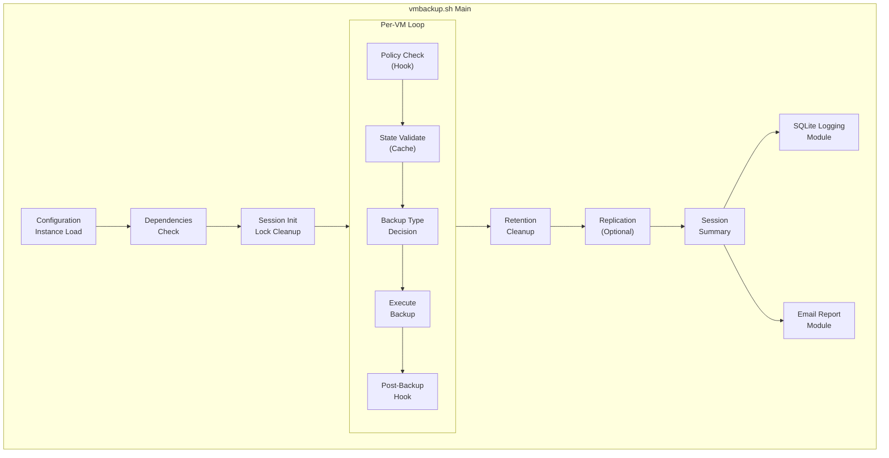

### Directory Structure

Installed layout from the `.deb` package:

```
/opt/vmbackup/
├── vmbackup.sh                      # Main entry point
│
├── modules/                         # Business logic modules
│   ├── vmbackup_integration.sh      # Module loader, lifecycle hooks
│   ├── rotation_module.sh           # Rotation policies
│   ├── logging_module.sh            # SQLite lifecycle logging
│   ├── chain_manifest_module.sh     # JSON manifest for restore points
│   ├── retention_module.sh          # Per-VM retention enforcement
│   ├── email_report_module.sh       # Email notifications
│   ├── replication_local_module.sh  # Multi-destination local replication
│   ├── replication_cloud_module.sh  # Cloud replication via rclone
│   ├── fstrim_optimization_module.sh # Pre-backup FSTRIM
│   └── tpm_backup_module.sh         # TPM state backup
│
├── lib/                             # Infrastructure utilities
│   ├── sqlite_module.sh             # SQLite database layer
│   ├── chain_validation.sh          # Backup chain integrity checks
│   ├── transfer_utils.sh            # Replication file-transfer helpers
│   ├── logging.sh                   # Shared logging functions
│   └── vm_lock.sh                   # Per-VM lock management
│
├── transports/                      # Local replication drivers
│   ├── transport_local.sh
│   ├── transport_ssh.sh
│   └── transport_smb.sh
│
├── cloud_transports/                # Cloud replication drivers
│   ├── cloud_transport_sharepoint.sh
│   └── sharepoint_auth.sh
│
└── config/                          # Configuration instances
    ├── default/                     # Production defaults
    └── template/                    # Documented templates

/lib/systemd/system/
├── vmbackup.service                 # Backup service (oneshot)
└── vmbackup.timer                   # Daily timer (01:00)

/etc/apparmor.d/local/abstractions/
└── libvirt-qemu                     # virtnbdbackup socket access rule
```

### File Reference

#### Core Scripts

| File | Purpose |
|------|---------|
| `vmbackup.sh` | Main backup orchestrator - VM discovery, backup execution, session management |

#### Business Logic Modules (modules/)

| File | Purpose |
|------|---------|
| `modules/vmbackup_integration.sh` | Loads modules, provides pre/post backup hooks, period boundary detection |
| `modules/rotation_module.sh` | Rotation policies (daily/weekly/monthly/accumulate), period ID generation |
| `modules/retention_module.sh` | Per-VM retention enforcement, orphan cleanup, age-based deletion |
| `modules/chain_manifest_module.sh` | JSON manifest for restore points, chain tracking |
| `modules/logging_module.sh` | SQLite lifecycle logging (log_chain_lifecycle, log_period_lifecycle, log_file_operation, log_retention_action, log_config_event) |
| `modules/email_report_module.sh` | Email notifications with backup summary and log attachment |
| `modules/replication_local_module.sh` | Multi-destination local replication (local/SSH/SMB) |
| `modules/replication_cloud_module.sh` | Cloud replication via rclone (SharePoint, Backblaze) |
| `modules/fstrim_optimization_module.sh` | Pre-backup FSTRIM to reduce backup size |
| `modules/tpm_backup_module.sh` | TPM state backup for BitLocker/Secure Boot VMs + BitLocker key extraction |

#### Infrastructure Utilities (lib/)

| File | Purpose |
|------|---------|
| `lib/sqlite_module.sh` | SQLite database layer - sessions, VM backups, chain health tracking |
| `lib/chain_validation.sh` | Validates backup chain integrity before restore |
| `lib/transfer_utils.sh` | Common file transfer utilities for replication |
| `lib/logging.sh` | Shared logging functions (log_info, log_warn, log_error) |
| `lib/vm_lock.sh` | Per-VM lock management (prevents concurrent backups) |

#### Transport Drivers (transports/)

See [Transport Drivers](#transport-drivers-transportssh) in the Replication Architecture section for the full contract and implementation guide.

| File | Purpose | Status |
|------|---------|--------|
| `transports/transport_local.sh` | Local filesystem rsync replication | **Production** |
| `transports/transport_ssh.sh` | SSH/rsync remote replication | **Stub** — not implemented |
| `transports/transport_smb.sh` | SMB/CIFS mount + rsync replication | **Stub** — not implemented |

#### Cloud Transport Drivers (cloud_transports/)

| File | Purpose | Status |
|------|---------|--------|
| `cloud_transports/cloud_transport_sharepoint.sh` | SharePoint Online via rclone | **Production** |
| `cloud_transports/sharepoint_auth.sh` | SharePoint rclone auth helper (CLI flags, instance discovery) | **Production** |

#### Configuration (config/)

| Directory | Purpose |
|-----------|---------|
| `config/default/` | Production configuration files (used by default) |
| `config/template/` | Fully documented template configs for new deployments |

Each config directory contains:
- `vmbackup.conf` - Main backup settings
- `vm_overrides.conf` - Per-VM rotation policy overrides
- `exclude_patterns.conf` - VM exclusion patterns
- `email.conf` - Email notification settings
- `replication_local.conf` - Local replication destinations
- `replication_cloud.conf` - Cloud replication settings

### External Modules

All modules reside in the `modules/` subdirectory.

| Module | File | Purpose |
|--------|------|---------|
| Integration | `modules/vmbackup_integration.sh` | Module loader, pre/post backup hooks, archival |
| Rotation | `modules/rotation_module.sh` | Rotation policies, period boundaries |
| Retention | `modules/retention_module.sh` | Per-VM retention enforcement |
| Chain Manifest | `modules/chain_manifest_module.sh` | JSON manifest for restore points |
| Logging | `modules/logging_module.sh` | SQLite lifecycle logging |
| Email Report | `modules/email_report_module.sh` | Email notifications with log attachment |
| Local Replication | `modules/replication_local_module.sh` | Local/SSH/SMB offsite backup |
| Cloud Replication | `modules/replication_cloud_module.sh` | SharePoint/Backblaze cloud backup |
| FSTRIM | `modules/fstrim_optimization_module.sh` | Pre-backup TRIM optimization |
| TPM Backup | `modules/tpm_backup_module.sh` | Backup TPM state for BitLocker/Secure Boot |

### Data Flow

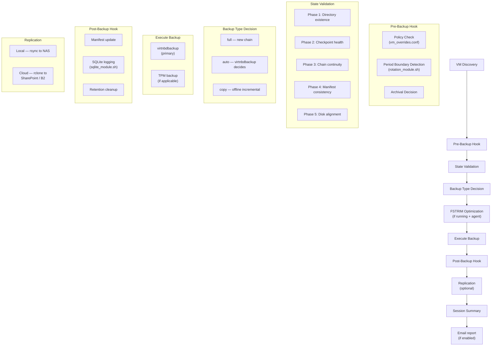

---

## Configuration

### Configuration Instances

Configuration instances provide complete isolation between different backup environments. Each instance has its own set of configuration files, allowing different settings for production, test, disaster recovery, or other purposes.

#### Instance Selection

| Command | Config Used |
|---------|-------------|
| `./vmbackup.sh` | `config/default/` |
| `./vmbackup.sh --config-instance test` | `config/test/` |
| `./vmbackup.sh --config-instance myinstance` | `config/myinstance/` |

#### Directory Structure

```
config/
├── default/                      # Default configuration (customize after install)
│   ├── vmbackup.conf                 # Main settings + replication order
│   ├── vm_overrides.conf             # Per-VM rotation policies
│   ├── exclude_patterns.conf         # Glob patterns to exclude VMs
│   ├── email.conf                    # Email notification settings
│   ├── replication_local.conf        # Local/NAS replication destinations
│   └── replication_cloud.conf        # Cloud replication destinations
│
├── test/                         # Test environment (isolated from production)
│   ├── vmbackup.conf
│   ├── vm_overrides.conf
│   ├── exclude_patterns.conf
│   ├── email.conf
│   ├── replication_local.conf
│   └── replication_cloud.conf
│
└── template/                     # Template for creating new instances
    ├── vmbackup.conf                 # Full documentation of all options
    ├── vm_overrides.conf
    ├── exclude_patterns.conf
    ├── email.conf
    ├── replication_local.conf
    └── replication_cloud.conf
```

#### Creating a New Instance

```bash
# Copy template to new instance
cp -r config/template config/production

# Edit the new instance
nano config/production/vmbackup.conf

# Use the new instance
./vmbackup.sh --config-instance production
```

### Configuration Files Reference

#### vmbackup.conf — Main Settings

The primary configuration file controlling backup behavior. Only settings you want to **override** need to be included.

```bash
#################################################################################
# BACKUP PATH (REQUIRED)
# Where backups are stored. Each instance should have a unique path.
# Structure: $BACKUP_PATH/<vm_name>/<YYYYMM>/
#################################################################################
BACKUP_PATH="/mnt/backup/vms/"

#################################################################################
# PRIORITY SETTINGS
#################################################################################
PROCESS_PRIORITY=10          # CPU nice: -20=highest, 0=normal, 19=lowest
IO_PRIORITY_CLASS=2          # ionice: 1=realtime, 2=best-effort, 3=idle
IO_PRIORITY_LEVEL=5          # 0-7 within class 2 (0=highest)

#################################################################################
# COMPRESSION
# LZ4 fast mode (1-2): ~1000+ MiB/s, ratio ~1.30x
# LZ4 HC mode  (3-16): ~48-76 MiB/s, ratio ~1.31x (different algorithm)
# Level 0: BROKEN in virtnbdbackup ≤2.28 — guarded to bump to 1
#################################################################################
VIRTNBD_COMPRESS_LEVEL=4     # LZ4 HC minimum. Default 4.

#################################################################################
# LOGGING
#################################################################################
LOG_LEVEL="INFO"               # ERROR|WARN|INFO|DEBUG

#################################################################################
# ROTATION DEFAULTS
#################################################################################
DEFAULT_ROTATION_POLICY="monthly"  # daily|weekly|monthly|accumulate|never
RETENTION_DAYS=7
RETENTION_WEEKS=4
RETENTION_MONTHS=3

#################################################################################
# ORPHAN RETENTION
# Cleanup of period dirs left behind after a rotation policy change
#################################################################################
#RETENTION_ORPHAN_ENABLED="true"       # false = keep orphans indefinitely
#RETENTION_ORPHAN_MAX_AGE_DAYS=90      # Delete orphans older than this
#RETENTION_ORPHAN_MIN_AGE_DAYS=7       # Safety buffer before eligible

#################################################################################
# CHECKPOINT MANAGEMENT
#################################################################################
CHECKPOINT_FORCE_FULL_ON_DAY=1
CHECKPOINT_HEALTH_CHECK="yes"
ENABLE_AUTO_RECOVERY_ON_CHECKPOINT_CORRUPTION="warn"  # yes|warn|no

#################################################################################
# FSTRIM OPTIMIZATION
#################################################################################
ENABLE_FSTRIM=false
FSTRIM_TIMEOUT=300
FSTRIM_WINDOWS_TIMEOUT=600

#################################################################################
# OFFLINE VM HANDLING
#################################################################################
SKIP_OFFLINE_UNCHANGED_BACKUPS=false
OFFLINE_CHANGE_DETECTION_THRESHOLD=60

#################################################################################
# REPLICATION ORDER
# Controls when local vs cloud replication runs
#################################################################################
REPLICATION_ORDER="simultaneous"   # simultaneous|local_first|cloud_first
```

#### vm_overrides.conf — Per-VM Policies

Override rotation policies for specific VMs using an associative array.

```bash
# Declare the associative array
declare -gA VM_POLICY

# Per-VM policy assignments
VM_POLICY["critical-db"]="accumulate"     # Never delete - critical data
VM_POLICY["web-server"]="weekly"          # Weekly rotation
VM_POLICY["dev-sandbox"]="daily"          # Short retention
VM_POLICY["template-win11"]="never"       # Exclude from backups
```

**Policy Options:**

| Policy | Behavior | Use Case |
|--------|----------|----------|
| `daily` | Keep RETENTION_DAYS days | Critical VMs needing daily restore points |
| `weekly` | Keep RETENTION_WEEKS weeks | Standard workloads |
| `monthly` | Keep RETENTION_MONTHS months | Default, balanced storage |
| `accumulate` | Never auto-delete | Long-term retention requirements |
| `never` | **Excluded from backup** | Templates, scratch VMs |

#### exclude_patterns.conf — Pattern-Based Exclusions

Exclude VMs matching glob patterns.

```bash
EXCLUDE_PATTERN=()

# Examples:
EXCLUDE_PATTERN+=("test-*")           # Exclude test VMs
EXCLUDE_PATTERN+=("*-template")       # Exclude template VMs
EXCLUDE_PATTERN+=("*-clone-*")        # Exclude clones
EXCLUDE_PATTERN+=("tmp-*")            # Exclude temporary VMs
```

#### email.conf — Notifications

Configure email reporting for this instance.

```bash
EMAIL_ENABLED="yes"
EMAIL_RECIPIENT="admin@example.com"
EMAIL_SENDER="backups@example.com"
EMAIL_HOSTNAME=""                     # Empty = use system hostname
EMAIL_SUBJECT_PREFIX="[VM Backup]"
EMAIL_ON_SUCCESS="yes"
EMAIL_ON_FAILURE="yes"
EMAIL_INCLUDE_REPLICATION="yes"
EMAIL_INCLUDE_DISK_SPACE="yes"
```

#### replication_local.conf — Local/NAS Destinations

Configure rsync-based replication to local storage.

```bash
#=============================================================================
# GLOBAL SETTINGS
#=============================================================================
REPLICATION_ENABLED="no"                  # Master switch: "yes" to enable
REPLICATION_ON_FAILURE="continue"     # continue|abort
REPLICATION_SPACE_CHECK="skip"        # skip|warn|disabled
REPLICATION_MIN_FREE_PERCENT=10

#=============================================================================
# DESTINATION 1: Local filesystem example
#=============================================================================
DEST_1_ENABLED="no"
DEST_1_NAME="local-backup"
DEST_1_TRANSPORT="local"                # local|ssh|smb
DEST_1_PATH="/mnt/backups"
DEST_1_SYNC_MODE="mirror"             # mirror (--delete) | accumulate
DEST_1_BWLIMIT="0"                    # KB/s, 0=unlimited
DEST_1_VERIFY="size"                  # none|size|checksum

#=============================================================================
# DESTINATION 2: SSH Example
#=============================================================================
DEST_2_ENABLED="no"
DEST_2_NAME="offsite-ssh"
DEST_2_TRANSPORT="ssh"
DEST_2_HOST="backup.example.com"
DEST_2_USER="backupuser"
DEST_2_PORT="22"
DEST_2_PATH="/backups/vms"
DEST_2_SSH_KEY="/root/.ssh/backup_rsa"
DEST_2_SYNC_MODE="mirror"
DEST_2_BWLIMIT="5000"
DEST_2_VERIFY="size"
```

#### replication_cloud.conf — Cloud Destinations

Configure rclone-based replication to cloud storage.

```bash
#=============================================================================
# GLOBAL CLOUD SETTINGS
#=============================================================================
CLOUD_REPLICATION_ENABLED="no"             # Master switch: "yes" to enable

# What to replicate
CLOUD_REPLICATION_SCOPE="everything"      # everything|archives-only|monthly

# Sync behavior
CLOUD_REPLICATION_SYNC_MODE="mirror"      # mirror|accumulate-all|accumulate-valid

# Post-upload verification
CLOUD_REPLICATION_POST_VERIFY="checksum"  # none|size|checksum

# Failure handling
CLOUD_REPLICATION_ON_FAILURE="continue"   # continue|abort

# Rate limiting
CLOUD_REPLICATION_DEFAULT_BWLIMIT="0"     # KB/s (0=unlimited)
CLOUD_REPLICATION_THROTTLE_ON_429="yes"   # Auto-reduce on rate limit
CLOUD_REPLICATION_THROTTLE_FACTOR="0.5"   # Reduce to 50% per 429
CLOUD_REPLICATION_THROTTLE_MIN="1000"     # Minimum KB/s

# Retry logic
CLOUD_REPLICATION_MAX_RETRIES="3"
CLOUD_REPLICATION_RETRY_DELAY="60"
CLOUD_REPLICATION_RESUME_PARTIAL="auto"   # auto|delete|keep

# Token expiry tracking
CLOUD_REPLICATION_TRACK_EXPIRY="yes"
CLOUD_REPLICATION_EXPIRY_WARN_DAYS="30"
CLOUD_REPLICATION_EXPIRY_CRITICAL_DAYS="7"

# Logging (inherits from vmbackup.conf LOG_LEVEL by default)
# Uncomment only to override main LOG_LEVEL for cloud-specific verbosity
#CLOUD_REPLICATION_LOG_LEVEL="debug"      # Optional override: debug|info|warn|error

# Concurrent replication lock
CLOUD_REPLICATION_USE_LOCKFILE="yes"
CLOUD_REPLICATION_LOCKFILE="/var/run/cloud_replication.lock"
CLOUD_REPLICATION_LOCK_TIMEOUT="3600"     # Seconds before stale lock is broken

# Per-VM exclusions (comma-separated VM names to skip)
CLOUD_REPLICATION_VM_EXCLUDE=""

# Destination processing
CLOUD_REPLICATION_DEST_MODE="sequential"  # sequential|parallel
CLOUD_REPLICATION_DRY_RUN="no"

#=============================================================================
# CLOUD DESTINATION 1: SharePoint
#=============================================================================
CLOUD_DEST_1_ENABLED="no"
CLOUD_DEST_1_NAME="sharepoint-backup"
CLOUD_DEST_1_PROVIDER="sharepoint"
CLOUD_DEST_1_REMOTE="sharepoint:"         # rclone remote name
CLOUD_DEST_1_PATH="VMBackups"
CLOUD_DEST_1_SCOPE=""                     # Empty = use global
CLOUD_DEST_1_SYNC_MODE=""                 # Empty = use global
CLOUD_DEST_1_BWLIMIT="0"
CLOUD_DEST_1_VERIFY=""                    # Empty = use global
CLOUD_DEST_1_MAX_SIZE="250G"              # SharePoint file size limit
CLOUD_DEST_1_SECRET_EXPIRY=""             # Credential expiry date (YYYY-MM-DD)

#=============================================================================
# CLOUD DESTINATION 2: Backblaze B2 Example
#=============================================================================
CLOUD_DEST_2_ENABLED="no"
CLOUD_DEST_2_NAME="backblaze-b2"
CLOUD_DEST_2_PROVIDER="backblaze"
CLOUD_DEST_2_REMOTE="b2:"
CLOUD_DEST_2_PATH="vmbackups"
CLOUD_DEST_2_SCOPE="archives-only"        # Only consolidated chains
CLOUD_DEST_2_BWLIMIT="5000"
CLOUD_DEST_2_VERIFY="checksum"
CLOUD_DEST_2_MAX_SIZE="10T"               # Backblaze max file size
CLOUD_DEST_2_SECRET_EXPIRY=""             # B2 keys don't expire by default
```

### Cloud Authentication (SharePoint)

SharePoint requires **delegated authentication** (device code flow) for uploads longer than 1 hour.

**Why Delegated Auth?**
- Client credentials have a **1-hour hard token limit** with no refresh
- Uploads >1 hour fail with `401 Unauthorized`
- Delegated auth provides automatic token refresh via 90-day refresh token

#### Step-by-Step: Setting Up SharePoint Cloud Replication

Follow these steps **in order** when deploying vmbackup to a new host or enabling cloud replication for the first time.

##### Step 1: Install rclone

```bash
sudo apt install rclone
```

Verify it's installed:
```bash
rclone version
```

##### Step 2: Edit replication_cloud.conf

Open the cloud replication config for your config instance (e.g., `default`):

```bash
sudo nano /opt/vmbackup/config/default/replication_cloud.conf
```

Set these values:

```bash
# Enable cloud replication
CLOUD_REPLICATION_ENABLED="yes"

# Configure destination
CLOUD_DEST_1_ENABLED="yes"
CLOUD_DEST_1_NAME="sharepoint-backup"
CLOUD_DEST_1_PROVIDER="sharepoint"
CLOUD_DEST_1_REMOTE="sharepoint:"         # rclone remote name (must match step 3)
CLOUD_DEST_1_PATH="VMBackups"             # folder name in SharePoint doc library
```

Save and close. The folder name in `CLOUD_DEST_1_PATH` will be created automatically on the first upload if it doesn't exist.

##### Step 3: Run sharepoint_auth.sh

This interactive script configures the rclone remote and authenticates with SharePoint:

```bash
sudo /opt/vmbackup/cloud_transports/sharepoint_auth.sh --instance default
```

The script will:
1. Read `CLOUD_DEST_1_REMOTE` and `CLOUD_DEST_1_PATH` from your config (step 2)
2. Launch `rclone config` interactively — follow the prompts:

   | Prompt | Answer |
   |--------|--------|
   | Storage type | `onedrive` |
   | Client ID | Leave blank (press Enter) |
   | Client secret | Leave blank (press Enter) |
   | Region | `global` |
   | Use web browser to authenticate | `n` (device code flow) |

3. **Device code flow:** The script displays a URL and a code. Open the URL in any browser (even on your phone), sign in with your Microsoft 365 account, and enter the code.

4. After authentication succeeds:

   | Prompt | Answer |
   |--------|--------|
   | Drive type | `sharepoint` |
   | Site URL | Your SharePoint site URL (e.g., `https://contoso.sharepoint.com/sites/backups`) |
   | Document library | Select from the listed libraries |

5. The script verifies the connection and checks for the destination folder.

##### Step 4: Verify the connection

```bash
sudo /opt/vmbackup/cloud_transports/sharepoint_auth.sh --test-only
```

You should see the remote listing and available space. If this works, cloud replication is ready.

##### Step 5: Run a backup to test

```bash
sudo vmbackup --config-instance default --dry-run
```

Check the output for cloud replication steps. Remove `--dry-run` to run for real.

##### Troubleshooting

| Symptom | Cause | Fix |
|---------|-------|-----|
| `401 Unauthorized` during upload | Token expired | Run `sharepoint_auth.sh --instance default` |
| `Failed to get token` | Server idle 90+ days, refresh token expired | Run `sharepoint_auth.sh --instance default` |
| Wrong folder | `CLOUD_DEST_1_PATH` doesn't match | Edit `replication_cloud.conf`, no re-auth needed |
| Wrong SharePoint site | Site URL baked into rclone config | Run `sharepoint_auth.sh` to reconfigure |

#### Three-Layer Configurability Model

SharePoint cloud replication has three independently configurable layers:

| Layer | What it controls | Where configured | When set |
|-------|-----------------|------------------|----------|
| **SharePoint Site URL** | Which SharePoint site to connect to | `rclone config` (interactive) | During initial setup or re-auth |
| **Document Library** | Which document library within the site | `rclone config` (stored as `drive_id`) | During initial setup or re-auth |
| **Folder** | Folder within the document library | `CLOUD_DEST_N_PATH` in `replication_cloud.conf` | Any time via config edit |

**Example mapping:**
```
rclone remote "sharepoint:" → https://contoso.sharepoint.com/sites/backups
                              └── Document Library: "Shared Documents" (drive_id in rclone.conf)
                                  └── Folder: "VMBackups" (CLOUD_DEST_1_PATH in vmbackup config)
```

#### sharepoint_auth.sh

Interactive helper script for configuring or re-authenticating rclone with any SharePoint site. Supports multiple vmbackup config instances, auto-discovers settings, and works on headless servers via device code flow.

**Usage:**
```bash
# Auto-discover instances and choose interactively
sudo ./cloud_transports/sharepoint_auth.sh

# Use settings from a specific vmbackup config instance
sudo ./cloud_transports/sharepoint_auth.sh --instance dev

# Specify remote name and folder directly
sudo ./cloud_transports/sharepoint_auth.sh --remote sharepoint --folder VMBackups

# Test existing connection without re-authenticating
sudo ./cloud_transports/sharepoint_auth.sh --test-only

# Use a specific rclone config file
sudo ./cloud_transports/sharepoint_auth.sh --config /path/to/rclone.conf
```

**Options:**

| Option | Default | Description |
|--------|---------|-------------|
| `--remote NAME` | `sharepoint` | rclone remote name |
| `--folder PATH` | from config instance | Folder in document library to verify/create |
| `--instance NAME` | auto-detect | vmbackup config instance (e.g., `dev`, `default`) |
| `--config FILE` | `/root/.config/rclone/rclone.conf` | rclone config file path |
| `--test-only` | — | Test existing connection, don't re-authenticate |

**Instance auto-discovery:** When run without `--folder` or `--instance`, the script scans `config/*/replication_cloud.conf` and presents a menu showing each instance's `CLOUD_DEST_1_REMOTE` and `CLOUD_DEST_1_PATH`.

**Interactive rclone config flow:**
During the `rclone config` step, you will choose:
1. **Storage type:** `onedrive` (Microsoft OneDrive)
2. **Client ID/secret:** Leave blank (uses rclone's default Microsoft app)
3. **Region:** `global` (unless in a special region)
4. **Web browser auth:** `n` (triggers device code flow — works on headless servers)
5. **Drive type:** `sharepoint` (SharePoint site documentLibrary)
6. **Site URL:** Your SharePoint site URL (e.g., `https://contoso.sharepoint.com/sites/backups`)
7. **Document Library:** Select from the listed libraries (stored as `drive_id`)

**Token Lifecycle:**

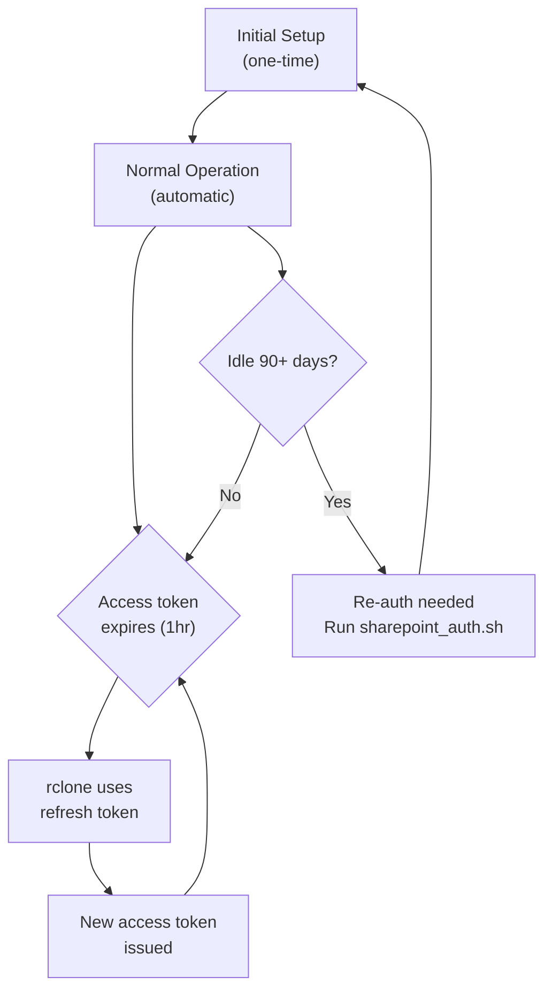

**When to re-run:**
- Initial setup (first time on a new host)
- After 90+ days of inactivity (refresh token expired)
- `401 Unauthorized` or token expired errors
- Changing to a different SharePoint site or document library

**rclone Config Location:** `/root/.config/rclone/rclone.conf`

> **Note:** The rclone config is global (per-host, under root), not per-instance.
> Multiple vmbackup instances on the same host share the same rclone remote but
> differentiate by `CLOUD_DEST_N_PATH` (folder) in each instance's config.

### Core Settings

See [vmbackup.conf](#vmbackupconf--main-settings) above for the complete reference. Key settings summary:

| Variable | Default | Description |
|----------|---------|-------------|
| `BACKUP_PATH` | (required) | Destination directory. **Trailing slash required.** |
| `RETENTION_MONTHS` | `3` | Months to retain (for monthly policy) |
| `DEFAULT_ROTATION_POLICY` | `monthly` | Default VM rotation policy |
| `REPLICATION_ORDER` | `simultaneous` | When to run local vs cloud replication |

### Priority & Performance Tuning

Three settings control backup process priority to balance performance vs. system impact:

| Variable | Range | Default | Description |
|----------|-------|---------|-------------|
| `PROCESS_PRIORITY` | -20 to 19 | `10` | CPU nice value. Lower = higher priority. |
| `IO_PRIORITY_CLASS` | 1-3 | `2` | ionice class: 1=realtime, 2=best-effort, 3=idle |
| `IO_PRIORITY_LEVEL` | 0-7 | `5` | Priority within class (0=highest, 7=lowest) |

#### Performance Profiles

| Profile | CPU | I/O Class | I/O Level | Estimated Speed | Use Case |
|---------|-----|-----------|-----------|-----------------|----------|
| **Minimal Impact** | 19 | 3 (idle) | - | ~1-3 MB/s | Production during business hours |
| **Low Impact** | 15 | 2 | 7 | ~5-10 MB/s | Background tasks |
| **Balanced** | 10 | 2 | 5 | ~15-30 MB/s | Default - good balance |
| **Normal** | 0 | 2 | 4 | ~50-80 MB/s | Dedicated backup window |
| **High Performance** | 0 | 2 | 2 | ~100-150 MB/s | Fast backup priority |
| **Maximum** | -10 | 1 | 4 | ~200+ MB/s | Emergency/DR scenarios |

#### Example Configuration

```bash
# Balanced (Default)
PROCESS_PRIORITY=10
IO_PRIORITY_CLASS=2
IO_PRIORITY_LEVEL=5

# High Performance (overnight backups)
PROCESS_PRIORITY=0
IO_PRIORITY_CLASS=2
IO_PRIORITY_LEVEL=4
```

### virtnbdbackup Options

| Variable | Default | Description |
|----------|---------|-------------|
| `VIRTNBD_COMPRESS_LEVEL` | `4` | LZ4 compression level. Fast mode (1-2): ~1000+ MiB/s. HC mode (3-16): ~48-76 MiB/s, marginal ratio gain. Level 0 broken in virtnbdbackup ≤2.28 (guarded). |
| `VIRTNBD_WORKERS` | `auto` | Parallel threads. `auto` = CPU count detection. |
| `VIRTNBD_EXCLUDE_DISKS` | `""` | Comma-separated devices to skip (e.g., `"sdb,sdc"`). |
| `VIRTNBD_INCLUDE_DISKS` | `""` | Only backup these disks (overrides exclude). |
| `VIRTNBD_FSFREEZE` | `true` | Use QEMU agent to freeze filesystems. |
| `VIRTNBD_OUTPUT_FORMAT` | `stream` | Output: `stream` (thin) or `raw` (full). |
| `VIRTNBD_SPARSE_DETECTION` | `true` | Skip TRIM'd/sparse blocks. |
| `VIRTNBD_SCRATCH_DIR` | `/var/tmp` | Temporary directory for NBD operations. |
| `VIRTNBD_FSFREEZE_PATHS` | `""` | Specific paths to freeze (empty = all). Comma-separated: `"/mnt,/var"`. |
| `VIRTNBD_THRESHOLD` | `""` | Minimum delta bytes before backup runs. Empty = always backup. |

### Checkpoint Management

| Variable | Default | Description |
|----------|---------|-------------|
| `CHECKPOINT_FORCE_FULL_ON_DAY` | `1` | Day of month to force full backup. |
| `CHECKPOINT_HEALTH_CHECK` | `yes` | Validate checkpoint integrity before backup. |
| `CHECKPOINT_MAX_DEPTH_WARN` | `10` | Log warning if chain exceeds this depth. |
| `ENABLE_AUTO_RECOVERY_ON_CHECKPOINT_CORRUPTION` | `warn` | `yes`=auto-fix, `warn`=log only, `no`=fail |

### Timeout & Monitoring

| Variable | Default | Description |
|----------|---------|-------------|
| `BACKUP_STARTUP_GRACE` | `300` | Grace period (seconds) before monitoring begins. |
| `BACKUP_STALL_THRESHOLD` | `180` | Declare hung if no I/O for this many seconds. |
| `BACKUP_CHECK_INTERVAL` | `30` | How often to check backup progress. |
| `MAX_RETRIES` | `2` | Maximum backup retry attempts on failure. |
| `RETRY_DELAY` | `30` | Seconds between retries. |

### Unified Logging System

All modules share a unified logging system with configurable verbosity levels.

#### Log Level Hierarchy

| Level | Numeric | Description |
|-------|---------|-------------|
| `ERROR` | 3 | Errors only (quietest) |
| `WARN` | 2 | Errors + warnings |
| `INFO` | 1 | Normal operation (default) |
| `DEBUG` | 0 | Verbose debugging |

**Important:** All messages are *always* written to the log file regardless of level. The `LOG_LEVEL` setting controls which messages appear on screen (stderr).

#### Configuration

Set in `vmbackup.conf` per instance:

```bash
# config/default/vmbackup.conf - Production (quiet)
LOG_LEVEL="INFO"

# config/test/vmbackup.conf - Testing (verbose)
LOG_LEVEL="DEBUG"
```

#### Inheritance Model

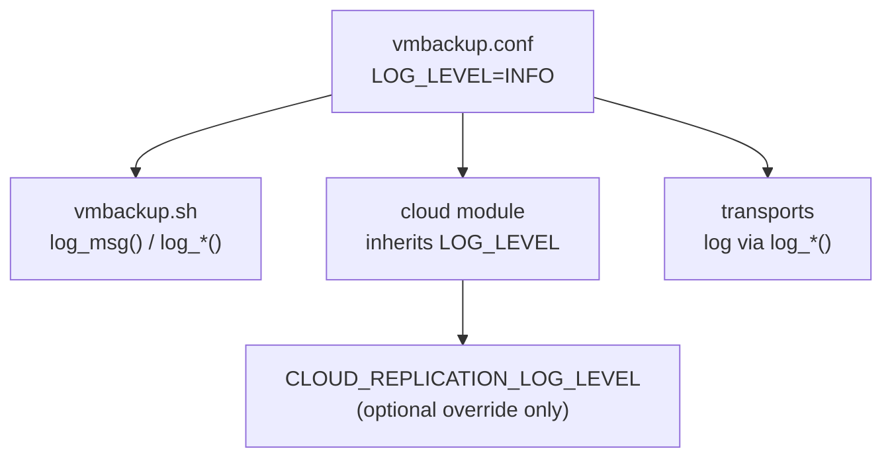

- **vmbackup.sh**: Uses `LOG_LEVEL` directly
- **replication_cloud_module.sh**: Inherits `LOG_LEVEL` unless `CLOUD_REPLICATION_LOG_LEVEL` is explicitly set
- **Transport drivers**: Delegate to main `log_*()` functions, automatically respect `LOG_LEVEL`

#### Cloud Module Override

For cloud-specific verbosity (e.g., debugging SharePoint issues while keeping main logs quiet):

```bash
# config/*/replication_cloud.conf
# Uncomment only if you need cloud-specific verbosity different from main LOG_LEVEL
CLOUD_REPLICATION_LOG_LEVEL="debug"  # Override: debug|info|warn|error
```

#### Log Format

All log messages follow a consistent format:

```
[timestamp] [LEVEL] [module.sh] [function] message
```

Example output:
```
[2026-02-03 14:30:15 AEDT] [INFO] [vmbackup.sh] [perform_backup] Starting backup for win11-pro
[2026-02-03 14:30:16 AEDT] [DEBUG] [replication_cloud_module.sh] [replicate_to_cloud] Using transport: sharepoint
[2026-02-03 14:30:17 AEDT] [INFO] [cloud_transport_sharepoint.sh] [upload_files] Uploading 3 files to SharePoint
```

#### Recommended Settings by Environment

| Instance | `LOG_LEVEL` | Use Case |
|----------|-------------|----------|
| `default` | `INFO` | Production - clean output |
| `test` | `DEBUG` | Development - full verbosity |
| `template` | `INFO` | Documentation reference |

---

## VM State Handling

### State Detection Flow

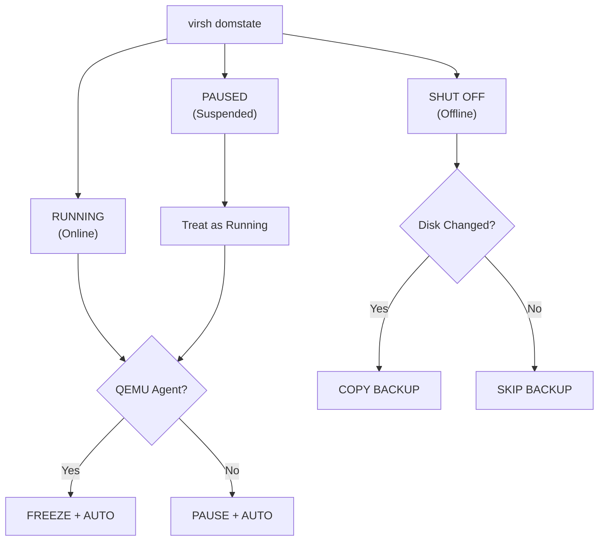

### Running VMs (Online)

**With QEMU Guest Agent:**
- Uses `virsh qemu-agent-command` to verify agent responsiveness
- Enables FSFREEZE for application-consistent snapshots
- Backup type: `auto` (incremental) or `full` (boundary)

**Without QEMU Guest Agent:**
- VM is **paused** during backup to ensure crash-consistent snapshot
- Pause state monitored to ensure resume after backup completes
- Backup type: `auto` or `full`

### Shut Off VMs (Offline)

**Disk Change Detection:**
```
Compares disk mtime against last backup timestamp
├── mtime > last_backup → Disk changed → ARCHIVE + COPY backup
└── mtime ≤ last_backup → Unchanged → SKIP backup
```

**Key Behaviors:**
- Clean shutdown **always** modifies disk (mtime updates)
- First offline day after running = archive chain + copy backup
- Subsequent offline days with no changes = skip backup
- Copy backup preserved, not chain

### Paused VMs

Treated identically to running VMs. The script's pause/resume logic handles backup coordination.

---

## Checkpoint System

### Checkpoint Storage Locations

| Location | Purpose | Created By |
|----------|---------|------------|
| `/var/lib/libvirt/qemu/checkpoint/<vm>/` | Primary libvirt checkpoint metadata | `virsh checkpoint-create` |
| `<backup_dir>/checkpoints/` | Backup-local checkpoint copy | `virtnbdbackup` |
| `<backup_dir>/<vm>.cpt` | JSON array of checkpoint names | `virtnbdbackup` |
| QEMU qcow2 bitmaps | Dirty block tracking inside disk | QEMU/libvirt |

### Checkpoint Chain Lifecycle

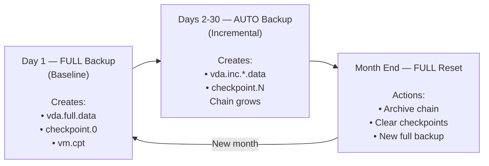

### Validation States

The `validate_backup_state()` function performs 5-phase validation:

| State | Meaning | Action |
|-------|---------|--------|
| `clean` | No issues detected | Proceed with backup |
| `copy_backup` | Valid offline copy backup exists | Archive copy → FULL backup |
| `stale_metadata` | Old metadata without data | Clean metadata → FULL |
| `broken_chain` | Checkpoint/bitmap mismatch | Archive chain → FULL |
| `missing_backup_data` | Checkpoints but no .data files | FULL backup |
| `incomplete_backup` | Partial `.partial` files | Clean partial → FULL |

---

## Backup Types & Strategies

### Backup Type Decision Matrix

| Condition | Backup Type | Command Flag |
|-----------|-------------|--------------|
| Month boundary (new month) | `full` | `virtnbdbackup --full` |
| Day 01 AND no existing valid data | `full` | `virtnbdbackup --full` |
| Day 01 AND existing valid chain | `auto` | `virtnbdbackup --auto` |
| Recovery flag present | `full` | `virtnbdbackup --full` |
| Offline VM with changes | `copy` | `virtnbdbackup --copy` |
| First backup ever | `full` | `virtnbdbackup --full` |
| Normal daily backup | `auto` | `virtnbdbackup --auto` |

### Retry Strategy

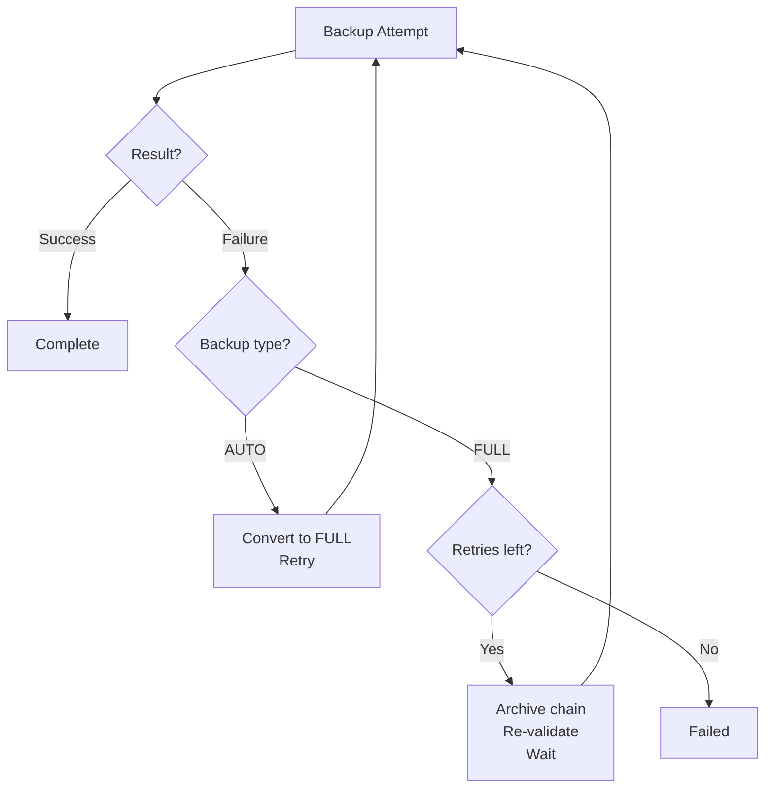

---

## Rotation Policies

### Policy Types

| Policy | Behavior | Period Format | Period Boundary |
|--------|----------|---------------|-----------------|
| `daily` | Archive chain at midnight | `YYYYMMDD` | New day |
| `weekly` | Archive chain on Monday | `YYYY-Www` (ISO week) | New week |
| `monthly` | Archive chain on 1st | `YYYYMM` | New month |
| `accumulate` | Never archive, chain grows indefinitely | None | None |
| `never` | **Excluded from backup** | N/A | N/A |

### Period ID Generation

The `get_period_id()` function generates period identifiers based on policy:

```bash
get_period_id "daily" "2026-02-06"   →  "20260206"
get_period_id "weekly" "2026-02-06"  →  "2026-W06"
get_period_id "monthly" "2026-02-06" →  "202602"
get_period_id "monthly" "2026-03-01" →  "202603"  # ← PERIOD BOUNDARY
```

### Retention Settings

Each rotation policy uses a corresponding retention setting to control how many period folders are kept:

| Policy | Retention Setting | Default | Folder Format | Example |
|--------|-------------------|---------|---------------|---------|
| `daily` | `RETENTION_DAYS` | 7 | `YYYYMMDD` | Keep 7 daily folders |
| `weekly` | `RETENTION_WEEKS` | 4 | `YYYY-Www` | Keep 4 weekly folders |
| `monthly` | `RETENTION_MONTHS` | 3 | `YYYYMM` | Keep 3 monthly folders |
| `accumulate` | N/A | N/A | Single folder | See accumulate limits below |

**Important:** Tier 1 retention only applies to folders **matching the current policy format**. Tier 2 orphan retention handles folders from previous policies using age-based cleanup. See [Tier 2: Orphaned Policy Retention](#tier-2-orphaned-policy-retention-age-based) for configuration details.

### Accumulate Policy Limits

The `accumulate` policy does not use `RETENTION_*` settings. Instead, it monitors checkpoint depth:

| Setting | Default | Behaviour |
|---------|---------|-----------|
| `ACCUMULATE_WARN_DEPTH` | 100 | Log warning when checkpoint count ≥ this |
| `ACCUMULATE_HARD_LIMIT` | 365 | **Archive chain and force full backup** when checkpoint count ≥ this |

**When hard limit is reached:**
- Current chain is automatically **archived** to `.archives/chain-YYYY-MM-DD/`
- Recovery flag is set to force a **fresh full backup**
- Next backup starts a new accumulate chain
- The 365 default means ~1 year of daily incrementals before automatic archival

### Per-VM Policy Configuration

In `vm_overrides.conf`:
```bash
# Associative array: VM_POLICY[vm_name]="policy"
declare -gA VM_POLICY=(
    ["critical-db"]="daily"
    ["web-server"]="weekly"
    ["dev-vm"]="monthly"
    ["template-win11"]="never"
)
```

### Pattern-Based Exclusion

In `exclude_patterns.conf`:
```bash
# Array of glob patterns - matching VMs are excluded
EXCLUDE_PATTERNS=(
    "template-*"
    "test-*"
    "*-scratch"
)
```

---

## Archive Chain Management

This section provides exhaustive documentation of how backup chains are created, archived, and managed over time, including the effects of policy changes.

### Archive Structure

```
<backup_dir>/.archives/
├── chain-2026-01-14/           # Archived chain from Jan 14
│   ├── checkpoints/
│   │   ├── virtnbdbackup.0.xml
│   │   ├── virtnbdbackup.1.xml
│   │   └── virtnbdbackup.2.xml
│   ├── vda.full.data
│   ├── vda.inc.virtnbdbackup.1.data
│   ├── vda.inc.virtnbdbackup.2.data
│   └── vm.cpt
├── chain-2026-01-14.1/         # Collision handling (same day)
└── chain-2026-01-17/           # Another archived chain
```

### Archive Naming Convention

```
.archives/chain-YYYY-MM-DD[.N]/
```
- Date is when the archive was **created** (not when chain started)
- `.N` suffix for multiple archives on same day (collision handling)

### Files Moved During Archive

| File Pattern | Description | Archived? |
|-------------|-------------|-----------|
| `*.full.data` | Full backup data | Yes |
| `*.full.data.chksum` | Full backup checksum | Yes |
| `*.inc.virtnbdbackup.*.data` | Incremental data | Yes |
| `*.inc.*.data.chksum` | Incremental checksums | Yes |
| `*.cpt` | Checkpoint name list | Yes |
| `checkpoints/` | Checkpoint XML directory | Yes |
| `*.qcow.json` | QCOW metadata | No — Recreated |
| `vmconfig.*.xml` | VM config snapshots | No — In config/ |

### Archive Triggers

| Trigger | Condition | Action |
|---------|-----------|--------|
| Period boundary | New period (day/week/month based on policy) | Archive current chain, start FULL |
| Policy change | Rotation policy differs from last backup | Archive current chain, start FULL |
| Offline VM changes | Disk modified since last backup | Archive chain → Copy backup |
| Running VM full reset | Orphaned data detected | Archive before overwrite |
| Online transition | VM started, copy backup exists | Archive copy → Fresh FULL |

### Archive Size Calculation

```
Chain with N incrementals:
  Archive Size ≈ Full_Size + (N × Avg_Incremental_Size)
  
Example (27 restore points):
  11.4 GiB (full) + 26 × 250 MB = 11.4 + 6.5 = ~18 GiB
```

---

## Directory Structure Evolution: Three-Month Extrapolation

This section demonstrates how the backup directory structure evolves over three months with multiple policy changes, using a VM named `prod-webserver` as an example.

### Configuration Reference

From `config/templates/vmbackup.conf`:
```bash
BACKUP_PATH="/mnt/backup/vms/"
DEFAULT_ROTATION_POLICY="monthly"
RETENTION_DAYS=7
RETENTION_WEEKS=4
RETENTION_MONTHS=3
```

### Starting State (Feb 1, 2026)

**Policy:** `monthly`

```
/mnt/backup/vms/prod-webserver/
├── chain-manifest.json
└── 202602/                          ← ACTIVE chain (monthly: YYYYMM)
    ├── .agent-status                # "qemu" indicator
    ├── checkpoints/
    │   └── virtnbdbackup.0.xml
    ├── config/
    ├── vda.full.data                # 11.4 GiB
    ├── vda.full.data.chksum
    ├── vda.virtnbdbackup.0.qcow.json
    └── vmconfig.virtnbdbackup.0.xml
```

---

### MONTH 1: February 2026

**Policy:** `monthly` (unchanged)

#### Feb 15, 2026 - Mid-Month Status

After ~15 backup sessions, incrementals accumulate:

```
/mnt/backup/vms/prod-webserver/
├── chain-manifest.json
└── 202602/                          ← ACTIVE chain
    ├── .agent-status
    ├── .archives/                   ← May contain broken/restarted chains
    │   └── chain-2026-02-05/       # Chain archived due to corruption
    ├── checkpoints/
    │   ├── virtnbdbackup.0.xml
    │   ├── virtnbdbackup.1.xml
    │   ├── ...
    │   └── virtnbdbackup.14.xml
    ├── config/
    ├── vda.full.data                # 11.4 GiB (checkpoint 0)
    ├── vda.inc.virtnbdbackup.1.data # ~230 MB
    ├── vda.inc.virtnbdbackup.2.data # ~245 MB
    ├── ...
    └── vda.inc.virtnbdbackup.14.data
```

#### Feb 28, 2026 - End of Month

**Chain Statistics:**
- Restore Points: ~28 (one per backup session)
- Chain Size: ~18 GiB (full + ~28 incrementals)
- Active Period: `202602`

```
202602/
├── vda.full.data                    # 11.4 GiB
├── vda.inc.virtnbdbackup.1-27.data  # ~6.5 GiB total
└── checkpoints/
    └── virtnbdbackup.0-27.xml       # 28 checkpoint files
```

---

### MONTH 2: March 2026

#### Mar 1, 2026 02:00 - PERIOD BOUNDARY TRIGGER

**Detection Logic:**
```bash
current_period=$(get_period_id "monthly" "2026-03-01")  # → "202603"
stored_period="202602"
is_period_boundary → TRUE (202603 != 202602)
```

**Archive Operation (Automatic):**
1. Create archive directory: `202602/.archives/chain-2026-03-01/`
2. Move all chain files (full + incrementals + checkpoints)
3. Create new period directory: `202603/`
4. Run FULL backup to new period

**Post-Boundary Structure:**
```
/mnt/backup/vms/prod-webserver/
├── chain-manifest.json
├── 202602/                          ← OLD PERIOD (contains only archives)
│   └── .archives/
│       ├── chain-2026-02-05/       # Earlier archived chain (if any)
│       └── chain-2026-03-01/       # End-of-Feb chain (~18 GiB)
│           ├── checkpoints/
│           │   └── virtnbdbackup.0-27.xml
│           ├── vda.full.data
│           ├── vda.inc.virtnbdbackup.1-27.data
│           └── prod-webserver.cpt
└── 202603/                          ← NEW ACTIVE PERIOD
    ├── .agent-status
    ├── checkpoints/
    │   └── virtnbdbackup.0.xml
    ├── config/
    ├── vda.full.data                # 12.0 GiB (new full)
    └── vda.virtnbdbackup.0.qcow.json
```

---

#### Mar 10, 2026 - POLICY CHANGE: monthly → weekly

**Configuration Change:**
```bash
# User edits config/production/vmbackup.conf
# Before: DEFAULT_ROTATION_POLICY="monthly"
# After:  DEFAULT_ROTATION_POLICY="weekly"
```

**Policy Change Detection:**
```bash
detect_policy_change "prod-webserver" "weekly"
# Queries SQLite: previous_policy="monthly", current_policy="weekly"
# Result: POLICY CHANGE DETECTED

_POLICY_CHANGE_DETECTED="true"
_POLICY_CHANGE_PREVIOUS="monthly"
_POLICY_CHANGE_CURRENT="weekly"
```

**Actions Triggered:**
1. Archive current monthly chain (even though only 10 days old)
2. Switch to weekly period format: `YYYY-Www`
3. Start fresh FULL backup

**Post-Policy-Change Structure:**
```
/mnt/backup/vms/prod-webserver/
├── chain-manifest.json
├── 202602/                          ← Old monthly archives
│   └── .archives/
│       └── chain-2026-03-01/
├── 202603/                          ← Transitional monthly (archived)
│   └── .archives/
│       └── chain-2026-03-10/       # Archived due to policy change
│           ├── checkpoints/
│           ├── vda.full.data
│           └── vda.inc.virtnbdbackup.1-9.data
└── 2026-W11/                        ← NEW ACTIVE (weekly format)
    ├── .agent-status
    ├── checkpoints/
    │   └── virtnbdbackup.0.xml
    ├── config/
    └── vda.full.data                # 12.0 GiB
```

---

#### Mar 17, 2026 - Weekly Period Boundary

**Period Boundary Detection:**
```bash
current_period=$(get_period_id "weekly" "2026-03-17")  # → "2026-W12"
stored_period="2026-W11"
is_period_boundary → TRUE (W12 != W11)
```

**Post-Boundary Structure:**
```
/mnt/backup/vms/prod-webserver/
├── 2026-W11/                        ← Week 11 (archived)
│   └── .archives/
│       └── chain-2026-03-17/       # Full + 6 incrementals
└── 2026-W12/                        ← NEW ACTIVE (Week 12)
    └── vda.full.data
```

---

#### Mar 31, 2026 - End of Month (Weekly Policy)

After 3 weekly boundaries:

```
/mnt/backup/vms/prod-webserver/
├── chain-manifest.json
├── 202602/.archives/chain-2026-03-01/    # 18 GiB (Feb monthly)
├── 202603/.archives/chain-2026-03-10/    # 14 GiB (partial March)
├── 2026-W11/.archives/chain-2026-03-17/  # 14 GiB
├── 2026-W12/.archives/chain-2026-03-24/  # 14 GiB
├── 2026-W13/.archives/chain-2026-03-31/  # 14 GiB
└── 2026-W14/                              ← ACTIVE (Week 14)
    └── vda.full.data
```

**Storage Analysis:**
| Period | Size | Notes |
|--------|------|-------|
| 202602 archives | 18 GiB | Feb monthly chain |
| 202603 archives | 14 GiB | Partial March (policy change) |
| 2026-W11 archives | 14 GiB | First full week |
| 2026-W12 archives | 14 GiB | Second week |
| 2026-W13 archives | 14 GiB | Third week |
| 2026-W14 active | 12 GiB | Current week (2 days) |
| **TOTAL** | **86 GiB** | |

---

### MONTH 3: April 2026

#### Apr 1, 2026 - Policy Change: weekly → daily

**Configuration Change:**
```bash
DEFAULT_ROTATION_POLICY="daily"
RETENTION_DAYS=7
```

**CRITICAL: Daily Policy = 1 Full Backup Per Day!**

Each day at boundary:
1. Archive previous day's chain (which is just 1 full backup)
2. Create new full backup

This is extremely storage-intensive!

**Post-Policy-Change Structure (Apr 1):**
```
/mnt/backup/vms/prod-webserver/
├── 2026-W14/.archives/chain-2026-04-01/  # Archived weekly chain
└── 20260401/                              ← NEW ACTIVE (daily format)
    └── vda.full.data                     # 12.0 GiB
```

---

#### Apr 2-7, 2026 - Daily Accumulation

```
/mnt/backup/vms/prod-webserver/
├── 20260401/.archives/chain-2026-04-02/  # 12.0 GiB
├── 20260402/.archives/chain-2026-04-03/  # 12.0 GiB
├── 20260403/.archives/chain-2026-04-04/  # 12.0 GiB
├── 20260404/.archives/chain-2026-04-05/  # 12.0 GiB
├── 20260405/.archives/chain-2026-04-06/  # 12.0 GiB
├── 20260406/.archives/chain-2026-04-07/  # 12.0 GiB
└── 20260407/                              ← ACTIVE
    └── vda.full.data                     # 12.0 GiB
```

---

#### Apr 8, 2026 - RETENTION LIMIT REACHED

**Retention Check:**
```bash
RETENTION_DAYS=7

# Count daily periods:
periods=(20260401 20260402 20260403 20260404 20260405 20260406 20260407 20260408)
# Count: 8 periods
# Limit: 7
# Action: PURGE OLDEST (20260401)
```

**Purge Operation:**
```bash
rm -rf "/mnt/backup/vms/prod-webserver/20260401"
```

**Post-Purge Structure:**
```
/mnt/backup/vms/prod-webserver/
├── 20260402/.archives/...        ← Oldest remaining (6 days old)
├── 20260403/.archives/...
├── 20260404/.archives/...
├── 20260405/.archives/...
├── 20260406/.archives/...
├── 20260407/.archives/...
└── 20260408/                     ← ACTIVE
```

---

#### Apr 15, 2026 - Policy Change: daily → monthly + FULL_BACKUP_INTERVAL

**Configuration Change:**
```bash
DEFAULT_ROTATION_POLICY="monthly"
RETENTION_MONTHS=6
FULL_BACKUP_INTERVAL=7  # Force new full every 7 days within period
```

**Post-Policy-Change Structure:**
```
/mnt/backup/vms/prod-webserver/
├── 20260409/.archives/...        # Remaining daily archives
├── 20260410/.archives/...
├── 20260411/.archives/...
├── 20260412/.archives/...
├── 20260413/.archives/...
├── 20260414/.archives/...
├── 20260415/.archives/chain-2026-04-15/  # Last daily, archived
└── 202604/                       ← NEW MONTHLY PERIOD (ACTIVE)
    ├── vda.full.data            # 12.0 GiB (checkpoint 0)
    └── checkpoints/
```

---

#### Apr 22, 2026 - FULL_BACKUP_INTERVAL Trigger

**Interval Check (within same period):**
```bash
FULL_BACKUP_INTERVAL=7
days_since_full = 7

if days_since_full >= FULL_BACKUP_INTERVAL; then
    # Force FULL backup within same period (NO archiving)
    backup_type="full"
fi
```

**Result - Multi-Full Chain:**
```
202604/
├── vda.full.data                    # 12.0 GiB (Apr 15 - checkpoint 0)
├── vda.inc.virtnbdbackup.1-6.data   # Incrementals for checkpoints 1-6
├── vda.full.7.data                  # 12.0 GiB (Apr 22 - checkpoint 7) ← NEW FULL
└── checkpoints/
    └── virtnbdbackup.0-7.xml
```

**Restore Point Dependencies:**
```
Checkpoint 0: vda.full.data
Checkpoint 1: vda.full.data + vda.inc.1.data
...
Checkpoint 6: vda.full.data + vda.inc.1-6.data

Checkpoint 7: vda.full.7.data (NEW BASELINE - independent)
Checkpoint 8: vda.full.7.data + vda.inc.8.data
...
```

---

#### Apr 30, 2026 - End of Extrapolation

**Final Structure:**
```
/mnt/backup/vms/prod-webserver/
├── chain-manifest.json
│
├── 202602/                        # February (monthly) - ARCHIVED
│   └── .archives/
│       └── chain-2026-03-01/     # ~18 GiB
│
├── 202603/                        # March transition (monthly→weekly)
│   └── .archives/
│       └── chain-2026-03-10/     # ~14 GiB
│
├── 2026-W11/.archives/...         # Week 11 (~14 GiB)
├── 2026-W12/.archives/...         # Week 12 (~14 GiB)
├── 2026-W13/.archives/...         # Week 13 (~14 GiB)
├── 2026-W14/.archives/...         # Week 14 (~14 GiB)
│
├── 20260409/.archives/...         # Daily archives (7 kept due to retention)
├── 20260410/.archives/...         # Each ~12 GiB
├── 20260411/.archives/...
├── 20260412/.archives/...
├── 20260413/.archives/...
├── 20260414/.archives/...
├── 20260415/.archives/...
│
└── 202604/                        # ACTIVE MONTHLY PERIOD
    ├── vda.full.data             # Checkpoint 0 (Apr 15)
    ├── vda.inc.1-6.data
    ├── vda.full.7.data           # Checkpoint 7 (Apr 22)
    ├── vda.inc.8-13.data
    ├── vda.full.14.data          # Checkpoint 14 (Apr 29)
    ├── vda.inc.15.data           # Checkpoint 15 (Apr 30)
    └── checkpoints/
```

---

### Storage Summary Table

| Date | Policy | Active Chain | New Archives | Cumulative Storage |
|------|--------|--------------|--------------|-------------------|
| Feb 6 | monthly | 202602 (10 pts) | - | ~14 GiB |
| Feb 28 | monthly | 202602 (28 pts) | - | ~18 GiB |
| Mar 1 | monthly | 202603 (1 pt) | 202602 archived | ~30 GiB |
| Mar 10 | **weekly** | 2026-W11 (1 pt) | 202603 archived | ~44 GiB |
| Mar 31 | weekly | 2026-W14 (2 pts) | W11-W13 archived | ~86 GiB |
| Apr 1 | **daily** | 20260401 (1 pt) | W14 archived | ~100 GiB |
| Apr 8 | daily | 20260408 (1 pt) | Purged 20260401 | ~96 GiB |
| Apr 15 | **monthly** | 202604 (1 pt) | Daily archived | ~178 GiB |
| Apr 30 | monthly | 202604 (16 pts) | - | ~220 GiB |

---

### Policy Change Limitation: Orphaned Period Folders

**Note:** This limitation has been resolved with the implementation of two-tier retention (see [Tier 2: Orphaned Policy Retention](#tier-2-orphaned-policy-retention-age-based)).

When policy changes:
- Monthly retention (`RETENTION_MONTHS=6`) manages only monthly directories (Tier 1)
- Orphaned directories from previous policies are cleaned by age-based retention (Tier 2)
- Default: orphans are deleted after 90 days (`RETENTION_ORPHAN_MAX_AGE_DAYS`)

**Example from Apr 30, 2026 (with orphan retention enabled):**

| Period | Original Policy | Current Policy | Retention Status |
|--------|-----------------|----------------|------------------|
| 202602 | monthly | monthly | Tier 1: Within 6 months |
| 202603 | monthly | monthly | Tier 1: Within 6 months |
| 2026-W11 | weekly | monthly | Tier 2: Orphan (if < 90 days old) |
| 2026-W12 | weekly | monthly | Tier 2: Orphan (if < 90 days old) |
| 20260409-15 | daily | monthly | Tier 2: Orphan (7 daily dirs) |
| 202604 | monthly | monthly | Tier 1: Active |

**Configuration:** Set `RETENTION_ORPHAN_MAX_AGE_DAYS` to control when orphans are deleted.

---

### Key Insights Summary

1. **Archive Naming:** `chain-YYYY-MM-DD[.N]` - date is when archived, not when chain started

2. **Policy Change = Forced Archive:** Every policy change triggers immediate archival regardless of chain age

3. **Period Boundary = Automatic Archive:** Crossing day/week/month boundary archives entire chain

4. **Daily Policy is Expensive:** One FULL backup per day = rapid storage growth

5. **FULL_BACKUP_INTERVAL:** Creates in-chain full backups without archiving - best of both worlds

6. **Multi-Full Chains:** Each full becomes independent baseline for subsequent incrementals

7. **Cross-Policy Orphans:** Resolved — two-tier retention now handles orphaned period folders automatically

---

## Backup Lifecycle & Retention Management

### Overview

Backups move through a defined lifecycle from creation to eventual removal. The retention system is responsible for deciding *when* data is eligible for deletion, and the file management layer is responsible for *how* that deletion is executed, audited, and surfaced to operators.

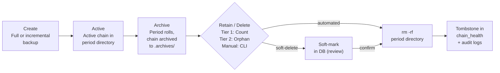

### Automated Retention System

Retention runs automatically after each successful backup via the post-backup hook:

```
post_backup_hook()                     (vmbackup_integration.sh)
  ├── run_retention_for_vm()           Tier 1: Active policy retention
  │   ├── get_vm_periods()             List period dirs matching current policy
  │   ├── count > retention_limit?     Count-based threshold
  │   └── _remove_period()             Delete oldest excess periods
  │
  └── run_orphan_retention_for_vm()    Tier 2: Orphaned policy retention
      ├── get_orphaned_periods()       Find dirs from previous rotation policies
      ├── calculate_orphan_age()       Age-based threshold (DB-backed)
      └── _remove_orphan_period()      Delete orphans exceeding max age
```

#### Tier 1: Active Policy Retention (Count-Based)

Removes the oldest period directories when the count exceeds the retention limit for the current rotation policy.

| Policy | Retention Setting | Default | Effect |
|--------|-------------------|---------|--------|
| `daily` | `RETENTION_DAYS` | 7 | Keep 7 daily period folders |
| `weekly` | `RETENTION_WEEKS` | 4 | Keep 4 weekly period folders |
| `monthly` | `RETENTION_MONTHS` | 3 | Keep 3 monthly period folders |
| `accumulate` | N/A | N/A | Chain depth limit only (see §8) |
| `never` | N/A | N/A | Excluded — no backups created |

**Decision flow:** `count_vm_periods()` counts filesystem directories matching the current policy format → if count > limit → `head -n $excess` selects the oldest → `_remove_period()` on each.

#### Tier 2: Orphaned Policy Retention (Age-Based)

When a VM's rotation policy changes (e.g., weekly → monthly), old-format period directories become orphaned. Tier 2 uses age-based cleanup:

| Setting | Default | Purpose |
|---------|---------|---------|
| `RETENTION_ORPHAN_ENABLED` | `true` | Master switch |
| `RETENTION_ORPHAN_MIN_AGE_DAYS` | 7 | Minimum age before deletion eligible |
| `RETENTION_ORPHAN_MAX_AGE_DAYS` | 90 | Delete orphans older than this |
| `RETENTION_ORPHAN_DRY_RUN` | `false` | Preview mode |

**Decision flow:** `get_orphaned_periods()` finds dirs not matching current policy format → `calculate_orphan_age()` queries DB for last successful backup age → age ≥ max_age → delete; min_age ≤ age < max_age → aging (kept); age < min_age → protected.

> **Policy change note:** When a VM's rotation policy changes (e.g., daily → weekly), old-format period directories become orphans automatically. Tier 2 protects them for `MIN_AGE` days, then deletes them after `MAX_AGE` days. The `accumulate` policy uses chain depth limits instead of period-based retention, so it does not generate orphans. See [todo-vmbackup.md](todo-vmbackup.md) for detailed scenarios.

#### Period Removal Pipeline

Both tiers ultimately call `_remove_period()` or `_remove_orphan_period()`, which follow the same pipeline:

```
_remove_period(vm_name, period_id, dry_run)
  │
  ├── [[ ! -d "$period_dir" ]] → return 0       # Already gone
  │
  ├── dry_run == "true" → log + return 0         # Preview only
  │
  ├── _is_safe_to_remove()                        # Safety validation:
  │     ├── Path under BACKUP_PATH?               #   Prevent rm -rf /
  │     ├── Not BACKUP_PATH itself?               #   Prevent rm -rf $BACKUP_PATH
  │     ├── Is a directory?                       #   Sanity check
  │     └── Depth ≥ 2 (VM/period)?               #   Prevent rm -rf vm_dir/
  │
  ├── sqlite_mark_chain_deleted()                 # DB: chain_status → 'deleted'
  │
  ├── rm -rf "$period_dir"                        # Filesystem removal
  │
  ├── log_retention_action()                      # Audit: retention_events table
  │
  └── log_file_operation()                        # Audit: file_operations table
```

### Database Audit Trail

Every retention action produces records in multiple tables, providing a complete audit history:

#### `retention_events` — Decision Audit

Records every retention decision, including dry runs and failures:

```sql
-- Example: Tier 1 deletes an old monthly period
INSERT INTO retention_events (
    session_id, vm_name, action, target_type, target_path,
    target_period, rotation_policy, retention_limit, current_count,
    age_days, freed_bytes, triggered_by, success
) VALUES (
    42, 'web-server', 'delete', 'period',
    '/mnt/backup/vms/web-server/202607',
    '202607', 'monthly', 6, 7,
    210, 5368709120, '_remove_period', 1
);
```

#### `file_operations` — Filesystem Audit

Records every file-level operation (create, move, delete):

```sql
-- Logged alongside the retention_events record
INSERT INTO file_operations (
    session_id, operation, vm_name, source_path,
    file_type, file_size_bytes, reason, triggered_by, success
) VALUES (
    42, 'delete', 'web-server',
    '/mnt/backup/vms/web-server/202607',
    'directory', 5368709120, 'Retention cleanup', '_remove_period', 1
);
```

#### `chain_health` — Lifecycle State

Chain rows persist as tombstones after deletion, recording that the data *existed* and *when* it was removed:

| State | Meaning | Reversible |
|-------|---------|------------|
| `active` | Chain is live, backups appending | N/A |
| `archived` | Chain archived (period rolled, policy change, error recovery) | No — archival is a move |
| `broken` | Chain integrity compromised (signal, checkpoint corruption) | No — needs new full |
| `deleted` | Period removed by retention or manual action | No — files gone from disk |

```sql
-- After _remove_period(), chain_health row becomes:
UPDATE chain_health SET
    chain_status = 'deleted',
    restorable_count = 0,
    break_reason = 'retention',
    deleted_at = '2026-02-17 03:00:00',
    updated_at = '2026-02-17 03:00:00'
WHERE vm_name = 'web-server' AND period_id = '202607';
-- Row is NEVER deleted — it serves as a permanent tombstone
```

### Proposed Interactive Operations Model

Three tiers of file management, escalating in destructiveness:

#### Tier 1: Inspect (Read-Only)

Read-only inspection. Browse VMs, view chain health, check period ages and sizes. No state changes.

#### Tier 2: Mark (Soft-Delete, DB-Only)

| Operation | DB Change | Disk Change | Reversible |
|-----------|-----------|-------------|------------|
| **Mark for deletion** | `chain_status='marked'`, `deleted_at=NOW()` | None | Yes — unmark reverts |
| **Unmark** | `chain_status='active'`, `deleted_at=NULL` | None | N/A |
| **Protect** | `purge_eligible=0` | None | Yes — unprotect reverts |
| **Unprotect** | `purge_eligible=1` | None | N/A |

All Tier 2 operations log to `retention_events` with `triggered_by='manual'` (versus `'_remove_period'` for automated retention). All are reversible until a Tier 3 sweep runs.

#### Tier 3: Sweep (Destructive, Disk + DB)

| Operation | What it does | Safety Requirements |
|-----------|-------------|---------------------|
| **Purge marked** | `rm -rf` everything with `chain_status='marked'` | Dry-run first, confirmation prompt, log to `file_operations` |
| **Purge orphans** | Delete old-policy period dirs exceeding age threshold | Interactive version of `run_orphan_retention_for_vm()` |
| **Purge VM** | Delete *all* data for a VM (files + DB rows → tombstones) | Double confirmation, refuse if VM is still in vmlist |
| **Compact** | Remove empty period dirs, clean up `.incomplete` / stale locks | Low-risk housekeeping |

#### Proposed State Transitions

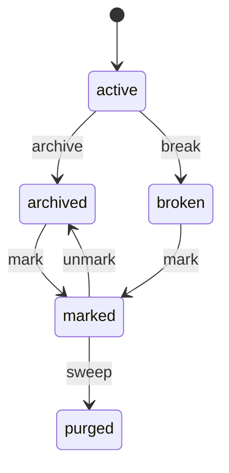

> **Notes:**
> - `marked` is a NEW state (distinct from current `deleted`)
> - `purged` = files gone, tombstone remains permanently
> - `deleted` (existing) stays as-is for backward compat with current retention
> - Protection (`purge_eligible=0`) is orthogonal — any state except `purged` can be protected

#### Architecture: Where Each Layer Lives

| Layer | Responsibility | Rationale |
|-------|---------------|-----------|
| **Shell module** (`retention_module.sh`) | All `rm -rf`, all DB writes, all safety checks | Single source of truth for safe deletion. Already has the primitives. |
| **CLI wrapper** (`vmbackup.sh --prune`) | Scriptable / cron-able interface | `--prune --dry-run`, `--prune --vm myvm`, `--purge-marked` |

---

## Failure Detection & Self-Remediation

### Multi-Layer Detection

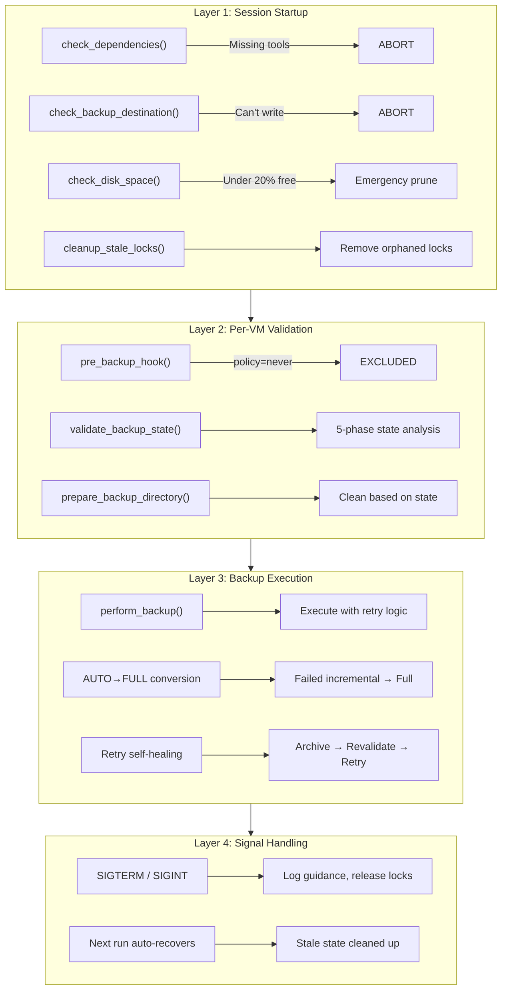

### Self-Remediation Summary

| Problem | Detection | Auto-Recovery |
|---------|-----------|---------------|
| Stale lock file | PID check | Delete if process dead |
| Orphaned QEMU checkpoint | No matching backup data | Delete checkpoint metadata |
| Stale backup metadata | Metadata without data | Delete, force FULL |
| Broken checkpoint chain | Bitmap mismatch | Archive chain, force FULL |
| Incomplete backup | `.partial` files | Clean, force FULL |
| AUTO backup fails | Exit code | Convert to FULL, retry |
| FULL backup fails | Exit code | Retry with delay |
| Script interrupted | Signal handler | Next run recovers |

---

## TPM Module Integration

### TPM Backup Flow

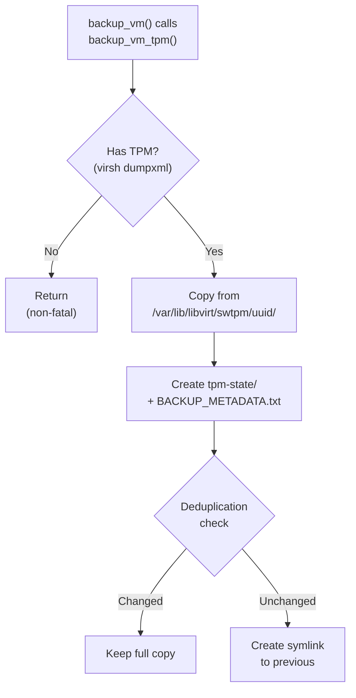

### Files Created

| File | Location | Purpose |
|------|----------|---------|
| `tpm2-*` | `<backup>/tpm-state/` | Raw TPM state files |
| `BACKUP_METADATA.txt` | `<backup>/tpm-state/` | Recovery instructions |
| `.tpm-backup-marker` | `<backup>/` | Restore identification |
| `bitlocker-recovery-keys.txt` | `<backup>/tpm-state/` | BitLocker recovery keys (when present) |

### BitLocker Recovery Key Extraction

When backing up a Windows VM with a virtual TPM, vmbackup automatically extracts BitLocker recovery keys from the running guest via the QEMU guest agent. This ensures recovery keys are available even if the TPM state becomes unusable after restore (e.g., new UUID, hardware change, or TPM corruption).

#### Prerequisites

All of the following must be true for extraction to occur:

1. `BITLOCKER_KEY_EXTRACTION=yes` (default)
2. VM is running
3. QEMU guest agent is installed and responsive inside the guest
4. Guest OS is Windows (detected via `guest-get-osinfo` → `id: mswindows`)
5. At least one volume has `Protection Status: Protection On`

If any condition is not met, extraction is silently skipped — it never blocks the backup.

#### How It Works

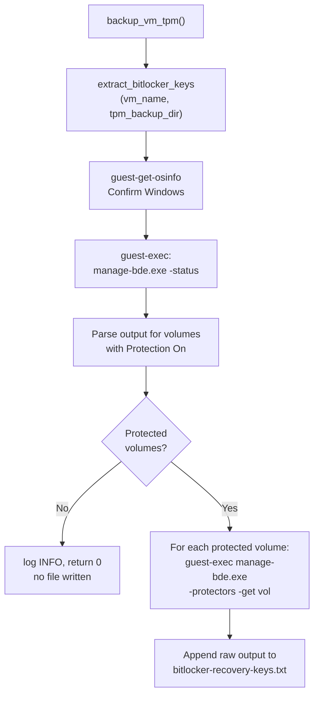

The extraction uses the QEMU guest agent's `guest-exec` command to run `C:\Windows\System32\manage-bde.exe` inside the Windows guest. This is a three-step async protocol:

1. **Launch:** `guest-exec` → returns a PID
2. **Poll:** `guest-exec-status` with PID → wait for `"exited": true`
3. **Decode:** base64-decode the `out-data` field from the response

The `_guest_exec_capture()` helper function encapsulates this pattern with proper JSON escaping of Windows paths (backslashes), configurable timeout polling, and error handling.

#### Output File Format

When keys are found, the file `tpm-state/bitlocker-recovery-keys.txt` contains the full raw `manage-bde` output — not parsed or reformatted. This preserves all details including protector IDs, backup types, and PCR validation profiles.

Example content:

```
BitLocker Recovery Keys
VM: win-vm
Extracted: 2026-03-03 16:11:39
Protected Volumes: 1
========================================

=== manage-bde -status ===
BitLocker Drive Encryption: Configuration Tool version 10.0.26100
Copyright (C) 2013 Microsoft Corporation. All rights reserved.

Disk volumes that can be protected with
BitLocker Drive Encryption:
Volume C: []
[OS Volume]

    Size:                 63.06 GB
    BitLocker Version:    2.0
    Conversion Status:    Used Space Only Encrypted
    Percentage Encrypted: 100.0%
    Encryption Method:    XTS-AES 128
    Protection Status:    Protection On
    Lock Status:          Unlocked
    Identification Field: Unknown
    Key Protectors:
        Numerical Password
        TPM

=== manage-bde -protectors -get C: ===
BitLocker Drive Encryption: Configuration Tool version 10.0.26100
Copyright (C) 2013 Microsoft Corporation. All rights reserved.

Volume C: []
All Key Protectors

    Numerical Password:
      ID: {XXXXXXXX-XXXX-XXXX-XXXX-XXXXXXXXXXXX}
      Password:
        000000-000000-000000-000000-000000-000000-000000-000000

    TPM:
      ID: {XXXXXXXX-XXXX-XXXX-XXXX-XXXXXXXXXXXX}
      PCR Validation Profile:
        7, 11
        (Uses Secure Boot for integrity validation)
```

#### File Permissions & Security

- **Permissions:** `root:root 600` — only root can read or write
- **Sensitivity:** Recovery keys provide full access to encrypted volumes. The file is stored inside `tpm-state/` alongside the TPM state files, which already require equivalent protection.

#### File Lifecycle

The key file is **overwritten on every successful extraction** — it always reflects the latest backup run. Its lifecycle inherits from the `tpm-state/` directory:

- **Archiving:** Moves with `tpm-state/` when the period chain is archived
- **Retention:** Deleted with `tpm-state/` when the period is pruned
- **Replication:** Copied with `tpm-state/` to local and cloud replication targets

No separate retention or rotation logic is needed.

#### When Recovery Keys Are Needed

After restoring a Windows VM, BitLocker may enter recovery mode if:

- The VM is restored with a **new UUID**
- The TPM state is **missing or corrupted**
- The virtual hardware configuration **changed** (different machine type, firmware)
- BitLocker detects a **Secure Boot policy change** (PCR 7/11 mismatch)

Windows will prompt for the 48-digit Numerical Password from the recovery key file.

#### Configuration

| Variable | Default | Purpose |
|----------|---------|---------|
| `BITLOCKER_KEY_EXTRACTION` | `yes` | Enable/disable BitLocker key extraction |
| `BITLOCKER_EXEC_TIMEOUT` | `30` | Timeout (seconds) for each guest-exec command |

#### Edge Cases

| Scenario | Behavior |
|----------|----------|
| VM shut off | Skipped — guest agent unreachable |
| No QEMU agent installed | Skipped — `guest-get-osinfo` fails |
| Linux guest | Skipped — `os_id != mswindows` |
| BitLocker not configured | Skipped — no volumes with Protection On |
| BitLocker suspended (Protection Off) | Skipped — no file written |
| Multiple encrypted volumes | All protected volumes extracted |
| `manage-bde` fails | Logged as WARN, returns 0 |
| Agent timeout | Respects `BITLOCKER_EXEC_TIMEOUT`, fails gracefully |

---

## Host Configuration Backup

vmbackup.sh backs up the host-level configuration needed to rebuild the virtualisation environment on a fresh OS install. This runs once per backup session (not per-VM) via `backup_host_config()`.

### What's Backed Up

The archive contains all configuration required by libvirt, QEMU, and the network bridges that VMs depend on:

| Path | Purpose |
|------|---------|
| `/etc/libvirt/` | Daemon config (`libvirtd.conf`, `qemu.conf`), VM domain XMLs, hooks, SASL/auth |
| `/var/lib/libvirt/qemu/` | QEMU runtime state, autostart symlinks |
| `/var/lib/libvirt/network/` | Virtual network definitions, DHCP leases |
| `/var/lib/libvirt/storage/` | Storage pool definitions, autostart |
| `/var/lib/libvirt/secrets/` | Libvirt secrets (encryption keys, auth credentials) |
| `/var/lib/libvirt/dnsmasq/` | DHCP lease databases for libvirt virtual networks |
| `/etc/network/` | ifupdown config (`interfaces`, `interfaces.d/`) — Debian legacy networking |
| `/etc/NetworkManager/system-connections/` | NetworkManager connection profiles (`.nmconnection` files) |

> **Network stack:** Both ifupdown and NetworkManager paths are captured unconditionally. On any given host, only one network manager is active — the other directory will be empty or contain only defaults. This ensures the backup covers both Debian networking styles without detection logic.

### What's NOT Backed Up

| Item | Why |
|------|---------|
| NVRAM (`/var/lib/libvirt/qemu/nvram/`) | Backed up per-VM by virtnbdbackup (per checkpoint) |
| TPM state (`/var/lib/libvirt/swtpm/`) | Backed up per-VM by `tpm_backup_module.sh` |
| Disk images | Backed up per-VM by virtnbdbackup |
| `/etc/fstab` | Storage mount points are host-specific — reconfigure on rebuild |
| Sysctl tunables | libvirt manages `ip_forward` at runtime; no custom sysctl files needed |
| Kernel modules (`/etc/modules-load.d/`) | Infrastructure concern, not libvirt-specific |
| AppArmor profiles | Shipped in the `.deb` package |

### Storage Location

```
$BACKUP_PATH/__HOST_CONFIG__/
└── YYYYMM/
    ├── libvirt_qemu_config_YYYYMM_FIRST.tar.gz   # First backup of the month (always kept)
    ├── libvirt_qemu_config_YYYYMMDD_HHMMSS.tar.gz # Subsequent backup (kept only if changed)
    └── ...                                         # Additional changed configs
```

### Retention Strategy

| Condition | Action |
|-----------|--------|
| First backup of the month | Always kept as `*_FIRST.tar.gz` |
| Config changed since first-of-month | Kept with timestamped filename |
| Config unchanged | Discarded (not retained) |

Change detection uses `cmp -s` (byte-for-byte comparison) against the first-of-month archive.

### Restore

The archive extracts to `/` which restores all paths to their original locations.

> **Note:** Network config files are restored but the network manager is **not** automatically restarted. The operator must manually restart networking after verifying the restored config matches the current hardware.

---

## Reports & Queries

All backup data lives in a single SQLite database (`$BACKUP_PATH/_state/vmbackup.db`). The following queries can be used directly via `sqlite3` or wrapped in shell scripts.

### Quick Reference: Database Location

```bash
# Default instance
DB="$BACKUP_PATH/_state/vmbackup.db"

# Or retrieve programmatically
DB=$(sqlite_get_db_path)
```

### Report 1: Dashboard Overview (Today)

Current session status.

```bash
sqlite3 -header -column "$DB" "
SELECT
  date(s.start_time) as date,
  s.instance,
  s.status as session_status,
  s.vms_total,
  s.vms_success,
  s.vms_failed,
  s.vms_skipped,
  s.vms_excluded,
  COALESCE(s.bytes_total,0) as bytes_total
FROM sessions s
WHERE date(s.start_time) = date('now')
ORDER BY s.start_time DESC
LIMIT 5;"
```

**Wrapper function:** `sqlite_query_today_sessions`

### Report 2: VM Backup History

Per-VM drill-down — last N backup runs with status, size, duration.

```bash
sqlite3 -header -column "$DB" "
SELECT s.start_time, vb.backup_type, vb.status,
       vb.bytes_written, vb.duration_sec, vb.restore_points
FROM vm_backups vb
JOIN sessions s ON vb.session_id = s.id
WHERE vb.vm_name = 'web-server'
ORDER BY s.start_time DESC
LIMIT 20;"
```

**Wrapper function:** `sqlite_query_vm_history "web-server" 20`

### Report 3: Monthly Summary (per VM)

Aggregated monthly stats.

```bash
sqlite3 -header -column "$DB" "
SELECT
  vm_name,
  COUNT(*) as total_runs,
  SUM(CASE WHEN status='success' THEN 1 ELSE 0 END) as success,
  SUM(CASE WHEN status='failed' THEN 1 ELSE 0 END) as failed,
  SUM(CASE WHEN status='skipped' THEN 1 ELSE 0 END) as skipped,
  SUM(CASE WHEN status='excluded' THEN 1 ELSE 0 END) as excluded,
  COALESCE(SUM(bytes_written),0) as total_bytes,
  MAX(restore_points) as peak_restore_points,
  ROUND(AVG(duration_sec),1) as avg_duration_sec,
  CASE
    WHEN SUM(CASE WHEN status='failed' THEN 1 ELSE 0 END) > 0 THEN 'DEGRADED'
    ELSE 'HEALTHY'
  END as health
FROM vm_backups
WHERE created_at >= '2026-02-01' AND created_at < '2026-03-01'
GROUP BY vm_name
ORDER BY vm_name;"
```

### Report 4: Recent Failures

VMs with failures in the last N days — ideal for alert panels.

```bash
sqlite3 -header -column "$DB" "
SELECT vm_name, COUNT(*) as failures,
       MAX(s.start_time) as last_failure,
       GROUP_CONCAT(DISTINCT COALESCE(vb.error_code,'unknown')) as error_types
FROM vm_backups vb
JOIN sessions s ON vb.session_id = s.id
WHERE vb.status = 'failed'
  AND s.start_time >= date('now', '-7 days')
GROUP BY vm_name
ORDER BY failures DESC;"
```

**Wrapper function:** `sqlite_query_recent_failures 7`

### Report 5: Date Range Statistics

Aggregated stats for any period — good for weekly/monthly dashboards.

```bash
sqlite3 -header -column "$DB" "
SELECT
  COUNT(DISTINCT s.id) as sessions,
  SUM(CASE WHEN vb.status='success' THEN 1 ELSE 0 END) as successful,
  SUM(CASE WHEN vb.status='failed' THEN 1 ELSE 0 END) as failed,
  SUM(vb.bytes_written) as total_bytes,
  ROUND(AVG(vb.duration_sec),1) as avg_duration_sec
FROM vm_backups vb
JOIN sessions s ON vb.session_id = s.id
WHERE date(s.start_time) BETWEEN '2026-02-01' AND '2026-02-28';"
```

### Report 6: Replication Status

Current session replication results — one row per endpoint.

```bash
sqlite3 -header -column "$DB" "
SELECT rr.endpoint_name, rr.endpoint_type, rr.transport,
       rr.status, rr.bytes_transferred, rr.files_transferred,
       rr.duration_sec
FROM replication_runs rr
JOIN sessions s ON rr.session_id = s.id
WHERE date(s.start_time) = date('now')
ORDER BY rr.endpoint_type, rr.endpoint_name;"
```

**Wrapper function:** `sqlite_query_today_replications`

### Report 7: Chain Health

Restorable chains per VM — critical for restoration planning.

```bash
sqlite3 -header -column "$DB" "
SELECT vm_name, period_id, chain_status, total_checkpoints,
       restorable_count, chain_location, last_backup
FROM chain_health
WHERE chain_status IN ('active','archived')
ORDER BY vm_name, period_id;"
```

**Wrapper function:** `sqlite_get_restorable_chains "web-server"`

### Report 8: Storage Trends (Daily Totals)

Per-day storage written.

```bash
sqlite3 -header -column "$DB" "
SELECT date(s.start_time) as day,
       COUNT(*) as backups,
       SUM(vb.bytes_written) as bytes_written,
       ROUND(AVG(vb.duration_sec),1) as avg_sec
FROM vm_backups vb
JOIN sessions s ON vb.session_id = s.id
WHERE s.start_time >= date('now','-30 days')
GROUP BY day
ORDER BY day;"
```

### Report 9: Retention Activity

Cleanup events — what was deleted and why.

```bash
sqlite3 -header -column "$DB" "
SELECT timestamp, vm_name, action, target_type,
       target_path, freed_bytes, triggered_by
FROM retention_events
WHERE timestamp >= date('now','-7 days')
ORDER BY timestamp DESC;"
```

### Report 10: Last Successful Backup per VM

Quick health check — shows the last successful backup for every VM.

```bash
sqlite3 -header -column "$DB" "
SELECT vb.vm_name,
       MAX(s.start_time) as last_success,
       vb.backup_type,
       vb.bytes_written
FROM vm_backups vb
JOIN sessions s ON vb.session_id = s.id
WHERE vb.status = 'success'
GROUP BY vb.vm_name
ORDER BY last_success DESC;"
```

All queries return tabular data suitable for `sqlite3 -header -column` (human-readable) or `sqlite3 -separator '|'` (pipe-delimited, for shell parsing).

**Database tables available:** `sessions`, `vm_backups`, `replication_runs`, `chain_events`, `period_events`, `file_operations`, `retention_events`, `config_events`, `chain_health`, `schema_info`

---

## SQLite Logging System

### Overview

vmbackup.sh uses **SQLite as the sole logging backend**. This provides:

- Structured relational data for complex queries
- Session-level tracking with unique IDs
- VM-to-replication association for audit trails
- Faster querying for large backup histories
- **Chain health tracking** for restoration validation
- **Complete exit path coverage** - all backup outcomes logged
- **Event tables** for chain, period, file, retention, and config events

### Schema Version

**Current Version:** 1.7 (2026-02-17)

| Version | Date | Changes |
|---------|------|---------|  
| 1.7 | 2026-02-17 | **Two-phase deletion & protection:** `marked_at`, `marked_by`, `purged_at` columns on `chain_health`. New `marked` chain status. 6 new lifecycle functions: `sqlite_mark_chain_for_deletion()`, `sqlite_unmark_chain()`, `sqlite_protect_chain()`, `sqlite_unprotect_chain()`, `sqlite_get_marked_chains()`. `purge_eligible` now enforced via `_is_period_protected()`. Keep-last guard prevents deletion of final period. INSERT OR IGNORE fallback in `sqlite_mark_chain_deleted()`. Session-active gate `sqlite_is_session_active()`. Reconciliation functions. |
| 1.6 | 2026-02-16 | **Datetime normalisation:** converted all bare local timestamps to UTC in `sessions` (`start_time`, `end_time`) and `replication_runs` (`start_time`, `end_time`). Removed duplicate `calculate_duration()` from `vmbackup.sh`. Migration script: `migrate_v1.6.sh` |
| 1.5 | 2026-02-12 | Added chain_events, config_events, file_operations, period_events, retention_events tables; extended vm_backups (+5 cols), replication_runs (+3 cols), replication_vms (+2 cols) |
| 1.3 | 2026-02-06 | Added `chain_health` table, chain lifecycle tracking |
| 1.2 | 2026-02-03 | Initial release with sessions, vm_backups, replication tables |

### Database Location

```
${BACKUP_PATH}/_state/vmbackup.db
```

Each backup instance maintains its own SQLite database.

### Timestamp Convention

All timestamps stored in the database use **UTC** (`YYYY-MM-DD HH:MM:SS`). Log output uses local time with a timezone suffix.

| Context | Convention | Example |
|---------|------------|--------|
| DB writes (`sqlite_module.sh`) | `date -u '+%Y-%m-%d %H:%M:%S'` | `2026-02-16 08:30:00` |
| DB reads via `date -d` | Append `" UTC"` suffix | `date -d "2026-02-16 08:30:00 UTC" +%s` |
| Session ID | `date +%s` (epoch, always UTC) | `1739692203` |
| Log timestamps (`log_msg`) | `date '+%Y-%m-%d %H:%M:%S %Z'` (local + TZ) | `2026-02-16 19:30:00 AEDT` |
| Rotation `period_id` | `date '+%Y%m%d'` etc. (local, intentional) | `20260216` |

Pre-1.6 databases may contain local-time timestamps. Run `migrate_v1.6.sh` (one-shot, idempotent) to convert them to UTC. See `DATETIME_BUGS.md` and `DATETIME_FIX_PLAN.md` for the full audit.

### Module Loading

The SQLite module is loaded automatically by vmbackup.sh if:
1. The `lib/sqlite_module.sh` file exists
2. The `sqlite3` command is available

If sqlite3 is not installed, backup operations continue normally without SQLite logging.

```bash
# Manual module loading (if needed)
source "$SCRIPT_DIR/lib/sqlite_module.sh"
sqlite_init_database
```

---

### Database Schema

The database contains the following core tables (plus event tables described below):

#### sessions Table

One row per vmbackup.sh invocation.

| Column | Type | Description |
|--------|------|-------------|
| `id` | INTEGER PK | Epoch timestamp as session ID |
| `instance` | TEXT | Configuration instance name |
| `start_time` | TEXT | UTC bare timestamp (`YYYY-MM-DD HH:MM:SS`, always UTC) |
| `end_time` | TEXT | UTC bare timestamp (`YYYY-MM-DD HH:MM:SS`, always UTC) |
| `duration_sec` | INTEGER | Session duration in seconds |
| `vms_total` | INTEGER | Total VMs processed |
| `vms_success` | INTEGER | Successfully backed up |
| `vms_failed` | INTEGER | Backup failures |
| `vms_skipped` | INTEGER | Skipped (offline/unchanged) |
| `vms_excluded` | INTEGER | Excluded by policy |
| `bytes_total` | INTEGER | Total bytes written |
| `status` | TEXT | 'running', 'success', 'partial', 'failed' |
| `log_file` | TEXT | Path to session log file |

#### vm_backups Table

One row per VM backup attempt.

| Column | Type | Description |
|--------|------|-------------|
| `id` | INTEGER PK | Auto-increment ID |
| `session_id` | INTEGER FK | References sessions(id) |
| `vm_name` | TEXT | Virtual machine name |
| `vm_status` | TEXT | 'running', 'shut off', 'paused' |
| `os_type` | TEXT | Detected OS type |
| `backup_type` | TEXT | 'full', 'auto', 'copy', 'n/a' |
| `backup_method` | TEXT | 'agent', 'paused', 'offline', 'excluded' |
| `rotation_policy` | TEXT | 'daily', 'weekly', 'monthly', etc. |
| `status` | TEXT | 'success', 'failed', 'skipped', 'excluded' |
| `bytes_written` | INTEGER | Bytes written this backup |
| `chain_size_bytes` | INTEGER | Total chain size |
| `total_dir_bytes` | INTEGER | Total directory size |
| `restore_points` | INTEGER | Checkpoint count |
| `duration_sec` | INTEGER | Backup duration |
| `backup_path` | TEXT | Backup directory path |
| `log_file` | TEXT | Per-VM log file |
| `error_code` | TEXT | Error identifier |
| `error_message` | TEXT | Error description |
| `qemu_agent` | INTEGER | 0/1 - guest agent used |
| `vm_paused` | INTEGER | 0/1 - VM was paused |
| `chain_archived` | INTEGER | 0/1 - chain was archived |
| `restore_points_before` | INTEGER | Restore points before this backup |
| `retry_attempt` | INTEGER | Retry count (0 = first attempt) |
| `archived_restore_points` | INTEGER | Restore points moved to archive |
| `event_type` | TEXT | Event classification |
| `event_detail` | TEXT | Human-readable event context |
| `created_at` | TEXT | Record creation timestamp |

#### replication_runs Table

One row per replication endpoint sync.

| Column | Type | Description |
|--------|------|-------------|
| `id` | INTEGER PK | Auto-increment ID |
| `session_id` | INTEGER FK | References sessions(id) |
| `endpoint_name` | TEXT | Destination identifier |
| `endpoint_type` | TEXT | 'local' or 'cloud' |
| `transport` | TEXT | 'local', 'ssh', 'smb', 'sharepoint', 'backblaze' |
| `sync_mode` | TEXT | 'mirror' or 'accumulate' |
| `destination` | TEXT | Remote path or URL |
| `start_time` | TEXT | UTC bare timestamp (`YYYY-MM-DD HH:MM:SS`, always UTC) |
| `end_time` | TEXT | UTC bare timestamp (`YYYY-MM-DD HH:MM:SS`, always UTC) |
| `duration_sec` | INTEGER | Sync duration |
| `bytes_transferred` | INTEGER | Bytes synced |
| `files_transferred` | INTEGER | Files synced |
| `status` | TEXT | 'success', 'failed', 'skipped' |
| `error_message` | TEXT | Error description |
| `log_file` | TEXT | Replication log file |
| `dest_avail_bytes` | INTEGER | Available space (local) |
| `dest_total_bytes` | INTEGER | Total space (local) |
| `dest_space_known` | INTEGER | 0/1 - space was checked |
| `throttle_count` | INTEGER | API throttle events (cloud) |
| `bwlimit_final` | TEXT | Final bandwidth limit |
| `retry_attempt` | INTEGER | Retry count (0 = first attempt) |
| `backup_timestamp` | TEXT | Timestamp of source backup |
| `destination_path` | TEXT | Resolved destination path |

#### replication_vms Table

Junction table: VMs included in each replication run.

| Column | Type | Description |
|--------|------|-------------|
| `id` | INTEGER PK | Auto-increment ID |
| `run_id` | INTEGER FK | References replication_runs(id) |
| `vm_name` | TEXT | VM included in replication |
| `bytes_transferred` | INTEGER | Bytes transferred for this VM |
| `status` | TEXT | 'success', 'failed', 'skipped' |

**Unique constraint:** `(run_id, vm_name)` - prevents duplicate entries.

---

### Chain Health Tracking

The `chain_health` table tracks the lifecycle of backup chains for restoration validation. This is the **authoritative source** for determining which chains are restorable.

#### chain_health Table

| Column | Type | Description |
|--------|------|-------------|
| `id` | INTEGER PK | Auto-increment ID |
| `vm_name` | TEXT | Virtual machine name |
| `period_id` | TEXT | Period identifier (e.g., "202602", "2026-W07", "20260215") |
| `chain_location` | TEXT | Backup directory path (or archive path once archived) |
| `chain_status` | TEXT | 'active', 'archived', 'broken', 'marked', 'deleted' |
| `rotation_policy` | TEXT | 'daily', 'weekly', 'monthly' (inferred from period_id format if not set) |
| `total_checkpoints` | INTEGER | Total checkpoints in chain |
| `restorable_count` | INTEGER | Count of actually restorable checkpoints |
| `broken_at` | INTEGER | Checkpoint index where chain broke (NULL if healthy) |
| `break_reason` | TEXT | Error type and message (NULL if healthy) |
| `first_backup` | TEXT | Timestamp of first backup in chain |
| `last_backup` | TEXT | Timestamp of most recent backup in chain |
| `archived_at` | TEXT | Archive timestamp (NULL if not archived) |
| `deleted_at` | TEXT | Deletion timestamp (NULL if not deleted) |
| `archive_size_bytes` | INTEGER | Size for retention reporting |
| `purge_eligible` | INTEGER | 0=protected, 1=can delete (default: 1) |
| `marked_at` | TEXT | UTC timestamp when marked for deletion |
| `marked_by` | TEXT | Who marked: 'retention-policy', 'tui-manual', 'cli' |
| `purged_at` | TEXT | UTC timestamp when files actually removed |
| `created_at` | TEXT | Record creation timestamp |
| `updated_at` | TEXT | Last update timestamp |

**Unique constraint:** `(vm_name, period_id)` — one record per chain per period.

#### Chain Status Values

| Status | Meaning | Restorable? |
|--------|---------|-------------|
| `active` | Chain is in use for current backups | Yes (up to `restorable_count`) |
| `archived` | Chain moved to archive directory | Yes (all checkpoints) |
| `broken` | Chain interrupted mid-backup | Partial (up to `broken_at - 1`) |
| `marked` | Soft-deleted, pending review/purge | Yes (files still on disk) |
| `deleted` | Chain removed by retention policy | No |

---

### Event Tables

Structured event tables for chain, period, file, retention, and config lifecycle tracking. All are append-only audit trails.

#### chain_events Table

Records chain lifecycle transitions (created, archived, broken, deleted).

| Column | Type | Description |
|--------|------|-------------|
| `id` | INTEGER PK | Auto-increment ID |
| `session_id` | INTEGER FK | References sessions(id) |
| `timestamp` | TEXT | UTC timestamp |
| `vm_name` | TEXT | Virtual machine name |
| `event_type` | TEXT | 'chain_created', 'chain_archived', 'chain_deleted', 'chain_broken' |
| `chain_id` | TEXT | Chain identifier |
| `period_id` | TEXT | Period identifier |
| `backup_dir` | TEXT | Backup directory path |
| `chain_location` | TEXT | Chain location on disk |
| `chain_start_time` | TEXT | First backup in chain |
| `chain_end_time` | TEXT | Last backup in chain |
| `checkpoint_count` | INTEGER | Number of checkpoints |
| `full_backup_file` | TEXT | Full backup filename |
| `total_chain_bytes` | INTEGER | Total chain size |
| `archive_reason` | TEXT | Why chain was archived |
| `archive_trigger` | TEXT | What triggered archival |
| `source_backup_type` | TEXT | Backup type that triggered event |
| `covers_from` | TEXT | Earliest date coverage |
| `covers_to` | TEXT | Latest date coverage |
| `restore_point_ids` | TEXT | Comma-separated restore point IDs |

#### config_events Table

Records configuration changes, policy overrides, and system events.

| Column | Type | Description |
|--------|------|-------------|
| `id` | INTEGER PK | Auto-increment ID |
| `session_id` | INTEGER FK | References sessions(id) |
| `timestamp` | TEXT | UTC timestamp |
| `event_type` | TEXT | 'config_loaded', 'policy_applied', 'policy_override', 'policy_changed', 'config_missing', 'config_error', 'script_start', 'script_end', 'audit_start', 'audit_complete', 'manifest_rebuilt', 'state_backup', 'lock_contention' |
| `config_source` | TEXT | Configuration file path |
| `vm_name` | TEXT | VM name (if VM-specific) |
| `setting_name` | TEXT | Configuration key |
| `setting_value` | TEXT | Current value |
| `previous_value` | TEXT | Previous value (for change detection) |
| `applied_to` | TEXT | What the setting was applied to |
| `triggered_by` | TEXT | What triggered the event |
| `detail` | TEXT | Human-readable context |

#### file_operations Table

Records file-level operations (create, move, copy, delete, archive, rename).

| Column | Type | Description |
|--------|------|-------------|
| `id` | INTEGER PK | Auto-increment ID |
| `session_id` | INTEGER FK | References sessions(id) |
| `timestamp` | TEXT | UTC timestamp |
| `operation` | TEXT | 'create', 'move', 'copy', 'delete', 'archive', 'rename' |
| `vm_name` | TEXT | Virtual machine name |
| `source_path` | TEXT | Source file path |
| `dest_path` | TEXT | Destination path (if applicable) |
| `file_type` | TEXT | File type descriptor |
| `file_size_bytes` | INTEGER | File size in bytes |
| `verification_data` | TEXT | Verification info (checksum etc.) |
| `reason` | TEXT | Why operation was performed |
| `triggered_by` | TEXT | What triggered the operation |
| `success` | INTEGER | 1=success, 0=failed |
| `error_message` | TEXT | Error description (if failed) |

#### period_events Table

Records period boundary transitions (created, closed, archived, deleted).

| Column | Type | Description |
|--------|------|-------------|
| `id` | INTEGER PK | Auto-increment ID |
| `session_id` | INTEGER FK | References sessions(id) |
| `timestamp` | TEXT | UTC timestamp |
| `vm_name` | TEXT | Virtual machine name |
| `event_type` | TEXT | 'period_created', 'period_closed', 'period_archived', 'period_deleted' |
| `period_id` | TEXT | Period identifier |
| `rotation_policy` | TEXT | Rotation policy in effect |
| `period_dir` | TEXT | Period directory path |
| `period_start` | TEXT | Period start date |
| `period_end` | TEXT | Period end date |
| `chains_count` | INTEGER | Number of chains in period |
| `total_restore_points` | INTEGER | Total restore points |
| `total_bytes` | INTEGER | Total size in bytes |
| `previous_period` | TEXT | Previous period identifier |
| `archive_location` | TEXT | Archive path (if archived) |
| `retention_remaining` | INTEGER | Periods remaining before retention |

#### retention_events Table

Records retention policy enforcement actions (delete, archive, keep, skip, error).

| Column | Type | Description |
|--------|------|-------------|
| `id` | INTEGER PK | Auto-increment ID |
| `session_id` | INTEGER FK | References sessions(id) |
| `timestamp` | TEXT | UTC timestamp |
| `vm_name` | TEXT | Virtual machine name |
| `action` | TEXT | 'delete', 'archive', 'keep', 'skip', 'error' |
| `target_type` | TEXT | 'period', 'chain', 'orphan_period', 'orphan_file' |
| `target_path` | TEXT | Path to target |
| `target_period` | TEXT | Period identifier of target |
| `rotation_policy` | TEXT | Rotation policy in effect |
| `retention_limit` | INTEGER | Configured retention limit |
| `current_count` | INTEGER | Current count before action |
| `age_days` | INTEGER | Age of target in days |
| `freed_bytes` | INTEGER | Bytes freed by action |
| `preserve_reason` | TEXT | Why target was preserved (if kept) |
| `triggered_by` | TEXT | What triggered the action |
| `success` | INTEGER | 1=success, 0=failed |

---

#### Chain Health Functions

##### sqlite_update_chain_health

Updates or inserts chain health record after each backup. Uses `INSERT ... ON CONFLICT DO UPDATE` for upsert behaviour. Rotation policy is inferred from `period_id` format if not provided (weekly=`YYYY-WNN`, daily=`YYYYMMDD`, monthly=`YYYYMM`).

```bash
sqlite_update_chain_health \
  "vm-name" \           # VM name
  "202602" \            # Period ID
  "/mnt/backup/vm-name/202602" \  # Chain location (backup dir)
  "active" \            # Status (active|archived|broken|deleted)
  15 \                  # Checkpoint count
  "" \                  # Error type (optional)
  "" \                  # Error message (optional)
  "monthly"             # Rotation policy (optional, inferred if empty)
```

##### sqlite_archive_chain

Marks a chain as archived. Updates `chain_location` to the archive path and sets `archived_at`.

```bash
sqlite_archive_chain \
  "vm-name" \           # VM name
  "202601" \            # Period ID
  "/mnt/backup/vm-name/202601" \  # Original chain location
  "/mnt/backup/vm-name/.archives/202601" \  # Archive path (optional)
  5368709120            # Total size in bytes (optional)
```

##### sqlite_mark_chain_broken

Records chain break point when backup is interrupted. Uses upsert — creates the record if it doesn't already exist.

```bash
sqlite_mark_chain_broken \
  "vm-name" \           # VM name
  "202602" \            # Period ID
  "/mnt/backup/vm-name/202602" \  # Chain location
  23 \                  # Broken at checkpoint index
  "SIGINT at 60%"       # Error message
```

##### sqlite_mark_chain_deleted

Records chain deletion by retention policy or space cleanup. Uses `INSERT OR IGNORE` to ensure the row exists, then `UPDATE` to set status. Refuses to re-delete chains already in `deleted` or `purged` status.

```bash
sqlite_mark_chain_deleted \
  "vm-name" \           # VM name
  "202601" \            # Period ID
  "/mnt/backup/vm-name/202601" \  # Chain location (use '.' for unknown)
  "retention"           # Reason: 'retention' or 'space_cleanup'
```

##### sqlite_mark_chain_for_deletion

Soft-deletes a chain (two-phase model). Sets `chain_status='marked'` and records `marked_at`/`marked_by`. Files remain on disk until purge. Refuses to mark protected chains (`purge_eligible=0`).

```bash
sqlite_mark_chain_for_deletion \
  "vm-name" \           # VM name
  "202601" \            # Period ID
  "tui-manual"          # Marked by: 'tui-manual', 'cli', 'retention-policy'
```

##### sqlite_unmark_chain

Reverts a marked chain back to `active` status. Clears `marked_at` and `marked_by`. Only operates on chains with `chain_status='marked'`.

```bash
sqlite_unmark_chain "vm-name" "202601"
```

##### sqlite_protect_chain

Sets `purge_eligible=0` on a chain, preventing both automated retention and manual deletion.

```bash
sqlite_protect_chain "vm-name" "202601"
```

##### sqlite_unprotect_chain

Removes protection from a chain, setting `purge_eligible=1`.

```bash
sqlite_unprotect_chain "vm-name" "202601"
```

##### sqlite_get_marked_chains

Returns all chains with `chain_status='marked'`, ordered by `marked_at`.

```bash
sqlite_get_marked_chains
# Output (tab-separated):
# vm-name    202601    2026-02-17 10:30:00    retention-policy
```

##### sqlite_is_session_active

Safety gate for destructive operations. Checks if any backup session is currently running (`status='running'`).

```bash
sqlite_is_session_active
# Returns: 0 if a session IS active (do NOT proceed), 1 if safe
# Prints running session count to stdout
```

##### sqlite_get_restorable_chains

Returns JSON array of restorable chains for a VM (status in 'active', 'archived', 'broken' with `restorable_count > 0`).

```bash
sqlite_get_restorable_chains "vm-name"
# Output: JSON array with vm_name, period_id, chain_location, chain_status,
#         restorable_count, total_checkpoints, broken_at, first_backup, last_backup
```

##### sqlite_chain_health_summary

Returns formatted summary table grouped by VM, showing chain counts by status and total restore points. Excludes `deleted` and `purged` chains.

```bash
sqlite_chain_health_summary
# Output:
# vm_name     total_chains  active  archived  broken  marked  total_restore_points
# web-server  3             1       2         0       0       45
```

---

### SQLite Logging Coverage

**All backup exit paths are logged to SQLite.** The `_log_vm_backup_summary()` function ensures every backup outcome is recorded:

| Scenario | Status | Logged |
|----------|--------|--------|
| Backup completed successfully | SUCCESS | ✓ |
| VM excluded by policy | EXCLUDED | ✓ |
| Offline VM unchanged | SKIPPED | ✓ |
| Backup already in progress | SKIPPED | ✓ |
| Lock creation failed | FAILED | ✓ |
| Offline archive failed | FAILED | ✓ |
| Policy change archive failed | FAILED | ✓ |
| Checkpoint delete failed | FAILED | ✓ |
| Checkpoint corruption (warn mode) | FAILED | ✓ |
| Checkpoint corruption (recovery disabled) | FAILED | ✓ |
| VM pause failed | FAILED | ✓ |
| Backup operation failed | FAILED | ✓ |
| Backup verification failed | FAILED | ✓ |

---

### Query Functions

The SQLite module provides query helpers for diagnostics, email reporting, and administration.

#### Diagnostic Queries

##### sqlite_query_today_sessions

Returns all backup sessions from today.

```bash
sqlite_query_today_sessions
# Output:
# id         instance    start_time          status     vms_success  vms_failed
# 1770147143 default     2026-02-03 10:00:00 success    5            0
```

##### sqlite_query_vm_history

Returns backup history for a specific VM.

```bash
sqlite_query_vm_history "web-server" 10
# Returns last 10 backups for web-server
```

##### sqlite_query_last_success

Returns the most recent successful backup for a VM.

```bash
sqlite_query_last_success "web-server"
# Output: 2026-02-03 10:15:32|full|/mnt/backup/web-server|1073741824
```

##### sqlite_query_recent_failures

Returns VMs with failures in the last N days.

```bash
sqlite_query_recent_failures 7
# Returns VMs with failures grouped by count
```

##### sqlite_query_today_replications

Returns replication runs for today's sessions.

```bash
sqlite_query_today_replications
# Output:
# endpoint_name  endpoint_type  status   bytes_transferred  duration_sec
# nas-local      local          success  5368709120         45
```

##### sqlite_get_last_rotation_policy

Returns the last rotation policy used for a VM (from the most recent successful backup).

```bash
sqlite_get_last_rotation_policy "web-server"
# Output: monthly
```

#### Email Report Queries

Session-scoped queries used by the email report module. All accept an optional session ID (defaults to current session) and return pipe-delimited rows.

##### sqlite_query_session_vm_backups

Returns all VM backup records for a session. Used to build per-VM detail sections.

```bash
sqlite_query_session_vm_backups
# Returns pipe-delimited rows:
# vm_name|vm_status|os_type|backup_type|backup_method|status|bytes_written|
# chain_size_bytes|total_dir_bytes|restore_points|restore_points_before|
# duration_sec|error_code|error_message|event_type|event_detail|
# qemu_agent|vm_paused|chain_archived|rotation_policy
```

##### sqlite_query_session_replication

Returns all replication runs for a session. Used to build replication sections.

```bash
sqlite_query_session_replication
# Returns pipe-delimited rows:
# endpoint_name|endpoint_type|transport|status|bytes_transferred|
# files_transferred|duration_sec|destination|error_message
```

##### sqlite_query_session_summary

Returns session-level summary counts (single row). Used for the email subject line.

```bash
sqlite_query_session_summary
# Returns: vms_total|vms_success|vms_failed|vms_skipped|vms_excluded|bytes_total|status
```

#### Configuration Change Detection

##### sqlite_query_previous_config_value

Returns the value of a setting from the previous session with the same instance. Used for detecting configuration changes between runs.

```bash
sqlite_query_previous_config_value "RETENTION_MONTHS"
# Output: 3
```

##### sqlite_query_previous_config_settings

Returns all setting names matching a prefix from the previous session. Used for detecting removed endpoints.

```bash
sqlite_query_previous_config_settings "LOCAL_DEST_"
# Output (newline-separated):
# LOCAL_DEST_1_PATH
# LOCAL_DEST_1_TRANSPORT
# LOCAL_DEST_2_PATH
```

#### Utility Functions

##### sqlite_query (Custom)

Execute arbitrary SQL queries.

```bash
sqlite_query "SELECT vm_name, COUNT(*) FROM vm_backups GROUP BY vm_name;"
```

##### sqlite_is_available

Returns 0 if the SQLite module is loaded and available.

```bash
if sqlite_is_available; then
    echo "SQLite logging active"
fi
```

##### sqlite_get_db_path

Returns the database file path.

```bash
sqlite_get_db_path
# Output: /mnt/backup/vms/_state/vmbackup.db
```

##### sqlite_get_schema_version

Returns the current schema version from the database.

```bash
sqlite_get_schema_version
# Output: 1.7
```

---

### Event Logging Functions

These functions write to the event tables. They are called internally by vmbackup modules during backup operations.

| Function | Target Table | Purpose |
|----------|-------------|---------|
| `sqlite_log_chain_event()` | `chain_events` | Chain lifecycle transitions (15 positional args) |
| `sqlite_log_config_event()` | `config_events` | Configuration changes and system events (9 positional args) |
| `sqlite_log_file_operation()` | `file_operations` | File create/move/copy/delete/archive (11 positional args) |
| `sqlite_log_period_event()` | `period_events` | Period boundary transitions (13 positional args) |
| `sqlite_log_retention_event()` | `retention_events` | Retention policy enforcement actions (13 positional args) |

---

### Direct Database Access

You can query the database directly using sqlite3:

```bash
# Open database
sqlite3 /mnt/backup/vms/_state/vmbackup.db

# List tables
.tables

# Show schema
.schema sessions

# Query recent sessions
SELECT * FROM sessions ORDER BY id DESC LIMIT 5;

# Find failed VMs
SELECT vm_name, error_message FROM vm_backups WHERE status='failed';

# Join sessions with backups
SELECT s.start_time, vb.vm_name, vb.status 
FROM sessions s 
JOIN vm_backups vb ON s.id = vb.session_id 
WHERE date(s.start_time) = date('now');
```

---

## Session Summary & Tracking

### VM Categories

The session summary accurately tracks VMs in four categories:

| Category | Symbol | Meaning |
|----------|--------|---------|
| **Backed Up** | ✓ | VM was actually backed up |
| **Excluded** | ○ | VM excluded by policy (never) or pattern |
| **Skipped** | ◇ | Offline VM with unchanged disks |
| **Failed** | ✗ | Backup attempt failed |

### Return Codes

```bash
BACKUP_RC_SUCCESS=0   # Backup completed or VM unchanged
BACKUP_RC_FAILED=1    # Backup error
BACKUP_RC_EXCLUDED=2  # Excluded by policy (not counted as success)
```

### Session Summary Format

```
╔══════════════════════════════════════════════════════════════════════════════════════════════════════════╗
║                                  VM BACKUP SESSION SUMMARY                                              ║
╠══════════════════════════════════════════════════════════════════════════════════════════════════════════╣
║  Total VMs: 10
║
║  ✓ Backed Up: 3  (daily: 0, weekly: 0, monthly: 3, accumulate: 0)
║  ○ Excluded:  5  (policy=never or pattern match)
║  ◇ Skipped:   2  (offline/unchanged)
║  ✗ Failed:    0
╠══════════════════════════════════════════════════════════════════════════════════════════════════════════╣
║  VM NAME               │ STATUS   │ TYPE  │ POLICY    │ DURATION │ CHKPTS │ SIZE        │ ERROR
╠══════════════════════════════════════════════════════════════════════════════════════════════════════════╣
║  web-server            │ SUCCESS  │ auto  │ monthly   │ 00:05:12 │ 6      │ 1.2GiB      │
║  database              │ SUCCESS  │ auto  │ daily     │ 00:12:34 │ 15     │ 4.5GiB      │
║  dev-vm                │ SUCCESS  │ full  │ monthly   │ 00:23:45 │ 1      │ 8.9GiB      │
║  template-win11        │ EXCLUDED │ n/a   │ never     │ 00:00:00 │ 0      │ N/A         │
║  offline-vm            │ SKIPPED  │ n/a   │ monthly   │ 00:00:00 │ 3      │ N/A         │
╚══════════════════════════════════════════════════════════════════════════════════════════════════════════╝
```

---

## Email Reporting System

### Overview

The email report module (`email_report_module.sh`) generates plaintext reports and sends them via `msmtp`. It reads **exclusively from the SQLite database** using session-scoped queries.

**Data sources:**

| Data | Source | Function |
|------|--------|----------|
| VM backup details | SQLite `vm_backups` table | `sqlite_query_session_vm_backups()` |
| Subject line counts | SQLite `sessions` table | `sqlite_query_session_summary()` |
| Replication details | SQLite `replication_runs` table | `sqlite_query_session_replication()` |
| Chain health | SQLite `chain_health` table | `sqlite_chain_health_summary()` |
| Storage info | Filesystem (`df`/`du`) | Direct |
| Log attachment | `vmbackup.log` (session-filtered) | `get_todays_log()` |

### Email Format

**Subject Line:**
- Success: `VM Backup - 3 backed up, 5 excluded - OK`
- Failure: `VM Backup - 3 backed up, 5 excluded, 1 FAILED`

**Body Structure:**
```
VM Backup Report
================
Host:     <hostname>
Date:     YYYY-MM-DD
Started:  HH:MM:SS
Finished: HH:MM:SS
Duration: Xh Ym Zs

Total VMs: 10
  ✓ Backed Up: 3
  ○ Excluded:  5 (policy=never)
  ◇ Skipped:   2 (offline unchanged)
  ✗ Failed:    0

Total Written: X.X GiB

────────────────────────────────
VM: <vm-name>
────────────────────────────────
Status:          SUCCESS
OS:              <detected OS>
VM State:        running
Backup Type:     incremental
Consistency:     Agent
Duration:        Xm Ys
...
```

### Configuration

| Variable | Description |
|----------|-------------|
| `EMAIL_RECIPIENT` | Destination email address |
| `EMAIL_SENDER` | From address |
| `EMAIL_HOSTNAME` | Host identifier in reports |

---

## Interrupt Recovery

### Interrupt Causes

| Cause | Detection | Recovery |
|-------|-----------|----------|
| systemd timeout | SIGTERM | Next run cleans up |
| User kill (Ctrl+C) | SIGINT | Next run cleans up |
| OOM killer | Process death | Next run cleans up |
| System reboot | No signal | Next run cleans up |

### What Gets Left Behind

- Stale lock files (`vmbackup-<vm>.lock`)
- Orphaned QEMU checkpoints
- Partial `.data` files
- Orphaned metadata (`*.copy.qcow.json`)

### Interrupt Guard (`_BACKUP_IN_PROGRESS`)

SIGINT/SIGTERM during fstrim or VSS pauses previously triggered the interrupt handler, which would falsely mark the backup chain as broken even though no backup was in progress. A `_BACKUP_IN_PROGRESS` flag now guards against this:

- Set to `1` when `perform_backup()` begins
- Cleared to `0` when `perform_backup()` completes
- `_log_interrupted_chain()` only marks chain broken when `_BACKUP_IN_PROGRESS=1`

### Automatic Recovery

On next run:
1. `cleanup_stale_locks()` - Remove locks with dead PIDs
2. `cleanup_orphaned_checkpoints()` - Remove checkpoints without data
3. `validate_backup_state()` - Detect incomplete state
4. `prepare_backup_directory()` - Clean partial files
5. Proceed with FULL backup

---

## File Inventory

All paths below are relative to `$BACKUP_PATH/` (instance-specific backup directory).

### Backup Files

| File | Location | Purpose |
|------|----------|---------|
| `vda.full.data` | `<vm>/` | Full backup image |
| `vda.copy.data` | `<vm>/` | Offline copy backup |
| `vda.inc.virtnbdbackup.N.data` | `<vm>/` | Incremental N |
| `<vm>.cpt` | `<vm>/` | Checkpoint list (JSON) |
| `virtnbdbackup.N.xml` | `<vm>/checkpoints/` | Checkpoint metadata |

### State Files

| File | Location | Purpose |
|------|----------|---------|
| `.agent-status` | `<vm>/` | Cached agent availability |
| `.full-backup-month` | `<vm>/` | Month of last full |
| `vmbackup.db` | `_state/` | SQLite logging database |
| `.last_month` | `_state/` | Month boundary detection file |
| `cloud_replication_state.txt` | `_state/` | Cloud replication tracking (invalidated at session start, regenerated when cloud replication runs) |
| `local_replication_state.txt` | `_state/` | Local replication tracking (invalidated at session start, regenerated when local replication runs) |
| `vmbackup-<vm>.lock` | `_state/locks/` | Per-VM lock file |

### Log Files

vmbackup creates extensive logs across several directories. **No automatic log rotation is implemented** — logs accumulate indefinitely unless manually purged.

#### Main Session Log

| File | Location | Purpose | Accumulation |
|------|----------|---------|--------------|
| `vmbackup.log` | `_state/logs/` | Main session log (appended each run) | Grows indefinitely |

#### Per-VM Backup Logs

virtnbdbackup output is captured per-VM per-backup:

| Pattern | Location | Purpose |
|---------|----------|---------|
| `backup_<vm>_<epoch>.log` | `_state/logs/` | virtnbdbackup stdout/stderr for each backup |

**Example:** `backup_my-vm_1739030406.log` — log from backup run at Unix epoch 1739030406.

#### Replication Logs

Each replication operation creates a timestamped log:

| Pattern | Location | Purpose |
|---------|----------|---------|
| `<endpoint>_<date>_<time>.log` | `_state/replication_logs/cloud/` | Cloud endpoint replication logs |
| `<transport>_<date>_<time>.log` | `_state/replication_logs/local/` | Local transport logs (local, ssh, smb) |

**Examples:**
- `cloudprovider_20260212_020134.log` — Cloud upload log
- `local_20260212_020134.log` — Local rsync log

#### Email Debug Logs

Debug output from email report generation:

| Pattern | Location | Purpose |
|---------|----------|---------|
| `debug_<epoch>.log` | `_state/email/` | Email report generation debug |
| `db_query_<epoch>.log` | `_state/email/` | Database query debug output |

### State Backups

Daily state snapshots provide disaster recovery for the `_state/` directory:

| Pattern | Location | Purpose | Rotation |
|---------|----------|---------|----------|
| `state-<YYYYMMDD>.tar.gz` | `_state/backups/` | Daily snapshot of critical state files | `STATE_BACKUP_KEEP_DAYS` (default: 90) |

**Contents of state backups:**
- `vmbackup.db` — SQLite database
- `.last_month` — Month boundary file
- `cloud_replication_state.txt` — Cloud tracking
- `local_replication_state.txt` — Local tracking
- `locks/` — Lock files (usually empty at backup time)
- `logs/` — All log files (vmbackup.log + per-VM logs)
- `replication_logs/` — Cloud and local replication logs
- `email/` — Email debug logs

**Exclusions:** `backups/` directory and `*.lock` files are excluded from the archive.

**Cleanup:** State backups older than `STATE_BACKUP_KEEP_DAYS` are automatically purged.

### Log Retention & Cleanup

Log files are automatically cleaned up after being captured in state backups:

| Setting | Default | Purpose |
|---------|---------|--------|
| `STATE_BACKUP_KEEP_DAYS` | 90 | Days to keep state-*.tar.gz archives |
| `LOG_KEEP_DAYS` | 30 | Days to keep live log files |

**Cleanup behavior (`cleanup_old_logs()`):**
1. Daily state backup created (captures all current logs)
2. Old state archives deleted (> `STATE_BACKUP_KEEP_DAYS`)
3. Old log files deleted (> `LOG_KEEP_DAYS`)

| Directory | Contents | Rotation |
|-----------|----------|----------|
| `_state/logs/` | vmbackup.log + per-VM logs | `LOG_KEEP_DAYS` (per-VM only) |
| `_state/replication_logs/cloud/` | Cloud endpoint logs | `LOG_KEEP_DAYS` |
| `_state/replication_logs/local/` | Local transport logs | `LOG_KEEP_DAYS` |
| `_state/email/` | Email debug files | `LOG_KEEP_DAYS` |
| `_state/backups/` | State backup archives | `STATE_BACKUP_KEEP_DAYS` |

> **Note:** The main `vmbackup.log` file is not rotated (single appending file). Per-VM logs (`backup_<vm>_<epoch>.log`) are cleaned up after `LOG_KEEP_DAYS`.

---

## Replication Architecture

### Overview

Replication runs after backup completes, copying backups to secondary storage. Two replication systems operate independently:

- **Local Replication**: Local/SSH/SMB to NAS or remote servers via rsync
- **Cloud Replication**: SharePoint/Backblaze via rclone

### Replication Order (vmbackup.conf)

The `REPLICATION_ORDER` setting in `vmbackup.conf` controls execution:

| Value | Behavior | Use Case |
|-------|----------|----------|
| `simultaneous` | Run local and cloud in parallel | Fastest, default |
| `local_first` | Complete local before starting cloud | Ensure local copy first |
| `cloud_first` | Complete cloud before starting local | Rare, offsite priority |

```bash
# In vmbackup.conf
REPLICATION_ORDER="simultaneous"
```

> **Note:** The old `CLOUD_REPLICATION_WAIT_FOR_LOCAL` in replication_cloud.conf is **deprecated**. Use `REPLICATION_ORDER` in vmbackup.conf instead.

### Local Replication (replication_local_module.sh)

Syncs backups to secondary local/NAS storage via rsync.

**Configuration:** `config/<instance>/replication_local.conf`

**Key Settings:**

| Setting | Values | Description |
|---------|--------|-------------|
| `REPLICATION_ENABLED` | yes/no | Master enable |
| `REPLICATION_ON_FAILURE` | continue/abort | Error handling |
| `REPLICATION_SPACE_CHECK` | skip/warn/disabled | Pre-replication space check |
| `REPLICATION_MIN_FREE_PERCENT` | 0-100 | Minimum free space threshold |
| `DEST_N_TRANSPORT` | local/ssh/smb | Protocol for destination N |
| `DEST_N_SYNC_MODE` | mirror/accumulate | Delete behavior |
| `DEST_N_VERIFY` | none/size/checksum | Post-sync verification |

**Key Functions:**

| Function | Purpose | Returns |
|----------|---------|---------|
| `load_local_replication_module()` | Load config, discover destinations | Sets REPLICATION_ENABLED |
| `replicate_batch()` | Sync all backups to all destinations | Status per destination |
| `get_replication_summary()` | Format summary for email | Text summary |

### Cloud Replication (replication_cloud_module.sh)

Uploads backups to cloud storage via rclone.

**Configuration:** `config/<instance>/replication_cloud.conf`

**Authentication:** For SharePoint, see [Cloud Authentication (SharePoint)](#cloud-authentication-sharepoint) for setup instructions and the three-layer configurability model (site URL, document library, folder are all independently configurable).

**Global Settings Reference:**

| Setting | Values | Default | Description |
|---------|--------|---------|-------------|
| `CLOUD_REPLICATION_ENABLED` | yes/no | no | Master enable |
| `CLOUD_REPLICATION_SCOPE` | everything/archives-only/monthly | everything | What to upload |
| `CLOUD_REPLICATION_SYNC_MODE` | mirror/accumulate-all/accumulate-valid | mirror | Delete behavior |
| `CLOUD_REPLICATION_POST_VERIFY` | none/size/checksum | checksum | Post-upload verification |
| `CLOUD_REPLICATION_ON_FAILURE` | continue/abort | continue | Error handling |
| `CLOUD_REPLICATION_DEFAULT_BWLIMIT` | KB/s | 0 | Bandwidth limit |
| `CLOUD_REPLICATION_THROTTLE_ON_429` | yes/no | yes | Auto-throttle on rate limit |
| `CLOUD_REPLICATION_MAX_RETRIES` | count | 3 | Retry attempts |
| `CLOUD_REPLICATION_DEST_MODE` | sequential/parallel | sequential | Destination processing |
| `CLOUD_REPLICATION_DRY_RUN` | yes/no | no | Test mode |

**Per-Destination Overrides:**

| Setting | Purpose |
|---------|---------|
| `CLOUD_DEST_N_ENABLED` | Enable this destination |
| `CLOUD_DEST_N_NAME` | Human-readable name |
| `CLOUD_DEST_N_PROVIDER` | sharepoint/backblaze/wasabi |
| `CLOUD_DEST_N_REMOTE` | rclone remote name |
| `CLOUD_DEST_N_PATH` | Path within remote |
| `CLOUD_DEST_N_SCOPE` | Override global scope |
| `CLOUD_DEST_N_SYNC_MODE` | Override global sync mode |
| `CLOUD_DEST_N_BWLIMIT` | Destination-specific limit |
| `CLOUD_DEST_N_VERIFY` | Override global verification |
| `CLOUD_DEST_N_MAX_SIZE` | Provider's max file size limit |
| `CLOUD_DEST_N_SECRET_EXPIRY` | Credential expiry date (YYYY-MM-DD) |

### Transport Drivers (transports/*.sh)

Pluggable drivers for local replication. The replication module loads the appropriate driver based on `DEST_N_TRANSPORT` and calls a standard set of functions. See [Implementing a New Transport](#implementing-a-new-transport) below for the full contract.

> **Warning:** Only `transport_local.sh` is production-tested. The SSH and SMB transports are **stubs** — they log an error and return `exit 1`. Do not configure `DEST_N_TRANSPORT="ssh"` or `"smb"` and expect replication to work. These transports need to be implemented before use.

| Driver | Status | Purpose |
|--------|--------|---------|
| `transport_local.sh` | **Production** | Local/mounted filesystems (local disk, NFS, virtiofs, pre-mounted CIFS) |
| `transport_ssh.sh` | **Stub** — not implemented | Remote SSH/rsync |
| `transport_smb.sh` | **Stub** — not implemented | SMB/CIFS shares |

### Cloud Transport Drivers (cloud_transports/*.sh)

Pluggable drivers for cloud replication. Cloud transports use a different function naming convention (`cloud_transport_<provider>_*`) and metrics contract.

| Driver | Status | Purpose |
|--------|--------|---------|
| `cloud_transport_sharepoint.sh` | **Production** | SharePoint Online via rclone |

### Transport Function Contract

All local transport drivers (`transports/transport_*.sh`) **must** export the following functions. The replication module (`replication_local_module.sh`) calls these by name after sourcing the driver via `_load_transport()`.

#### Required Functions

| Function | Signature | Purpose | Return |
|----------|-----------|---------|--------|
| `transport_init()` | `transport_init <dest_path> <dest_name>` | Verify destination is accessible and writable. Populate space metrics. | `0` = ready, `1` = failed |
| `transport_sync()` | `transport_sync <source_path> <dest_path> <sync_mode> <bwlimit> <dry_run> <dest_name>` | Perform rsync to destination. Must populate all metrics globals on completion. | `0` = success, `1` = failed |
| `transport_verify()` | `transport_verify <source_path> <dest_path> <verify_mode>` | Post-sync verification. `verify_mode` is `none`, `size`, or `checksum`. | `0` = verified, `1` = mismatch |
| `transport_cleanup()` | `transport_cleanup [<dest_path>]` | Cleanup after sync (unmount, close connections, etc.). No-op is acceptable. | `0` always |
| `transport_get_free_space()` | `transport_get_free_space <dest_path>` | Return available bytes at destination (echo to stdout). | Echoes integer bytes, `0` if unknown |

#### Required Globals

Every transport must declare and set these identification globals:

```bash
TRANSPORT_NAME="mytransport"    # Short name matching the filename suffix
TRANSPORT_VERSION="1.0"         # Semver string
```

### Transport Metrics Contract

All local transports **must** set these globals after `transport_sync()` returns, so the replication module can pass them to `sqlite_log_replication_run()` for audit logging.

| Global | Type | Description |
|--------|------|-------------|
| `TRANSPORT_BYTES_TRANSFERRED` | integer | Bytes transferred (`0` if none) |
| `TRANSPORT_SYNC_DURATION` | integer | Elapsed seconds |
| `TRANSPORT_DEST_AVAIL_BYTES` | integer | Free bytes at destination (`0` if unknown) |
| `TRANSPORT_DEST_TOTAL_BYTES` | integer | Total bytes at destination (`0` if unknown) |
| `TRANSPORT_DEST_SPACE_KNOWN` | `0`/`1` | Whether space metrics are reliable |
| `TRANSPORT_THROTTLE_COUNT` | integer | Throttle events during sync (`-1` if not applicable) |
| `TRANSPORT_BWLIMIT_FINAL` | string | Final bandwidth limit after adjustments (`""` if none) |

**Sentinel values:**

| Value | Meaning |
|-------|---------|
| `-1` | Metric is structurally not applicable to this transport type |
| `0` | Applicable but none occurred / not available |
| `""` | No value (string fields) |

**Per-transport defaults to set at initialisation:**

| Transport | `TRANSPORT_THROTTLE_COUNT` | `TRANSPORT_DEST_SPACE_KNOWN` | Rationale |
|-----------|---------------------------|------------------------------|-----------|
| local | `-1` | `1` | rsync doesn't throttle; local `df` is always reliable |
| ssh | `-1` | `0` or `1` | rsync over SSH doesn't throttle; remote `df` may or may not work |
| smb | `-1` | `1` when mounted | rsync doesn't throttle; mounted CIFS has reliable `df` |

### Cloud Transport Metrics Contract

Cloud transports use a separate set of globals prefixed with `CLOUD_TRANSPORT_`:

| Global | Type | Description |
|--------|------|-------------|
| `CLOUD_TRANSPORT_THROTTLE_COUNT` | integer | Throttle events (e.g., HTTP 429 responses) |
| `CLOUD_TRANSPORT_BWLIMIT_FINAL` | string | Final bandwidth limit after adjustments |
| `CLOUD_TRANSPORT_DEST_AVAIL_BYTES` | integer | Free bytes at destination (`0` if unknown) |
| `CLOUD_TRANSPORT_DEST_TOTAL_BYTES` | integer | Total bytes at destination (`0` if unknown) |
| `CLOUD_TRANSPORT_DEST_SPACE_KNOWN` | `0`/`1` | Whether space metrics are reliable |

Cloud transport function names follow the pattern `cloud_transport_<provider>_<action>()` (e.g., `cloud_transport_sharepoint_upload()`). Unlike local transports, cloud drivers are called by the cloud replication module directly by provider-specific function names.

### Implementing a New Transport

To add a new local transport (e.g., SSH):

**1. Create the driver file:**

```bash
# transports/transport_ssh.sh
TRANSPORT_NAME="ssh"
TRANSPORT_VERSION="1.0"
```

**2. Initialise metrics globals** at the top of the file (before any function):

```bash
TRANSPORT_BYTES_TRANSFERRED=0
TRANSPORT_SYNC_DURATION=0
TRANSPORT_DEST_AVAIL_BYTES=0
TRANSPORT_DEST_TOTAL_BYTES=0
TRANSPORT_DEST_SPACE_KNOWN=0
TRANSPORT_THROTTLE_COUNT=-1    # rsync doesn't throttle
TRANSPORT_BWLIMIT_FINAL=""
```

**3. Load shared utilities:**

```bash
source "${SCRIPT_DIR}/lib/transfer_utils.sh"
```

`transfer_utils.sh` provides: `tu_format_bytes()`, `tu_format_progress()`, `tu_get_dir_size()`, `tu_rsync_exit_message()`, `tu_get_replication_log_path()`.

**4. Implement all 5 required functions.** The replication module calls them in this order:

```
transport_init()  →  transport_sync()  →  transport_verify()  →  transport_cleanup()
                                              ↑ only if verify_mode ≠ "none"
```

`transport_get_free_space()` is called independently for space checks.

**5. Use the logging wrappers** from the parent scope (`log_info`, `log_warn`, `log_error`, `log_debug`). Format: `log_info "transport_ssh" "function_name" "message"`.

**6. Set all metrics globals** before returning from `transport_sync()`. The replication module reads them immediately after the call returns.

**7. File naming and loading:** The file must be named `transport_<type>.sh` where `<type>` matches the `DEST_N_TRANSPORT` config value. The replication module loads it via `source "$script_dir/transports/transport_${transport_type}.sh"`.

**8. Permissions:** The Makefile installs transports with `750` (`root:backup`, executable). Add your file to the Makefile `install` target.

---

## Function Reference

### Module Specifications

#### vmbackup.sh (Main Script)

**Purpose:** Entry point and orchestration. Manages the complete backup lifecycle from VM discovery through completion notification.

| Function | Purpose | Inputs | Outputs |
|----------|---------|--------|---------|
| `main()` | Entry point, orchestrates full backup session | CLI args | Exit code 0/1 |
| `backup_vm()` | Single VM backup coordinator | vm_name | Return code: 0=success, 1=failed, 2=excluded |
| `perform_backup()` | Execute virtnbdbackup with options | vm_name, backup_type, backup_dir | Return code 0/1 |
| `validate_backup_state()` | Check checkpoint/backup health | vm_name, backup_dir | Sets cached validation state |
| `determine_backup_level()` | Decide full vs incremental | vm_name, requested_type | "full" or "incremental" |
| `check_dependencies()` | Verify required tools exist | none | Return code 0/1 |
| `create_lock()` / `remove_lock()` | Per-VM lock management | vm_name | Return code 0/1 |
| `emergency_cleanup_current_vm()` | Recover from interrupted backup | vm_name | Cleans orphaned state |
| `validate_operational_settings()` | Validate config settings, apply defaults | none | Logs warnings for missing settings |
| `_log_vm_backup_summary()` | Log per-VM result to console | 10 params including policy | Formatted log output |
| `_log_session_summary()` | Log final session totals | counts for 4 categories | Formatted session summary |
| `_invalidate_replication_state_files()` | Remove stale replication state files at session start | none | Prevents stale data in summaries |

**Return Codes:**
```bash
BACKUP_RC_SUCCESS=0   # Backup completed successfully (or offline unchanged skip)
BACKUP_RC_FAILED=1    # Backup failed with error
BACKUP_RC_EXCLUDED=2  # VM excluded by policy (not counted as success)
```

#### email_report_module.sh

**Purpose:** Generate human-readable email reports from SQLite database.

| Function | Purpose | Inputs | Outputs |
|----------|---------|--------|---------|
| `load_email_config()` | Load per-instance config | none | Sets EMAIL_MODULE_AVAILABLE |
| `send_backup_report()` | Main entry - builds and sends email | start_time, end_time, status | Email sent via msmtp |
| `build_email_body()` | Format DB data into readable report | start_time, end_time, date | Text body string |
| `build_subject()` | Generate email subject line | start_time, end_time, date | Subject string |
| `format_bytes()` | Convert bytes to human readable | bytes | "X.X GiB" |
| `format_duration()` | Convert seconds to Xm Ys | seconds | "5m 30s" |

#### fstrim_optimization_module.sh

**Purpose:** Execute filesystem TRIM in guest VMs before backup to reduce backup size.

| Function | Purpose | Inputs | Outputs |
|----------|---------|--------|---------|
| `apply_fstrim_optimization()` | Public API - safe wrapper | vm_name | Return 0 (always safe) |
| `execute_fstrim_in_guest()` | Execute guest-fstrim via QEMU agent | vm_name | Return 0 (logs result) |

**OS Detection (pre-fstrim):**
- Uses `guest-get-osinfo` to detect Windows guests before running fstrim
- Windows: Uses `FSTRIM_WINDOWS_TIMEOUT` (default 600s) — retrim completes synchronously
- Linux: Uses `FSTRIM_TIMEOUT` (default 300s) — response contains `"trimmed"` byte count

**virsh Timeout Handling:**
- All `virsh qemu-agent-command` calls use explicit `--timeout` to override the 5-second default
- `guest-info` and `guest-get-osinfo` probes: 10s timeout
- `guest-fstrim`: OS-appropriate timeout (`FSTRIM_TIMEOUT` or `FSTRIM_WINDOWS_TIMEOUT`)

> **See also:** [Known Issue: VirtIO discard_granularity](#virtio-discard_granularity--windows-trim-performance) — Windows VMs with VirtIO disks require a QEMU XML fix for fast TRIM.

#### tpm_backup_module.sh

**Purpose:** Backup TPM (Trusted Platform Module) state for VMs with virtual TPM devices.

| Function | Purpose | Inputs | Outputs |
|----------|---------|--------|---------|
| `backup_vm_tpm()` | Main entry - dispatch to method | vm_name, backup_dir | Return 0 (non-fatal) |
| `backup_vm_tpm_full()` | Copy all TPM state files | vm_name, backup_dir | TPM files copied |
| `backup_vm_tpm_incremental()` | Rsync-based delta backup | vm_name, backup_dir | Changed files synced |
| `backup_vm_tpm_consistent()` | Tar-based atomic snapshot | vm_name, backup_dir | Tar archive + extract |
| `has_tpm_device()` | Check if VM has TPM defined | vm_name | Return 0/1 |
| `validate_tpm_backup()` | Verify TPM backup integrity | tpm_backup_dir | Return 0/1 |
| `extract_bitlocker_keys()` | Extract BitLocker recovery keys via guest agent | vm_name, tpm_backup_dir | Key file or skip |
| `_guest_exec_capture()` | Run command inside guest via QEMU agent guest-exec | vm_name, exe_path, args... | Decoded stdout |

### State Management

| Function | Purpose |
|----------|---------|
| `get_vm_status()` | Return running/shut off/paused |
| `check_qemu_agent()` | Verify agent responsiveness |
| `has_offline_vm_changed()` | Detect disk mtime changes |
| `pause_vm()` / `resume_vm()` | VM pause/resume |

### Validation

| Function | Purpose |
|----------|---------|
| `validate_backup_state()` | 5-phase validation with caching |
| `prepare_backup_directory()` | Clean/prepare based on state |
| `determine_backup_level()` | Decide full/auto/copy |

### Archival

| Function | Purpose |
|----------|---------|
| `archive_existing_checkpoint_chain()` | Move chain to .archives/ |
| `pre_backup_hook()` | Policy check, period boundary |
| `post_backup_hook()` | Manifest update, retention |

---

## Known Issues & Mitigations

### virtnbdbackup Issues

| Issue | Description | Mitigation |
|-------|-------------|------------|
| #267 | Checkpoint bitmap corruption | 20% disk threshold, monthly rotation |
| #226 | Destination full causes corruption | Enhanced disk space checks |
| #223 | "bitmap not found in backing chain" | Auto-recovery option |
| #102 | FSFREEZE timeout on some guests | Timeout guard |

### VirtIO discard_granularity & Windows TRIM Performance

**Affects:** ALL Windows VMs using VirtIO disks (virtio-blk or virtio-scsi). Not setup-specific — this is a universal QEMU upstream default.

**Symptom:** `guest-fstrim` takes 8–15 minutes on a Windows VM with a VirtIO disk, vs 1–2 seconds on Linux or SATA. The fstrim module logs a timeout warning or the backup stall exceeds `FSTRIM_WINDOWS_TIMEOUT`.

**Root Cause:** QEMU's `discard_granularity` property for all block device types defaults to `4294967295` (0xFFFFFFFF) — a sentinel value meaning "unset". When virtio-blk reports this to the guest, it resolves to the logical block size (typically 512 bytes). Windows then issues millions of individual 512-byte TRIM operations, each traversing the virtio ring and punching a separate hole in the qcow2 file. This is catastrophically slow.

Linux guests are unaffected because the Linux virtio-blk driver coalesces discard requests at the block layer regardless of the reported granularity.

SATA (ide-hd) guests work acceptably because AHCI handles TRIM via ATA Data Set Management commands at sector granularity through a different code path.

**QEMU evidence (all versions including 10.0.7):**
```
$ qemu-system-x86_64 -device virtio-blk-pci,help | grep discard_granularity
  discard_granularity=<size> -  (default: 4294967295)
```

**Performance impact (from Red Hat Bugzilla 2020998, 20 GB disk):**

| discard_granularity | virtio-blk time | virtio-scsi time |
|---|---|---|
| 4K (effective default) | 615s (~10 min) | 575s (~10 min) |
| 32K | 78s | 149s |
| 256K | 15s | 15s |
| 2M | 4s | 3s |
| 16M | 1.4s | 1.4s |
| **32M (recommended)** | **1.2s** | **1.7s** |

**Fix — libvirt XML (qemu:override):**

Add the `qemu:` XML namespace and override block to the domain XML. The `alias` must match the disk's device alias (visible in `virsh dumpxml`):

```xml
<domain type="kvm" xmlns:qemu="http://libvirt.org/schemas/domain/qemu/1.0">
  <!-- ... existing domain XML ... -->
  <qemu:override>
    <qemu:device alias="virtio-disk0">
      <qemu:frontend>
        <qemu:property name="discard_granularity" type="unsigned" value="33554432"/>
      </qemu:frontend>
    </qemu:device>
  </qemu:override>
</domain>
```

The `xmlns:qemu` namespace declaration must be on the `<domain>` tag. The value `33554432` is 32 MiB in bytes — matching Microsoft Hyper-V's default. The device alias (e.g. `virtio-disk0`, `scsi0-0-0-0`) can be found in `virsh dumpxml <vm>`.

For VMs with multiple VirtIO disks, add a `<qemu:device>` block for each disk alias.

**Fix — QEMU command line (non-libvirt):**
```bash
-device virtio-blk-pci,...,discard_granularity=32M
# or for virtio-scsi:
-device scsi-hd,...,discard_granularity=32M
```

**vmbackup mitigation:** The fstrim module detects Windows guests via `guest-get-osinfo` and applies `FSTRIM_WINDOWS_TIMEOUT=600s` (configurable) as a safety net. This allows unfixed VMs to complete trim within the timeout rather than being killed at 300s. However, applying the XML fix above is strongly recommended — it reduces trim from minutes to ~1 second.

**References:**
- [Red Hat Bugzilla 2020998](https://bugzilla.redhat.com/show_bug.cgi?id=2020998) — "Windows 10 TRIM/Discard causes all data to be rewritten" (CLOSED ERRATA)
- [RHBA-2023:2451](https://access.redhat.com/errata/RHBA-2023:2451) — virtio-win driver fix (viostor build 228+)
- [kvm-guest-drivers-windows #666](https://github.com/virtio-win/kvm-guest-drivers-windows/issues/666) — upstream issue
- [kvm-guest-drivers-windows PR #824](https://github.com/virtio-win/kvm-guest-drivers-windows/pull/824) — viostor driver fix
- QEMU source: `hw/block/virtio-blk.c` → `virtio_blk_update_config()` — sentinel fallback to `blk_size`

> **Note:** The virtio-win driver fix (RHBA-2023:2451) addresses the "Slab size is too small" error but does NOT fix the performance issue. Even with updated drivers, the QEMU `discard_granularity` override is required for fast TRIM.

### Configuration Options for Recovery

```bash
# Auto-recovery on checkpoint corruption
ENABLE_AUTO_RECOVERY_ON_CHECKPOINT_CORRUPTION="yes"  # yes|warn|no

# AUTO→FULL conversion on failure
CHECKPOINT_RETRY_AUTO_TO_FULL="yes"
CHECKPOINT_MAX_RETRIES_AUTO=1
```

