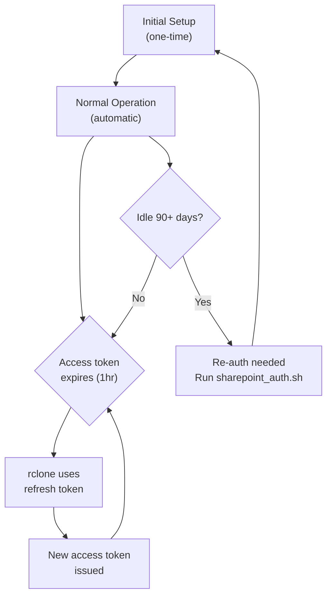
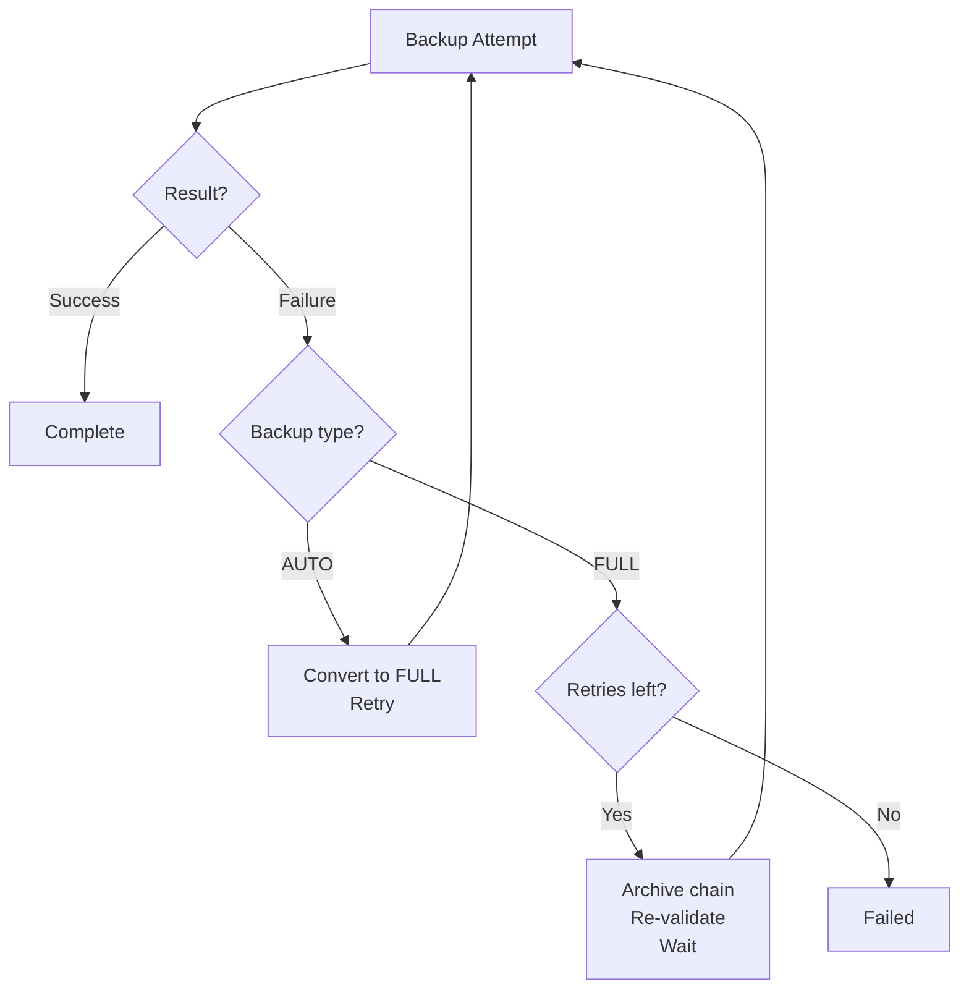
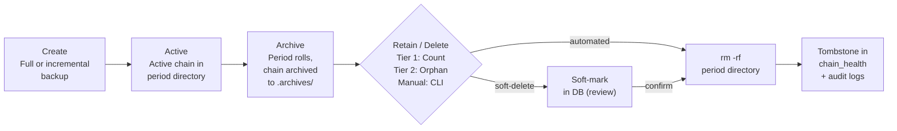
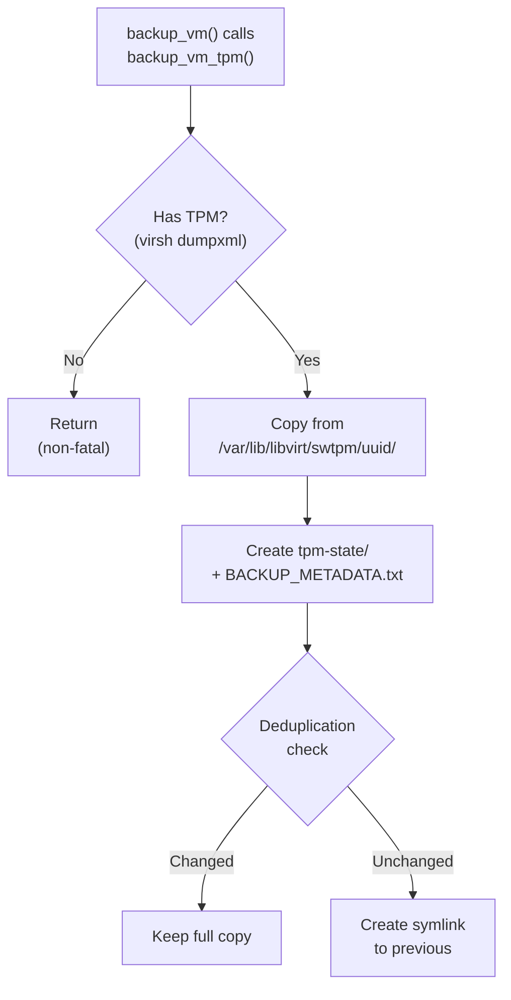

# vmbackup Documentation


## Table of Contents
1. [Overview](#overview)
2. [Usage](#usage)
3. [Installation](#installation)
   - [Prerequisites](#prerequisites)
   - [Dependencies](#dependencies)
   - [AppArmor Configuration](#apparmor-configuration-debianubuntu)
   - [Scheduling](#scheduling)
4. [Configuration](#configuration)
   - [Quick Setup Guide](#quick-setup-guide)
   - [Configuration Instances](#configuration-instances)
   - [Configuration Files Reference](#configuration-files-reference)
   - [Cloud Authentication (SharePoint)](#cloud-authentication-sharepoint)
   - [Unified Logging System](#unified-logging-system)
5. [VM State Handling](#vm-state-handling)
6. [Backup Types & Strategies](#backup-types--strategies)
7. [Checkpoint System](#checkpoint-system)
8. [Rotation Policies](#rotation-policies)
   - [Period ID Generation](#period-id-generation)
9. [Archive Chain Management](#archive-chain-management)
10. [Backup Lifecycle & Retention Management](#backup-lifecycle--retention-management)
    - [Automated Retention System](#automated-retention-system)
    - [Database Audit Trail](#database-audit-trail)
    - [On-Demand Cleanup (`--prune`)](#on-demand-cleanup---prune)
    - [Targeted Backup (`--vm`)](#targeted-backup---vm)
    - [Standalone Replication (`--replicate-only`)](#standalone-replication---replicate-only)
11. [Failure Detection & Self-Remediation](#failure-detection--self-remediation)
12. [Security & Permissions](#security--permissions)
    - [Permission Model](#permission-model)
    - [Access Groups](#access-groups)
    - [File Permissions Summary](#file-permissions-summary)
    - [TPM & BitLocker Key Security](#tpm--bitlocker-key-security)
    - [Config File Protection (conffiles)](#config-file-protection-conffiles)
13. [TPM Module Integration](#tpm-module-integration)
14. [SQLite Logging System](#sqlite-logging-system)
    - [Query Cookbook](#query-cookbook)
15. [Session Summary & Tracking](#session-summary--tracking)
16. [Email Reporting System](#email-reporting-system)
17. [Interrupt Recovery](#interrupt-recovery)
18. [File Inventory](#file-inventory)
    - [Backup Files](#backup-files)
19. [Replication Architecture](#replication-architecture)
    - [Local Replication](#local-replication-replication_local_modulesh)
    - [Cloud Replication](#cloud-replication-replication_cloud_modulesh)
    - [Transport Drivers](#transport-drivers-transportssh)
    - [Transport Function Contract](#transport-function-contract)
    - [Transport Metrics Contract](#transport-metrics-contract)
    - [Implementing a New Transport](#implementing-a-new-transport)
20. [Directory Structure Evolution: Three-Month Extrapolation](#directory-structure-evolution-three-month-extrapolation)
21. [Known Issues & Mitigations](#known-issues--mitigations)
    - [VirtIO discard_granularity & Windows TRIM Performance](#virtio-discard_granularity--windows-trim-performance)
    - [QEMU Agent Hang on FSTRIM Interruption](#qemu-agent-hang-on-fstrim-interruption)

---

## Overview

> **100% vibe coded. Could be 100% wrong.**
>
> Appropriate testing in any and all environments is required. Build your own confidence that the backups work.
>
> Backups are only as good as your restores. All backups are worthless if you cannot recover from them. **vmrestore** might be your answer.

vmbackup and vmrestore are two halves of one system. vmbackup backs up — [vmrestore](https://github.com/doutsis/vmrestore) restores. They share no code, no modules, and have no runtime coupling, but vmrestore exclusively restores backups created by vmbackup. It is standalone in implementation but purpose-built for vmbackup's output.

**vmbackup** is a production-grade but production untested backup manager for libvirt/KVM virtual machines. It wraps `virtnbdbackup` (v2.28+) to provide:

- Incremental/full backup automation with checkpoint tracking
- Multi-state VM handling (running, shut off, paused)
- QEMU guest agent integration for application-consistent snapshots
- TPM state preservation for Windows BitLocker / Linux Secure Boot
- Automatic recovery from checkpoint corruption
- SQLite-based activity logging with structured event tables
- Email notifications after backup completion
- Archive chain preservation for point-in-time recovery
- Per-instance configuration for different environments
- Rotation policies (daily, weekly, monthly, accumulate, never)
- Accurate session tracking with separate counts for backed-up, excluded, skipped, and failed VMs

vmbackup executes in a fixed sequence: load the configuration instance, verify dependencies, acquire the session lock and open a SQLite session. It then discovers all VMs via `virsh list` and applies exclude filters.

Each VM is processed in turn — policy and period boundary checks, five-phase state validation (directory, checkpoints, chain continuity, manifest, disk alignment), backup type decision (full, auto, or copy), optional FSTRIM via the QEMU agent, then `virtnbdbackup` execution with TPM backup if applicable. Every outcome is logged to SQLite.

After all VMs are processed, retention cleanup removes expired archives, replication syncs to local and cloud destinations, and a session summary is written. An email report is sent if configured.


---

## Usage

```
vmbackup <MODE> [OPTIONS]
```

Requires root. vmbackup runs as a systemd timer by default but can be invoked manually.

### Modes

Exactly one mode is required per invocation. Modes are mutually exclusive.

| Mode | Purpose |
|------|--------|
| `--run` | Start a backup session. Backs up all VMs (or those specified by `--vm`), then runs replication and retention. |
| `--prune <target>` | Remove backup data without running a backup. See [On-Demand Cleanup](#on-demand-cleanup---prune) for targets. |
| `--replicate-only [scope]` | Run replication without backing up. Scope: `local`, `cloud`, or `both` (default). Cannot combine with `--vm`. |
| `--cancel-replication` | Signal a running session to stop its replication phase. Backups in progress are not affected. Cannot combine with any other flag. |

### Options

| Option | Applies to | Description |
|--------|-----------|-------------|
| `--vm NAME` | `--run`, `--prune` | Target specific VM(s), comma-separated. With `--run`, replication is skipped. With `--prune`, only a single VM name is accepted. |
| `--dry-run` | `--run`, `--prune`, `--replicate-only` | Preview without writing anything. |
| `--config-instance NAME` | all modes | Load config from `config/NAME/` instead of `config/default/`. |
| `--yes`, `-y` | `--prune` | Skip confirmation prompt (for scripted use). |
| `--help`, `-h` | — | Show help and exit. |
| `--version` | — | Show version and exit. |

### Combination Rules

The following combinations are rejected at startup:

| Rejected combination | Reason |
|---------------------|--------|
| `--run` + `--prune` | Backup and cleanup are separate operations |
| `--run` + `--replicate-only` | Replication already runs as part of `--run` |
| `--replicate-only` + `--vm` | Replication operates on the entire backup path |
| `--prune` + `--replicate-only` | Separate operations |
| `--cancel-replication` + anything | Standalone signal only |
| `--prune` + multiple VMs | Prune requires a single VM name |
| `--vm` without `--run` or `--prune` | `--vm` modifies a mode; it is not a mode itself |

### Concurrency

A global PID lock (`$STATE_DIR/vmbackup.pid`) prevents concurrent vmbackup invocations. If a scheduled backup is already running, a manual invocation will fail with a clear error.

### Examples

```bash
# Full backup (all VMs, default config)
sudo vmbackup --run

# Single VM
sudo vmbackup --run --vm web

# Multiple VMs
sudo vmbackup --run --vm web,db,mail

# Preview without writing anything
sudo vmbackup --run --dry-run

# Named config instance
sudo vmbackup --run --config-instance prod

# Preview with named config
sudo vmbackup --run --config-instance test --dry-run

# Show backup inventory
sudo vmbackup --prune list

# Single VM inventory
sudo vmbackup --prune list --vm myvm

# Remove archived chains for a VM
sudo vmbackup --prune archives --vm myvm

# Preview archive removal
sudo vmbackup --prune archives --dry-run

# Remove everything for a VM (destructive)
sudo vmbackup --prune all --vm myvm --yes

# Replication only (both local + cloud)
sudo vmbackup --replicate-only

# Preview local replication only
sudo vmbackup --replicate-only local --dry-run

# Cancel replication on a running session
sudo vmbackup --cancel-replication
```

---

## Installation

### Prerequisites

vmbackup is a wrapper around [virtnbdbackup](https://github.com/abbbi/virtnbdbackup) — it **will not function without it**. Install virtnbdbackup before vmbackup. See [Dependencies](#dependencies) for the full list of required and optional packages.

### From .deb Package (Debian / Ubuntu)

Download the latest `.deb` from [Releases](https://github.com/doutsis/vmbackup/releases):

```bash
wget https://github.com/doutsis/vmbackup/releases/download/v0.5.3/vmbackup_0.5.3_all.deb
sudo dpkg -i vmbackup_0.5.3_all.deb
```

### From Source

```bash
git clone https://github.com/doutsis/vmbackup.git
cd vmbackup
```

**Option 1 — Build .deb package (Debian / Ubuntu):**

```bash
make package
sudo dpkg -i build/vmbackup_*.deb
```

**Option 2 — Direct install (any distro):**

```bash
sudo make install
```

Both methods install to `/opt/vmbackup/` and set up:
- `vmbackup` command in PATH (symlink to `/usr/local/bin/vmbackup`)
- AppArmor snippet for virtnbdbackup socket access
- systemd service and timer units (enabled but **not started** — see below)
- `root:backup` ownership with `750`/`640` permissions

> **Systemd timer:** The installer enables `vmbackup.timer` so it activates on next boot, but does not start it immediately. To begin scheduled backups now:
> ```bash
> sudo systemctl start vmbackup.timer    # daily at 1:00 AM
> ```
> The timer status shows the next scheduled run:
> ```bash
> systemctl status vmbackup.timer
> ```

### Manual Installation

```bash
# Clone the repository
git clone https://github.com/doutsis/vmbackup.git /opt/vmbackup

# Create symlink
sudo ln -sf /opt/vmbackup/vmbackup.sh /usr/local/bin/vmbackup

# Install AppArmor snippet (Debian/Ubuntu only)
sudo cp /opt/vmbackup/apparmor/libvirt-qemu.local \
  /etc/apparmor.d/local/abstractions/libvirt-qemu
for f in /etc/apparmor.d/libvirt/libvirt-*; do
  [[ "$f" == *.files || "$(basename "$f")" == "TEMPLATE.qemu" ]] && continue
  sudo apparmor_parser -r "$f"
done

# Install systemd timer
sudo cp /opt/vmbackup/systemd/vmbackup.service /etc/systemd/system/
sudo cp /opt/vmbackup/systemd/vmbackup.timer /etc/systemd/system/
sudo systemctl daemon-reload
sudo systemctl enable --now vmbackup.timer

# Create initial configuration
cp -r /opt/vmbackup/config/template /opt/vmbackup/config/default
nano /opt/vmbackup/config/default/vmbackup.conf
```

### Dependencies

| Tool | Package | Required | Notes |
|------|---------|----------|-------|
| `virtnbdbackup` | [virtnbdbackup](https://github.com/abbbi/virtnbdbackup) ≥2.28 | **Yes** | The backup engine that vmbackup wraps |
| `bash` | `bash` ≥5.0 | **Yes** | |
| `virsh` | `libvirt-daemon-system` | **Yes** | Libvirt VM management |
| `qemu-img` | `qemu-utils` | **Yes** | Disk image operations |
| `sqlite3` | `sqlite3` | **Yes** | Activity logging database |
| `jq` | `jq` | **Yes** | JSON parsing |
| `ionice` | `util-linux` | **Yes** | I/O priority control |
| `swtpm` | `swtpm` | For TPM VMs | Software TPM emulation |
| QEMU Guest Agent | `qemu-guest-agent` (in guest) | For online VMs | Filesystem quiescing and FSTRIM |
| `msmtp` | `msmtp` | For email reports | Email notifications |
| `rsync` | `rsync` | For replication | Local replication sync |
| `rclone` | `rclone` | For cloud replication | Cloud replication |

All required packages except `virtnbdbackup` are installed automatically by the `.deb` package or `make install`. `virtnbdbackup` can be installed from your distro's package manager or directly from the [virtnbdbackup project](https://github.com/abbbi/virtnbdbackup?tab=readme-ov-file#installation).

Development and testing has been done on Debian 13 with virtnbdbackup 2.28 from Debian's repository.

### User & Group Setup

vmbackup runs as **root** via systemd. No special user account is needed for backup operations. However, non-root users who need to interact with backups or VMs should be added to the appropriate groups:

| Group | Purpose | Who needs it | Command |
|-------|---------|-------------|----------|
| `backup` | Read access to backup data, logs, configs, and scripts under `BACKUP_PATH` and `/opt/vmbackup/` | Any user who browses backups or checks logs | `sudo usermod -aG backup <username>` |
| `libvirt` | Read-only access to libvirt/virsh (VM listing, status, domain info) | Any user who needs `virsh list`, `virsh dominfo` | `sudo usermod -aG libvirt <username>` |

```bash
# Example: grant both groups to a user
sudo usermod -aG backup,libvirt myuser
# Log out and back in (or: newgrp backup) for group membership to take effect
```

The `backup` group (GID 34) is a standard Debian system group. The `.deb` package creates it if it doesn't exist. The `libvirt` group is created by the `libvirt-daemon-system` package.

> **Note:** Group membership changes require a new login session. Running `newgrp backup` in an existing shell applies the group for that shell only.


### AppArmor Configuration (Debian/Ubuntu)

On Debian/Ubuntu systems with AppArmor enabled, QEMU is restricted from creating virtnbdbackup's NBD sockets in `/var/tmp/` by default. This causes backups to fail with:

```
Failed to bind socket to /var/tmp/virtnbdbackup.XXXX: Permission denied
```

**Detection:** `vmbackup.sh` detects a missing AppArmor override during `check_dependencies()` and logs an error with remediation commands. The backup will **not proceed** until the override is installed.

**Fix via .deb package (recommended):**

The `.deb` package installs the AppArmor snippet automatically to `/etc/apparmor.d/local/abstractions/libvirt-qemu` and reloads all libvirt VM profiles during `postinst`. No manual action is required when installing via the package.

**Manual fix:**
```bash
sudo mkdir -p /etc/apparmor.d/local/abstractions
echo '# Allow virtnbdbackup NBD sockets (installed by vmbackup)
/var/tmp/virtnbdbackup.* rwk,' | sudo tee /etc/apparmor.d/local/abstractions/libvirt-qemu

# Reload all libvirt VM profiles
for f in /etc/apparmor.d/libvirt/libvirt-*; do
  [[ "$f" == *.files || "$(basename "$f")" == "TEMPLATE.qemu" ]] && continue
  sudo apparmor_parser -r "$f"
done
```

> **Note:** If `VIRTNBD_SCRATCH_DIR` is changed from the default `/var/tmp`, the AppArmor rule path must match.


### Scheduling

The backup script is scheduled via a **systemd timer** which is installed and enabled automatically by the `.deb` package or `make install`. The default timer runs daily at 1:00 AM.

The service has a default timeout of 12 hours (`TimeoutStartSec=43200`). If a backup run exceeds this, systemd will terminate it. Monitor your backup durations and increase this value with `sudo systemctl edit vmbackup.service` if needed.

#### Installed systemd Timer

`/lib/systemd/system/vmbackup.timer`:
```ini
[Unit]
Description=VM Backup Timer
Documentation=https://github.com/doutsis/vmbackup

[Timer]
# Run daily at 1:00 AM, with up to 5 minutes random delay to avoid thundering herd
OnCalendar=*-*-* 01:00:00
Persistent=true
RandomizedDelaySec=300

[Install]
WantedBy=timers.target
```

#### Installed systemd Service

`/lib/systemd/system/vmbackup.service`:
```ini
[Unit]
Description=VM Backup Service
Documentation=https://github.com/doutsis/vmbackup
After=libvirtd.service
Requires=libvirtd.service

[Service]
Type=oneshot
ExecStart=/opt/vmbackup/vmbackup.sh --run
# Uses the 'default' config instance at /opt/vmbackup/config/default/
# To use a different config instance:
#   sudo systemctl edit vmbackup.service
# Then add:
#   [Service]
#   ExecStart=
#   ExecStart=/opt/vmbackup/vmbackup.sh --run --config-instance myinstance
TimeoutStartSec=43200
Nice=10
IOSchedulingClass=best-effort
IOSchedulingPriority=5

# Security: restrict file creation permissions
# Dirs → 750 (rwxr-x---), Files → 640 (rw-r-----)
# Belt-and-suspenders with umask 027 in vmbackup.sh itself.
UMask=0027

# Logging goes to journald (accessible via: journalctl -u vmbackup.service)
StandardOutput=journal
StandardError=journal
SyslogIdentifier=vmbackup

[Install]
WantedBy=multi-user.target
```

#### Managing the Timer

```bash
# Check timer status
systemctl list-timers vmbackup.timer

# Manual run
sudo systemctl start vmbackup.service

# View logs
journalctl -u vmbackup.service -n 100
```


---

## Configuration

### Quick Setup Guide

After installing the `.deb` package, the `config/default/` directory contains **template configuration** with safe defaults (features disabled, placeholder values). You must configure at minimum `vmbackup.conf` before running backups.

The steps below configure the `default` instance. vmbackup supports multiple **config instances** — isolated sets of configuration for different environments (e.g., `production`, `test`, `dr`). To create additional instances, copy `config/template/` to a new directory and configure it independently. See [Configuration Instances](#configuration-instances) for full details.

#### Step 1: Configure vmbackup.conf (Required)

```bash
sudo nano /opt/vmbackup/config/default/vmbackup.conf
```

**Minimum required settings:**

| Setting | What to set | Example |
|---------|-------------|---------|
| `BACKUP_PATH` | Directory where backups are stored (must exist — see below) | `/mnt/backup/vms/` |
| `LOG_LEVEL` | Verbosity: `ERROR`, `WARN`, `INFO`, `DEBUG` | `INFO` |

#### BACKUP_PATH Setup

vmbackup does **not** create `BACKUP_PATH` — it must exist before the first run. If the directory is missing, vmbackup exits with an error (`Backup path does not exist`).

```bash
sudo mkdir -p /mnt/backup/vms
```

On first run, vmbackup automatically applies the correct ownership and permissions via `ensure_backup_path_sgid()`:

| Property | Value | Meaning |
|----------|-------|---------|
| Owner | `root:backup` | Root writes backups; `backup` group members can read |
| Mode | `2750` | `rwxr-x---` with **SGID** bit set |
| SGID effect | Group inheritance | All subdirectories and files created under `BACKUP_PATH` automatically inherit the `backup` group |

This means:
- **You only need to `mkdir`** — vmbackup handles ownership and permissions automatically
- All VM backup directories, state files, logs, and chain data inherit `backup` group via SGID
- Users in the `backup` group can browse and read all backup data without `sudo`
- The `_state/` directory (SQLite DB, logs, temp files) is created under `BACKUP_PATH` with the same inherited permissions
- **Exception:** TPM private keys (`tpm-state/`) have SGID stripped and are locked to `root:root 600`

> **NFS mounts:** If `BACKUP_PATH` is on NFS with `root_squash` (the default), root is mapped to `nobody` and cannot set ownership. Either export with `no_root_squash` or pre-set the directory ownership on the NFS server.

**Optional but recommended settings to review:**
- `DEFAULT_ROTATION_POLICY` — default retention policy for all VMs (`monthly` is the default)
- `RETENTION_MONTHS` / `RETENTION_WEEKS` / `RETENTION_DAYS` — how many periods to keep
- `PROCESS_PRIORITY`, `IO_PRIORITY_CLASS`, `IO_PRIORITY_LEVEL` — resource usage tuning
- `ENABLE_FSTRIM` — trim VM disks before backup (reduces size, requires QEMU guest agent). Enabled by default.
- `FSTRIM_MINIMUM` — minimum TRIM extent (bytes). Default `1048576` (1 MiB). Linux only; Windows ignores this.
- `FSTRIM_EXCLUDE_FILE` — file containing VM name patterns to exclude from FSTRIM
- `ENABLE_AUTO_RECOVERY_ON_CHECKPOINT_CORRUPTION` — set to `"yes"` for unattended self-healing

Most settings have sensible defaults baked into `vmbackup.sh` — the config file only needs to contain values you want to **override**.

#### Step 2: Configure vm_overrides.conf (Optional)

```bash
sudo nano /opt/vmbackup/config/default/vm_overrides.conf
```

Set per-VM rotation policies if you want different VMs to have different retention:

```bash
declare -gA VM_POLICY
VM_POLICY["critical-db"]="accumulate"    # Never auto-delete
VM_POLICY["dev-sandbox"]="daily"         # Short retention
VM_POLICY["template-vm"]="never"         # Skip entirely
```

If you have no per-VM overrides, leave this file as-is.

#### Step 3: Configure exclude_patterns.conf (Optional)

```bash
sudo nano /opt/vmbackup/config/default/exclude_patterns.conf
```

Add glob patterns to exclude VMs by name:

```bash
EXCLUDE_PATTERNS+=("test-*")        # Exclude all test VMs
EXCLUDE_PATTERNS+=("*-template")    # Exclude template VMs
```

Leave empty (`EXCLUDE_PATTERNS=()`) to back up all VMs.

#### Step 4: Configure email.conf (Optional)

```bash
sudo nano /opt/vmbackup/config/default/email.conf
```

**Prerequisites:** `msmtp` must be installed and configured at `/etc/msmtprc`.

| Setting | What to set |
|---------|-------------|
| `EMAIL_ENABLED` | `"yes"` to enable email reports |
| `EMAIL_RECIPIENT` | Your alert email address |
| `EMAIL_SENDER` | Must match your SMTP config |

Other settings control conditional sending (success-only, failure-only, etc.) and what data to include in reports. See the file comments for details.

#### Step 5: Configure replication_local.conf (Optional)

```bash
sudo nano /opt/vmbackup/config/default/replication_local.conf
```

Configures rsync-based replication to local/NAS/remote storage after backups complete.

**To enable local replication:**
1. Set `REPLICATION_ENABLED="yes"`
2. Configure at least one destination:
   - Set `DEST_1_ENABLED="yes"`
   - Set `DEST_1_PATH` to your replication target (local mount, NFS, etc.)
   - Choose `DEST_1_TRANSPORT`: `local` (rsync to any mounted path — local disk, NFS, virtiofs, pre-mounted CIFS). Additional transports can be added by implementing the [transport contract](#transport-function-contract).
3. For SSH transport, also set `DEST_N_HOST`, `DEST_N_USER`, `DEST_N_PORT`, `DEST_N_SSH_KEY`

If you don't need local replication, set `REPLICATION_ENABLED="no"` (this is the template default). Individual destinations can be toggled with `DEST_N_ENABLED` when the master switch is on.

#### Step 6: Configure replication_cloud.conf (Optional)

```bash
sudo nano /opt/vmbackup/config/default/replication_cloud.conf
```

Configures rclone-based replication to cloud storage (SharePoint, Backblaze B2, etc.).

**To enable cloud replication:**
1. Install rclone: `sudo apt install rclone`
2. Configure an rclone remote: `rclone config` (or use `sharepoint_auth.sh` for SharePoint)
3. Set `CLOUD_REPLICATION_ENABLED="yes"`
4. Configure a cloud destination:
   - Set `CLOUD_DEST_1_ENABLED="yes"`
   - Set `CLOUD_DEST_1_REMOTE` to your rclone remote name (e.g., `sharepoint:`)
   - Set `CLOUD_DEST_1_PATH` to the destination folder

See the [Cloud Authentication (SharePoint)](#cloud-authentication-sharepoint) section for SharePoint-specific setup.

If you don't need cloud replication, set `CLOUD_REPLICATION_ENABLED="no"` (this is the template default). Individual destinations can be toggled with `CLOUD_DEST_N_ENABLED` when the master switch is on.

#### Step 7: Test and Verify

```bash
# Dry run to verify configuration (no backups performed)
sudo vmbackup --run --dry-run

# Check the systemd timer is active
systemctl list-timers vmbackup.timer

# View upcoming schedule
systemctl status vmbackup.timer
```

#### Changing the Systemd Schedule or Config Instance

The systemd timer runs daily at 01:00 by default. To change the schedule or use a different config instance:

```bash
# Create a systemd override
sudo systemctl edit vmbackup.timer    # For schedule changes
sudo systemctl edit vmbackup.service  # For config instance changes
```

**To change the config instance**, add to the service override:

```ini
[Service]
ExecStart=
ExecStart=/opt/vmbackup/vmbackup.sh --run --config-instance production
```

**To change the schedule**, add to the timer override:

```ini
[Timer]
OnCalendar=
OnCalendar=*-*-* 02:30:00
```

#### Creating Additional Config Instances

To run multiple backup configurations (e.g., different schedules for different VM groups):

```bash
# Copy the template to a new instance
sudo cp -r /opt/vmbackup/config/template /opt/vmbackup/config/production

# Edit the new instance
sudo nano /opt/vmbackup/config/production/vmbackup.conf

# Test it
sudo vmbackup --run --config-instance production --dry-run
```

### Configuration Instances

Configuration instances provide complete isolation between different backup environments. Each instance has its own set of configuration files, allowing different settings for production, test, disaster recovery, or other purposes.

#### Instance Selection

| Command | Config Used |
|---------|-------------|
| `./vmbackup.sh --run` | `config/default/` |
| `./vmbackup.sh --run --config-instance test` | `config/test/` |
| `./vmbackup.sh --run --config-instance myinstance` | `config/myinstance/` |

#### Directory Structure

```
config/
├── default/                      # Default configuration (customize after install)
│   ├── vmbackup.conf                 # Main settings + replication order
│   ├── vm_overrides.conf             # Per-VM rotation policies
│   ├── exclude_patterns.conf         # Glob patterns to exclude VMs
│   ├── fstrim_exclude.conf           # VM patterns to exclude from FSTRIM
│   ├── email.conf                    # Email notification settings
│   ├── replication_local.conf        # Local/NAS replication destinations
│   └── replication_cloud.conf        # Cloud replication destinations
│
├── test/                         # Test environment (isolated from production)
│   ├── vmbackup.conf
│   ├── vm_overrides.conf
│   ├── exclude_patterns.conf
│   ├── fstrim_exclude.conf
│   ├── email.conf
│   ├── replication_local.conf
│   └── replication_cloud.conf
│
└── template/                     # Template for creating new instances
    ├── vmbackup.conf                 # Full documentation of all options
    ├── vm_overrides.conf
    ├── exclude_patterns.conf
    ├── fstrim_exclude.conf
    ├── email.conf
    ├── replication_local.conf
    └── replication_cloud.conf
```

#### Creating a New Instance

```bash
# Copy template to new instance
cp -r config/template config/production

# Edit the new instance
nano config/production/vmbackup.conf

# Use the new instance
./vmbackup.sh --run --config-instance production
```

### Configuration Files Reference

All config files are self-documenting — `config/template/` contains every setting with inline comments. Only settings you want to override need to be present; omitted settings use code defaults. This section highlights groupings, gotchas, and non-obvious interactions.

#### vmbackup.conf — Main Settings

| Setting | Default | Description |
|---------|---------|-------------|
| `BACKUP_PATH` | *(required)* | Backup root directory. Must exist before first run (`mkdir -p`). SGID applied automatically on first run. |
| `PROCESS_PRIORITY` | `10` | CPU nice: −20 (highest) to 19 (lowest) |
| `IO_PRIORITY_CLASS` | `2` | ionice class: 1=realtime, 2=best-effort, 3=idle |
| `IO_PRIORITY_LEVEL` | `5` | 0–7 within class (0=highest) |
| `VIRTNBD_COMPRESS_LEVEL` | `4` | LZ4 level. 1–2=fast (~1000 MiB/s), 3–16=HC (~50 MiB/s). See gotchas. |
| `DEFAULT_ROTATION_POLICY` | `monthly` | `daily` / `weekly` / `monthly` / `accumulate` / `never`. `never`=excluded from backup. |
| `RETENTION_DAYS` | `7` | Periods kept under `daily` policy |
| `RETENTION_WEEKS` | `4` | Periods kept under `weekly` policy |
| `RETENTION_MONTHS` | `3` | Periods kept under `monthly` policy |
| `RETENTION_ORPHAN_ENABLED` | `true` | Age-based cleanup of orphaned period dirs. See gotchas. |
| `RETENTION_ORPHAN_MAX_AGE_DAYS` | `90` | Delete orphans older than this |
| `RETENTION_ORPHAN_MIN_AGE_DAYS` | `7` | Safety buffer before eligible |
| `RETENTION_ORPHAN_DRY_RUN` | `false` | Log actions but don't delete |
| `ACCUMULATE_WARN_DEPTH` | `100` | Warn when chain depth exceeds this (template recommends `30`) |
| `ACCUMULATE_HARD_LIMIT` | `365` | Force archive at this depth (template recommends `60`) |
| `CHECKPOINT_FORCE_FULL_ON_DAY` | `1` | Day of month to force a full backup (resets chain) |
| `CHECKPOINT_HEALTH_CHECK` | `yes` | Validate checkpoint chain integrity before backup |
| `LOG_LEVEL` | `INFO` | `ERROR` / `WARN` / `INFO` / `DEBUG`. Controls stderr only; log file always gets everything. |
| `MAX_RETRIES` | `3` | Retry failed VM backups (0=disable). Retries convert incremental→full. |
| `VIRTNBD_SCRATCH_DIR` | `/var/tmp` | Temp directory for NBD operations |
| `ENABLE_FSTRIM` | `true` | Pre-backup TRIM via QEMU guest agent |
| `FSTRIM_MINIMUM` | `1048576` | Minimum TRIM extent bytes. Linux only; Windows ignores this. |
| `FSTRIM_TIMEOUT` | `300` | Linux guest FSTRIM timeout (seconds) |
| `FSTRIM_WINDOWS_TIMEOUT` | `600` | Windows guest FSTRIM timeout (seconds) |
| `FSTRIM_EXCLUDE_FILE` | `fstrim_exclude.conf` | File of VM name patterns to skip |
| `SKIP_OFFLINE_UNCHANGED_BACKUPS` | `true` | Skip offline VMs whose disks haven't changed since last backup |
| `OFFLINE_CHANGE_DETECTION_THRESHOLD` | `60` | Seconds threshold for disk change detection |
| `ENABLE_AUTO_RECOVERY_ON_CHECKPOINT_CORRUPTION` | `yes` | `yes`=self-heal, `warn`=log remediation steps but fail, `no`=fail immediately |
| `REPLICATION_ORDER` | `simultaneous` | `simultaneous` / `local_first` / `cloud_first` |
| `STATE_BACKUP_KEEP_DAYS` | `90` | Days to keep daily `_state/` snapshots |
| `LOG_KEEP_DAYS` | `30` | Days to keep log files (0=disable) |

**I/O priority profiles** (tested estimates for typical VM workloads):

| Profile | CPU | I/O Class | I/O Level | Speed | Use Case |
|---------|-----|-----------|-----------|-------|----------|
| Minimal Impact | 19 | 3 (idle) | — | ~1–3 MB/s | Production hours |
| Balanced | 10 | 2 | 5 | ~15–30 MB/s | Default |
| Normal | 0 | 2 | 4 | ~50–80 MB/s | Dedicated window |
| Maximum | −10 | 1 | 4 | ~200+ MB/s | Emergency/DR |

**Gotchas:**

- **LZ4 level 0** is broken in virtnbdbackup ≤2.28 — vmbackup detects this and bumps to 1. Fast mode (1–2) and HC mode (3–16) produce virtually identical compression ratios for VM disk data (~1.30× vs ~1.31×), but HC is ~15× slower.
- **Orphan retention** — when a VM's rotation policy changes (e.g. weekly→monthly), old period directories become "orphaned" and invisible to count-based retention. The four `RETENTION_ORPHAN_*` settings provide age-based cleanup. Start with `DRY_RUN=true` to preview what would be removed.
- **FSTRIM on Windows** is significantly slower without the VirtIO `discard_granularity` XML fix — see [Known Issues](#known-issues). VMs without a QEMU guest agent are skipped automatically; the exclude file is for VMs that *have* an agent but should still be excluded (e.g., database servers where TRIM causes latency spikes, legacy guests with buggy drivers).
- **Each config instance should use a unique `BACKUP_PATH`**. The directory structure is `$BACKUP_PATH/<vm_name>/<YYYYMM>/`.

#### vm_overrides.conf — Per-VM Policies

Override the default rotation policy for specific VMs. Format is a bash associative array:

```bash
declare -gA VM_POLICY
VM_POLICY["critical-db"]="accumulate"     # Never delete
VM_POLICY["template-win11"]="never"       # Exclude from backups
```

See the [rotation policy options](#rotation-policies) above for available values.

#### exclude_patterns.conf — Pattern-Based Exclusions

Exclude VMs by name using glob patterns. Format: `EXCLUDE_PATTERN+=("pattern")`.

```bash
EXCLUDE_PATTERN+=("test-*")       # Exclude test VMs
EXCLUDE_PATTERN+=("*-template")   # Exclude templates
```

#### fstrim_exclude.conf — FSTRIM Exclusions

One glob pattern per line. `#` comments and blank lines ignored. VMs matching any pattern are silently skipped (logged as `"excluded"`). Useful for database servers (TRIM latency spikes), legacy guests with buggy VirtIO drivers, or VMs with known guest agent issues. VMs without an agent are skipped automatically — this file is for VMs that *have* an agent but should be excluded.

#### email.conf — Notifications

| Setting | Default | Description |
|---------|---------|-------------|
| `EMAIL_ENABLED` | `yes` | Master switch |
| `EMAIL_RECIPIENT` | *(required)* | Destination address |
| `EMAIL_SENDER` | *(required)* | From address |
| `EMAIL_HOSTNAME` | system hostname | Override hostname in subject |
| `EMAIL_SUBJECT_PREFIX` | `[VM Backup]` | Subject line prefix |
| `EMAIL_ON_SUCCESS` | `yes` | Send on successful backup |
| `EMAIL_ON_FAILURE` | `yes` | Send on failure |
| `EMAIL_INCLUDE_REPLICATION` | `yes` | Include replication details |
| `EMAIL_INCLUDE_DISK_SPACE` | `yes` | Include disk space summary |

#### replication_local.conf — Local/NAS Destinations

Global settings apply to all destinations. Per-destination settings use a numbered `DEST_N_` prefix.

| Setting | Default | Description |
|---------|---------|-------------|
| `REPLICATION_ENABLED` | `no` | Master switch |
| `REPLICATION_ON_FAILURE` | `continue` | `continue` / `abort` |
| `REPLICATION_SPACE_CHECK` | `skip` | `skip` / `warn` / `disabled` |
| `REPLICATION_MIN_FREE_PERCENT` | `10` | Minimum free space % for warn mode |

Per-destination (replace `N` with `1`, `2`, etc.):

| Setting | Example | Description |
|---------|---------|-------------|
| `DEST_N_ENABLED` | `no` | Enable this destination |
| `DEST_N_NAME` | `local-backup` | Human-readable label |
| `DEST_N_TRANSPORT` | `local` | Transport driver: `local`, `ssh`, `nfs`, `smb` |
| `DEST_N_PATH` | `/mnt/backups` | Destination path (or `HOST:PATH` for ssh) |
| `DEST_N_SYNC_MODE` | `mirror` | `mirror` (--delete) / `accumulate` |
| `DEST_N_BWLIMIT` | `0` | KB/s bandwidth limit (0=unlimited) |
| `DEST_N_VERIFY` | `size` | `none` / `size` / `checksum` |

SSH destinations additionally require `DEST_N_HOST`, `DEST_N_USER`, `DEST_N_PORT`, and `DEST_N_SSH_KEY`.

#### replication_cloud.conf — Cloud Destinations

Global settings apply to all cloud destinations. Per-destination settings use a numbered `CLOUD_DEST_N_` prefix.

| Setting | Default | Description |
|---------|---------|-------------|
| `CLOUD_REPLICATION_ENABLED` | `no` | Master switch |
| `CLOUD_REPLICATION_SCOPE` | `everything` | `everything` / `archives-only` / `monthly` |
| `CLOUD_REPLICATION_SYNC_MODE` | `mirror` | `mirror` / `accumulate-all` / `accumulate-valid` |
| `CLOUD_REPLICATION_POST_VERIFY` | `checksum` | `none` / `size` / `checksum` |
| `CLOUD_REPLICATION_ON_FAILURE` | `continue` | `continue` / `abort` |
| `CLOUD_REPLICATION_DEFAULT_BWLIMIT` | `0` | KB/s (0=unlimited) |
| `CLOUD_REPLICATION_EXPIRY_WARN_DAYS` | `30` | Token expiry warning threshold |
| `CLOUD_REPLICATION_EXPIRY_CRITICAL_DAYS` | `7` | Token expiry critical threshold |
| `CLOUD_REPLICATION_LOG_LEVEL` | *(inherits)* | Override main `LOG_LEVEL` for cloud verbosity |
| `CLOUD_REPLICATION_USE_LOCKFILE` | `yes` | Concurrent replication lock |
| `CLOUD_REPLICATION_LOCK_TIMEOUT` | `3600` | Seconds before stale lock is broken |
| `CLOUD_REPLICATION_VM_EXCLUDE` | *(empty)* | Comma-separated VM names to skip |
| `CLOUD_REPLICATION_DRY_RUN` | `no` | Preview mode |

Per-destination (replace `N` with `1`, `2`, etc.):

| Setting | Example | Description |
|---------|---------|-------------|
| `CLOUD_DEST_N_ENABLED` | `no` | Enable this destination |
| `CLOUD_DEST_N_NAME` | `sharepoint-backup` | Human-readable label |
| `CLOUD_DEST_N_PROVIDER` | `sharepoint` | Provider type |
| `CLOUD_DEST_N_REMOTE` | `sharepoint:` | rclone remote name |
| `CLOUD_DEST_N_PATH` | `VMBackups` | Folder within the remote |
| `CLOUD_DEST_N_SCOPE` | *(global)* | Per-dest scope override |
| `CLOUD_DEST_N_SYNC_MODE` | *(global)* | Per-dest sync mode override |
| `CLOUD_DEST_N_BWLIMIT` | `0` | Per-dest bandwidth limit |
| `CLOUD_DEST_N_VERIFY` | *(global)* | Per-dest verify override |
| `CLOUD_DEST_N_MAX_SIZE` | `250G` | Provider file size limit (e.g. SharePoint) |
| `CLOUD_DEST_N_SECRET_EXPIRY` | *(empty)* | Credential expiry date (`YYYY-MM-DD`) |

### Cloud Authentication (SharePoint)

SharePoint requires **delegated authentication** (device code flow) for uploads longer than 1 hour.

**Why Delegated Auth?**
- Client credentials have a **1-hour hard token limit** with no refresh
- Uploads >1 hour fail with `401 Unauthorized`
- Delegated auth provides automatic token refresh via 90-day refresh token

#### Step-by-Step: Setting Up SharePoint Cloud Replication

Follow these steps **in order** when deploying vmbackup to a new host or enabling cloud replication for the first time.

##### Step 1: Install rclone

```bash
sudo apt install rclone
```

Verify it's installed:
```bash
rclone version
```

##### Step 2: Edit replication_cloud.conf

Open the cloud replication config for your config instance (e.g., `default`):

```bash
sudo nano /opt/vmbackup/config/default/replication_cloud.conf
```

Set these values:

```bash
# Enable cloud replication
CLOUD_REPLICATION_ENABLED="yes"

# Configure destination
CLOUD_DEST_1_ENABLED="yes"
CLOUD_DEST_1_NAME="sharepoint-backup"
CLOUD_DEST_1_PROVIDER="sharepoint"
CLOUD_DEST_1_REMOTE="sharepoint:"         # rclone remote name (must match step 3)
CLOUD_DEST_1_PATH="VMBackups"             # folder name in SharePoint doc library
```

Save and close. The folder name in `CLOUD_DEST_1_PATH` will be created automatically on the first upload if it doesn't exist.

##### Step 3: Run sharepoint_auth.sh

This interactive script configures the rclone remote and authenticates with SharePoint:

```bash
sudo /opt/vmbackup/cloud_transports/sharepoint_auth.sh --instance default
```

The script will:
1. Read `CLOUD_DEST_1_REMOTE` and `CLOUD_DEST_1_PATH` from your config (step 2)
2. Launch `rclone config` interactively — follow the prompts:

   | Prompt | Answer |
   |--------|--------|
   | Storage type | `onedrive` |
   | Client ID | Leave blank (press Enter) |
   | Client secret | Leave blank (press Enter) |
   | Region | `global` |
   | Use web browser to authenticate | `n` (device code flow) |

3. **Device code flow:** The script displays a URL and a code. Open the URL in any browser (even on your phone), sign in with your Microsoft 365 account, and enter the code.

4. After authentication succeeds:

   | Prompt | Answer |
   |--------|--------|
   | Drive type | `sharepoint` |
   | Site URL | Your SharePoint site URL (e.g., `https://contoso.sharepoint.com/sites/backups`) |
   | Document library | Select from the listed libraries |

5. The script verifies the connection and checks for the destination folder.

##### Step 4: Verify the connection

```bash
sudo /opt/vmbackup/cloud_transports/sharepoint_auth.sh --test-only
```

You should see the remote listing and available space. If this works, cloud replication is ready.

##### Step 5: Run a backup to test

```bash
sudo vmbackup --run --config-instance default --dry-run
```

Check the output for cloud replication steps. Remove `--dry-run` to run for real.

##### Troubleshooting

| Symptom | Cause | Fix |
|---------|-------|-----|
| `401 Unauthorized` during upload | Token expired | Run `sharepoint_auth.sh --instance default` |
| `Failed to get token` | Server idle 90+ days, refresh token expired | Run `sharepoint_auth.sh --instance default` |
| Wrong folder | `CLOUD_DEST_1_PATH` doesn't match | Edit `replication_cloud.conf`, no re-auth needed |
| Wrong SharePoint site | Site URL baked into rclone config | Run `sharepoint_auth.sh` to reconfigure |

#### Three-Layer Configurability Model

SharePoint cloud replication has three independently configurable layers:

| Layer | What it controls | Where configured | When set |
|-------|-----------------|------------------|----------|
| **SharePoint Site URL** | Which SharePoint site to connect to | `rclone config` (interactive) | During initial setup or re-auth |
| **Document Library** | Which document library within the site | `rclone config` (stored as `drive_id`) | During initial setup or re-auth |
| **Folder** | Folder within the document library | `CLOUD_DEST_N_PATH` in `replication_cloud.conf` | Any time via config edit |

**Example mapping:**
```
rclone remote "sharepoint:" → https://contoso.sharepoint.com/sites/backups
                              └── Document Library: "Shared Documents" (drive_id in rclone.conf)
                                  └── Folder: "VMBackups" (CLOUD_DEST_1_PATH in vmbackup config)
```

#### sharepoint_auth.sh

Interactive helper script for configuring or re-authenticating rclone with any SharePoint site. Supports multiple vmbackup config instances, auto-discovers settings, and works on headless servers via device code flow.

**Usage:**
```bash
# Auto-discover instances and choose interactively
sudo ./cloud_transports/sharepoint_auth.sh

# Use settings from a specific vmbackup config instance
sudo ./cloud_transports/sharepoint_auth.sh --instance dev

# Specify remote name and folder directly
sudo ./cloud_transports/sharepoint_auth.sh --remote sharepoint --folder VMBackups

# Test existing connection without re-authenticating
sudo ./cloud_transports/sharepoint_auth.sh --test-only

# Use a specific rclone config file
sudo ./cloud_transports/sharepoint_auth.sh --config /path/to/rclone.conf
```

**Options:**

| Option | Default | Description |
|--------|---------|-------------|
| `--remote NAME` | `sharepoint` | rclone remote name |
| `--folder PATH` | from config instance | Folder in document library to verify/create |
| `--instance NAME` | auto-detect | vmbackup config instance (e.g., `dev`, `default`) |
| `--config FILE` | `/root/.config/rclone/rclone.conf` | rclone config file path |
| `--test-only` | — | Test existing connection, don't re-authenticate |

**Instance auto-discovery:** When run without `--folder` or `--instance`, the script scans `config/*/replication_cloud.conf` and presents a menu showing each instance's `CLOUD_DEST_1_REMOTE` and `CLOUD_DEST_1_PATH`.

**Interactive rclone config flow:**
During the `rclone config` step, you will choose:
1. **Storage type:** `onedrive` (Microsoft OneDrive)
2. **Client ID/secret:** Leave blank (uses rclone's default Microsoft app)
3. **Region:** `global` (unless in a special region)
4. **Web browser auth:** `n` (triggers device code flow — works on headless servers)
5. **Drive type:** `sharepoint` (SharePoint site documentLibrary)
6. **Site URL:** Your SharePoint site URL (e.g., `https://contoso.sharepoint.com/sites/backups`)
7. **Document Library:** Select from the listed libraries (stored as `drive_id`)

**Token Lifecycle:**



**When to re-run:**
- Initial setup (first time on a new host)
- After 90+ days of inactivity (refresh token expired)
- `401 Unauthorized` or token expired errors
- Changing to a different SharePoint site or document library

**rclone Config Location:** `/root/.config/rclone/rclone.conf`

> **Note:** The rclone config is global (per-host, under root), not per-instance.
> Multiple vmbackup instances on the same host share the same rclone remote but
> differentiate by `CLOUD_DEST_N_PATH` (folder) in each instance's config.

### Unified Logging System

All modules share a unified logging system with configurable verbosity levels.

#### Log Level Hierarchy

| Level | Numeric | Description |
|-------|---------|-------------|
| `ERROR` | 3 | Errors only (quietest) |
| `WARN` | 2 | Errors + warnings |
| `INFO` | 1 | Normal operation (default) |
| `DEBUG` | 0 | Verbose debugging |

**Important:** All messages are *always* written to the log file regardless of level. The `LOG_LEVEL` setting controls which messages appear on screen (stderr).

#### Configuration

Set in `vmbackup.conf` per instance:

```bash
# config/default/vmbackup.conf - Production (quiet)
LOG_LEVEL="INFO"

# config/test/vmbackup.conf - Testing (verbose)
LOG_LEVEL="DEBUG"
```

#### Inheritance Model

All modules inherit `LOG_LEVEL` from `vmbackup.conf`:

- **vmbackup.sh**: Uses `LOG_LEVEL` directly
- **replication_cloud_module.sh**: Inherits `LOG_LEVEL` unless `CLOUD_REPLICATION_LOG_LEVEL` is explicitly set
- **Transport drivers**: Delegate to main `log_*()` functions, automatically respect `LOG_LEVEL`

#### Cloud Module Override

For cloud-specific verbosity (e.g., debugging SharePoint issues while keeping main logs quiet):

```bash
# config/*/replication_cloud.conf
# Uncomment only if you need cloud-specific verbosity different from main LOG_LEVEL
CLOUD_REPLICATION_LOG_LEVEL="debug"  # Override: debug|info|warn|error
```

#### Log Format

All log messages follow a consistent format:

```
[timestamp] [LEVEL] [module.sh] [function] message
```

Example output:
```
[2026-02-03 14:30:15 AEDT] [INFO] [vmbackup.sh] [perform_backup] Starting backup for win11-pro
[2026-02-03 14:30:16 AEDT] [DEBUG] [replication_cloud_module.sh] [replicate_to_cloud] Using transport: sharepoint
[2026-02-03 14:30:17 AEDT] [INFO] [cloud_transport_sharepoint.sh] [upload_files] Uploading 3 files to SharePoint
```

#### Recommended Settings by Environment

| Instance | `LOG_LEVEL` | Use Case |
|----------|-------------|----------|
| `default` | `INFO` | Production - clean output |
| `test` | `DEBUG` | Development - full verbosity |
| `template` | `INFO` | Documentation reference |

---

## VM State Handling

### State Detection Flow

`virsh domstate` determines the VM's power state. The backup method and type follow from the state and agent availability:

| VM State | Condition | Method | Backup Type |
|----------|-----------|--------|-------------|
| Running | QEMU agent available | FSFREEZE + backup | auto or full |
| Running | No QEMU agent | Pause VM + backup | auto or full |
| Shut off | Disk changed since last backup | — | copy |
| Shut off | Disk unchanged | — | Skip |
| Paused | — | Treated as running | auto or full |

### Running VMs (Online)

**With QEMU Guest Agent:**
- Uses `virsh qemu-agent-command` to verify agent responsiveness
- Enables FSFREEZE for application-consistent snapshots
- Backup type: `auto` (incremental) or `full` (boundary)

**Without QEMU Guest Agent:**
- VM is **paused** during backup to ensure crash-consistent snapshot
- Pause state monitored to ensure resume after backup completes
- Backup type: `auto` or `full`

### Shut Off VMs (Offline)

**Disk Change Detection:**
```
Compares disk mtime against last backup timestamp
├── mtime > last_backup → Disk changed → ARCHIVE + COPY backup
└── mtime ≤ last_backup → Unchanged → SKIP backup
```

**Key Behaviors:**
- Clean shutdown **always** modifies disk (mtime updates)
- First offline day after running = archive chain + copy backup
- Subsequent offline days with no changes = skip backup
- Copy backup preserved, not chain

### Paused VMs

Treated identically to running VMs. The script's pause/resume logic handles backup coordination.

---

## Backup Types & Strategies

### Backup Type Decision Matrix

| Condition | Backup Type | Command Flag |
|-----------|-------------|--------------|
| Month boundary (new month) | `full` | `virtnbdbackup --full` |
| Day 01 AND no existing valid data | `full` | `virtnbdbackup --full` |
| Day 01 AND existing valid chain | `auto` | `virtnbdbackup --auto` |
| Recovery flag present | `full` | `virtnbdbackup --full` |
| Offline VM with changes | `copy` | `virtnbdbackup --copy` |
| First backup ever | `full` | `virtnbdbackup --full` |
| Normal daily backup | `auto` | `virtnbdbackup --auto` |

### Retry Strategy



---

## Checkpoint System

### Checkpoint Storage Locations

| Location | Purpose | Created By |
|----------|---------|------------|
| `/var/lib/libvirt/qemu/checkpoint/<vm>/` | Primary libvirt checkpoint metadata | `virsh checkpoint-create` |
| `<backup_dir>/checkpoints/` | Backup-local checkpoint copy | `virtnbdbackup` |
| `<backup_dir>/<vm>.cpt` | JSON array of checkpoint names | `virtnbdbackup` |
| QEMU qcow2 bitmaps | Dirty block tracking inside disk | QEMU/libvirt |

### Checkpoint Chain Lifecycle

The first backup creates a full image (`vda.full.data`), the initial checkpoint (`checkpoint.0`), and the checkpoint list (`vm.cpt`). Subsequent backups append incrementals (`vda.inc.*.data`) and new checkpoints, growing the chain. At the period boundary the entire chain is archived, all checkpoints are cleared, and a fresh full backup starts the next chain.

### Validation States

The `validate_backup_state()` function performs 5-phase validation:

| State | Meaning | Action |
|-------|---------|--------|
| `clean` | No issues detected | Proceed with backup |
| `copy_backup` | Valid offline copy backup exists | Archive copy → FULL backup |
| `stale_metadata` | Old metadata without data | Clean metadata → FULL |
| `broken_chain` | Checkpoint/bitmap mismatch | Archive chain → FULL |
| `missing_backup_data` | Checkpoints but no .data files | FULL backup |
| `incomplete_backup` | Partial `.partial` files | Clean partial → FULL |

---

## Rotation Policies

### Period ID Generation

Each rotation policy uses a period format that determines the backup directory name and when chains are archived:

| Policy | Period Format | Period Boundary | Example ID |
|--------|---------------|-----------------|------------|
| `daily` | `YYYYMMDD` | New day | `20260206` |
| `weekly` | `YYYY-Www` (ISO) | Monday | `2026-W06` |
| `monthly` | `YYYYMM` | 1st of month | `202602` |
| `accumulate` | None | None (chain grows) | N/A |

The `get_period_id()` function generates these identifiers:

```bash
get_period_id "daily" "2026-02-06"   →  "20260206"
get_period_id "weekly" "2026-02-06"  →  "2026-W06"
get_period_id "monthly" "2026-02-06" →  "202602"
get_period_id "monthly" "2026-03-01" →  "202603"  # ← PERIOD BOUNDARY
```

When the current date crosses a period boundary, the active chain is archived and a new full backup starts. Retention settings (`RETENTION_DAYS`, `RETENTION_WEEKS`, `RETENTION_MONTHS`) control how many period folders are kept. See [Rotation Policies](#rotation-policies) and [Tier 2: Orphaned Policy Retention](#tier-2-orphaned-policy-retention-age-based) for details.

---

## Archive Chain Management

This section provides exhaustive documentation of how backup chains are created, archived, and managed over time, including the effects of policy changes.

### Archive Structure

```
<backup_dir>/.archives/
├── chain-2026-01-14/           # Archived chain from Jan 14
│   ├── checkpoints/
│   │   ├── virtnbdbackup.0.xml
│   │   ├── virtnbdbackup.1.xml
│   │   └── virtnbdbackup.2.xml
│   ├── vda.full.data
│   ├── vda.inc.virtnbdbackup.1.data
│   ├── vda.inc.virtnbdbackup.2.data
│   └── vm.cpt
├── chain-2026-01-14.1/         # Collision handling (same day)
└── chain-2026-01-17/           # Another archived chain
```

### Archive Naming Convention

```
.archives/chain-YYYY-MM-DD[.N]/
```
- Date is when the archive was **created** (not when chain started)
- `.N` suffix for multiple archives on same day (collision handling)

### Files Moved During Archive

| File Pattern | Description | Archived? |
|-------------|-------------|-----------|
| `*.full.data` | Full backup data | Yes |
| `*.full.data.chksum` | Full backup checksum | Yes |
| `*.inc.virtnbdbackup.*.data` | Incremental data | Yes |
| `*.inc.*.data.chksum` | Incremental checksums | Yes |
| `*.cpt` | Checkpoint name list | Yes |
| `checkpoints/` | Checkpoint XML directory | Yes |
| `*.qcow.json` | QCOW metadata | No — Recreated |
| `vmconfig.*.xml` | VM config snapshots | No — In config/ |

### Archive Triggers

| Trigger | Condition | Action |
|---------|-----------|--------|
| Period boundary | New period (day/week/month based on policy) | Archive current chain, start FULL |
| Policy change | Rotation policy differs from last backup | Archive current chain, start FULL |
| Offline VM changes | Disk modified since last backup | Archive chain → Copy backup |
| Running VM full reset | Orphaned data detected | Archive before overwrite |
| Online transition | VM started, copy backup exists | Archive copy → Fresh FULL |

### Archive Size Calculation

```
Chain with N incrementals:
  Archive Size ≈ Full_Size + (N × Avg_Incremental_Size)
  
Example (27 restore points):
  11.4 GiB (full) + 26 × 250 MB = 11.4 + 6.5 = ~18 GiB
```

---

## Backup Lifecycle & Retention Management

### Overview

Backups move through a defined lifecycle from creation to eventual removal. The retention system is responsible for deciding *when* data is eligible for deletion, and the file management layer is responsible for *how* that deletion is executed, audited, and surfaced to operators.



### Automated Retention System

Retention runs automatically after each successful backup via the post-backup hook:

```
post_backup_hook()                     (vmbackup_integration.sh)
  ├── run_retention_for_vm()           Tier 1: Active policy retention
  │   ├── get_vm_periods()             List period dirs matching current policy
  │   ├── count > retention_limit?     Count-based threshold
  │   └── _remove_period()             Delete oldest excess periods
  │
  └── run_orphan_retention_for_vm()    Tier 2: Orphaned policy retention
      ├── get_orphaned_periods()       Find dirs from previous rotation policies
      ├── calculate_orphan_age()       Age-based threshold (DB-backed)
      └── _remove_orphan_period()      Delete orphans exceeding max age
```

#### Tier 1: Active Policy Retention (Count-Based)

Removes the oldest period directories when the count exceeds the retention limit for the current rotation policy.

| Policy | Retention Setting | Default | Effect |
|--------|-------------------|---------|--------|
| `daily` | `RETENTION_DAYS` | 7 | Keep 7 daily period folders |
| `weekly` | `RETENTION_WEEKS` | 4 | Keep 4 weekly period folders |
| `monthly` | `RETENTION_MONTHS` | 3 | Keep 3 monthly period folders |
| `accumulate` | N/A | N/A | Chain depth limit only (see §8) |
| `never` | N/A | N/A | Excluded — no backups created |

**Decision flow:** `count_vm_periods()` counts filesystem directories matching the current policy format → if count > limit → `head -n $excess` selects the oldest → `_remove_period()` on each.

#### Tier 2: Orphaned Policy Retention (Age-Based)

When a VM's rotation policy changes (e.g., weekly → monthly), old-format period directories become orphaned. Tier 2 uses age-based cleanup:

| Setting | Default | Purpose |
|---------|---------|---------|
| `RETENTION_ORPHAN_ENABLED` | `true` | Master switch |
| `RETENTION_ORPHAN_MIN_AGE_DAYS` | 7 | Minimum age before deletion eligible |
| `RETENTION_ORPHAN_MAX_AGE_DAYS` | 90 | Delete orphans older than this |
| `RETENTION_ORPHAN_DRY_RUN` | `false` | Preview mode |

**Decision flow:** `get_orphaned_periods()` finds dirs not matching current policy format → `calculate_orphan_age()` queries DB for last successful backup age → age ≥ max_age → delete; min_age ≤ age < max_age → aging (kept); age < min_age → protected.

> **Policy change note:** When a VM's rotation policy changes (e.g., daily → weekly), old-format period directories become orphans automatically. Tier 2 protects them for `MIN_AGE` days, then deletes them after `MAX_AGE` days. The `accumulate` policy uses chain depth limits instead of period-based retention, so it does not generate orphans. See [todo-vmbackup.md](todo-vmbackup.md) for detailed scenarios.

#### Period Removal Pipeline

Both tiers ultimately call `_remove_period()` or `_remove_orphan_period()`, which follow the same pipeline:

```
_remove_period(vm_name, period_id, dry_run)
  │
  ├── [[ ! -d "$period_dir" ]] → return 0       # Already gone
  │
  ├── dry_run == "true" → log + return 0         # Preview only
  │
  ├── _is_safe_to_remove()                        # Safety validation:
  │     ├── Path under BACKUP_PATH?               #   Prevent rm -rf /
  │     ├── Not BACKUP_PATH itself?               #   Prevent rm -rf $BACKUP_PATH
  │     ├── Is a directory?                       #   Sanity check
  │     └── Depth ≥ 2 (VM/period)?               #   Prevent rm -rf vm_dir/
  │
  ├── sqlite_mark_chain_deleted()                 # DB: chain_status → 'deleted'
  │
  ├── rm -rf "$period_dir"                        # Filesystem removal
  │
  ├── log_retention_action()                      # Audit: retention_events table
  │
  └── log_file_operation()                        # Audit: file_operations table
```

### Database Audit Trail

Every retention action produces records in multiple tables, providing a complete audit history:

#### `retention_events` — Decision Audit

Records every retention decision, including dry runs and failures:

```sql
-- Example: Tier 1 deletes an old monthly period
INSERT INTO retention_events (
    session_id, vm_name, action, target_type, target_path,
    target_period, rotation_policy, retention_limit, current_count,
    age_days, freed_bytes, triggered_by, success
) VALUES (
    42, 'web-server', 'delete', 'period',
    '/mnt/backup/vms/web-server/202607',
    '202607', 'monthly', 6, 7,
    210, 5368709120, '_remove_period', 1
);
```

#### `file_operations` — Filesystem Audit

Records every file-level operation (create, move, delete):

```sql
-- Logged alongside the retention_events record
INSERT INTO file_operations (
    session_id, operation, vm_name, source_path,
    file_type, file_size_bytes, reason, triggered_by, success
) VALUES (
    42, 'delete', 'web-server',
    '/mnt/backup/vms/web-server/202607',
    'directory', 5368709120, 'Retention cleanup', '_remove_period', 1
);
```

#### `chain_health` — Lifecycle State

Chain rows persist as tombstones after deletion, recording that the data *existed* and *when* it was removed:

| State | Meaning | Reversible |
|-------|---------|------------|
| `active` | Chain is live, backups appending | N/A |
| `archived` | Chain archived (period rolled, policy change, error recovery) | No — archival is a move |
| `broken` | Chain integrity compromised (signal, checkpoint corruption) | No — needs new full |
| `deleted` | Period removed by retention or manual action | No — files gone from disk |

```sql
-- After _remove_period(), chain_health row becomes:
UPDATE chain_health SET
    chain_status = 'deleted',
    restorable_count = 0,
    break_reason = 'retention',
    deleted_at = '2026-02-17 03:00:00',
    updated_at = '2026-02-17 03:00:00'
WHERE vm_name = 'web-server' AND period_id = '202607';
-- Row is NEVER deleted — it serves as a permanent tombstone
```

### On-Demand Cleanup (`--prune`)

Standalone on-demand cleanup of backup data — archives, periods, or entire VMs — without running a backup session. Addresses the gap where automated retention only runs inside `post_backup_hook()` after each successful backup. See [Usage](#usage) for CLI syntax and options.

#### Targets

| Target | What it deletes | Requires `--vm` | Example |
|--------|----------------|:---:|---------|
| `list` | Nothing — read-only discovery view | No (all VMs) or Yes (single VM detail) | `--prune list` |
| `archives` | All `.archives/` dirs across all periods | No (all VMs) or Yes (one VM) | `--prune archives --vm my-vm` |
| `archives:<period>` | `.archives/` in a specific period only | Yes | `--prune archives:202603 --vm my-vm` |
| `chain:<name>` | One specific archived chain directory | Yes | `--prune chain:chain-2026-01-14 --vm my-vm` |
| `period:<period_id>` | Entire period directory (active chain + archives + config) | Yes | `--prune period:202603 --vm my-vm` |
| `all` | Everything for a VM (all periods, entire VM directory) | Yes | `--prune all --vm my-vm` |

#### Discovery: `--prune list`

Space-focused discovery view. Shows every purgeable target with its size so the operator can construct a `--prune` command. **All-VMs view** shows per-VM totals (period count, archive count, total size, archive size). **Single-VM view** adds per-period breakdown with individual archive chains and their sizes, plus copy-paste `--prune` commands as `#` comments.

Data sourced from filesystem only (`find`, `du`) — works even if the SQLite DB is missing.

#### Operator Workflow

```
list → choose target → --dry-run → execute
```

1. **Discover** — `--prune list` to see sizes and copy-paste commands
2. **Preview** — `--prune <target> --vm <name> --dry-run` to see what would be removed
3. **Execute** — `--prune <target> --vm <name>` (confirmation prompt, or `--yes` to skip)

#### Safety Guards

| Guard | Behaviour |
|-------|-----------|
| **Keep-last protection** | `period:` target refuses to delete the last remaining period for a VM. Use `all` to explicitly remove everything. |
| **Confirmation prompt** | Interactive Y/N prompt before any destructive operation. Bypass with `--yes`. |
| **`_is_safe_to_remove()`** | Same path safety validation used by automated retention — prevents removal of paths outside `BACKUP_PATH`. |
| **Dry-run logging** | Dry runs are logged (tagged `DRY RUN`) for audit purposes. |

#### Database Audit Trail

All prune operations record audit rows in the same tables used by automated retention:

| Table | What's recorded |
|-------|----------------|
| `chain_events` | `chain_purged` event for each archived chain removed |
| `period_events` | `period_deleted` event when a period is removed |
| `retention_events` | Action, target path, freed bytes, triggered_by=`prune` |
| `file_operations` | Filesystem-level record of each deletion |
| `chain_health` | `chain_status='purged'`, `purged_at` timestamp (tombstone row persists) |

#### Log File

All prune operations log to `<BACKUP_PATH>/_state/logs/vmprune.log` — separate from the main backup session log. Each entry includes timestamp, VM name, target, and bytes freed.

---

### Targeted Backup (`--vm`)

Back up one or more specific VMs without running a full scheduled session. See [Usage](#usage) for CLI syntax, combination rules, and examples.

#### Behaviour

- **VM validation** — each VM in the list is validated against libvirt (`virsh dominfo`). If any VM does not exist, vmbackup exits immediately with an error. No partial backups are started.
- **Policy enforcement** — per-VM rotation policies are respected. A VM with `rotation_policy=never` will be excluded even when explicitly targeted. The operator must change the policy first.
- **Replication skipped** — targeted backups do not trigger local or cloud replication. If replication is needed after a targeted backup, run `--replicate-only` as a separate invocation.
- **Session tracking** — targeted sessions are logged in SQLite with `session_type='targeted'` so they can be distinguished from scheduled full runs in queries and reports.
- **Email report** — the email report fires as normal, showing only the targeted VM(s).
- **Dry-run** — `--vm web --dry-run` works as expected, previewing the targeted backup without writing anything.

---

### Standalone Replication (`--replicate-only`)

Re-run replication without performing a backup. No VMs are processed, no retention runs, no FSTRIM — just the replication phase against existing backup data. See [Usage](#usage) for CLI syntax, scope options, and examples.

#### What Gets Skipped

The following normal-session operations are bypassed entirely:

- `check_dependencies()` — virtnbdbackup/virsh not needed
- VM discovery (`virsh list`)
- FSTRIM optimisation
- Stale qemu-nbd cleanup
- All backup and retention logic

#### Configuration Interaction

Replicate-only respects your existing replication configuration:

| Config state | Behaviour |
|--------------|-----------|
| Local enabled, cloud enabled | Both run (or whichever scope was requested) |
| Local enabled, cloud disabled | Cloud skipped silently if `both`; clean exit if `--replicate-only cloud` |
| Neither enabled | Exit 0 with log message — not an error, respects config |
| `REPLICATION_ORDER` | Honoured (`simultaneous`, `local_first`, `cloud_first`) |
| Cancel flag set | Checked before each replication phase — graceful abort |

#### Database & Email

A replicate-only session creates a `sessions` row with `session_type='replicate_only'`. Replication results log to `replication_runs` and `replication_vms` as usual. No `vm_backups` rows are created.

If email is configured, a report is sent with subject `Replication Only — hostname — OK|FAILED`, replication results only (no VM details), and a footer noting no backups were performed.

---

## Failure Detection & Self-Remediation

### Multi-Layer Detection

Failure detection runs at four stages:

1. **Session startup** — `check_dependencies()` aborts on missing tools, `check_backup_destination()` aborts if the backup path is unwritable, `check_disk_space()` triggers emergency pruning below 20% free, and `cleanup_stale_locks()` removes orphaned lock files.
2. **Per-VM validation** — `pre_backup_hook()` excludes VMs with `policy=never`, `validate_backup_state()` runs 5-phase state analysis, and `prepare_backup_directory()` cleans stale state.
3. **Backup execution** — `perform_backup()` retries with AUTO→FULL conversion on failure, archives broken chains, re-validates, and retries.
4. **Signal handling** — SIGTERM/SIGINT release locks and log recovery guidance. The next run auto-recovers any stale state left behind.

### Self-Remediation Summary

| Problem | Detection | Auto-Recovery |
|---------|-----------|---------------|
| Stale lock file | PID check | Delete if process dead |
| Orphaned QEMU checkpoint | No matching backup data | Delete checkpoint metadata |
| Stale backup metadata | Metadata without data | Delete, force FULL |
| Broken checkpoint chain | Bitmap mismatch | Archive chain, force FULL |
| Incomplete backup | `.partial` files | Clean, force FULL |
| AUTO backup fails | Exit code | Convert to FULL, retry |
| FULL backup fails | Exit code | Retry with delay |
| Script interrupted | Signal handler | Next run recovers |

---

## Security & Permissions

### Permission Model

vmbackup uses **SGID (setgid)** on backup directories so that every new file and subdirectory automatically inherits the `backup` group. No post-hoc `chown` or `chgrp` is needed on individual files.

| Layer | Mechanism | Effect |
|-------|-----------|--------|
| **vmbackup.sh** | `umask 027` | Files: `640` (`rw-r-----`), Dirs: `750` (`rwxr-x---`) |
| **vmbackup.sh** | `ensure_backup_path_sgid()` | BACKUP_PATH gets `root:backup 2750` on first run |
| **vmbackup.sh** | `set_backup_permissions()` | Applies `root:backup` + SGID to directories (recursive sweep) |
| **systemd** | `UMask=0027` | Belt-and-suspenders with script umask |
| **Makefile/dpkg** | `install -m 750/640` | Installed files are not world-accessible |
| **postinst** | `chown -R root:backup /opt/vmbackup` | Group ownership set on install/upgrade |

### How SGID Works

When a directory has the SGID bit set (mode `2750`, shown as `drwxr-s---`):

1. New **files** created inside inherit the directory's **group** (not the creating process's group)
2. New **subdirectories** inherit both the group **and** the SGID bit — propagation is automatic
3. Combined with `umask 027`, files are created as `root:backup 640` and dirs as `root:backup 2750`

This means vmbackup only needs to set SGID once on `BACKUP_PATH` — all subsequent `mkdir`, `touch`, file redirects, and `virtnbdbackup` output automatically inherit `backup` group ownership.

### First-Run Setup

See [BACKUP_PATH Setup](#backup_path-setup) in the Installation section. In short: `mkdir -p` the directory and vmbackup handles the rest.

On first run, `ensure_backup_path_sgid()` detects the directory lacks SGID or backup group ownership and automatically applies `root:backup 2750`. This runs before `init_logging()` so all subdirectories (`_state/`, `_state/logs/`, `_state/temp/`) are created under the correct group.

### Access Groups

See [User & Group Setup](#user--group-setup) in the Installation section for setup instructions.

| Group | Purpose | Grant command |
|-------|---------|---------------|
| `backup` | Read access to all backups, logs, configs, and scripts | `sudo usermod -aG backup <username>` |
| `libvirt` | Read-only virsh access (VM status, `virsh list`, etc.) | `sudo usermod -aG libvirt <username>` |

### What Runs as Root

vmbackup.sh runs as root via systemd (required for libvirt, virtnbdbackup, and TPM access). All child processes — including virtnbdbackup — inherit the `umask 027`. Because BACKUP_PATH and its subdirectories have SGID set, all new files are created as `root:backup 640` automatically.

### Permission Enforcement Architecture

Two functions handle permissions:

**`ensure_backup_path_sgid()`** — runs once at the start of `main()`, before `init_logging()`:
- Checks if `BACKUP_PATH` has `backup` group ownership and SGID bit
- If not, applies `chown root:backup` and `chmod 2750`
- Ensures all subsequent directory creation inherits the correct group
- Logs to stderr since the logging system isn't initialised yet

**`set_backup_permissions()`** — the recursive sweep and safety net:

| Mode | Invocation | Behaviour |
|------|-----------|-----------|
| **Single-target** | `set_backup_permissions "/path"` | `chown root:backup` + `chmod g+s` on the named path |
| **Recursive** | `set_backup_permissions "/path" --recursive` | Uses `find` to apply `chown root:backup` and `chmod g+s` to the entire tree |

**Recursive mode** excludes `tpm-state/` directories (TPM private keys must stay `root:root 600`):

```bash
find "$target_path" \
  -not -path '*/tpm-state/*' -not -path '*/tpm-state' \
  -exec chown root:backup {} +
find "$target_path" -type d \
  -not -path '*/tpm-state/*' -not -path '*/tpm-state' \
  -exec chmod g+s {} +
```

The function is a **no-op** if the `backup` group does not exist on the system (checked via `getent group backup`). All operations suppress errors (`2>/dev/null || true`) so NFS or filesystem permission failures do not abort the backup.

**File modes are never changed by `set_backup_permissions()`** — modes are controlled exclusively by:
- `umask 027` (set at script top, inherited by all child processes including virtnbdbackup)
- Explicit `chmod` calls for security-sensitive files (e.g., `chmod 600` for BitLocker keys, `chmod 640` for TPM metadata)
- `chmod g-s` on `tpm-state/` directories to strip SGID (TPM keys must not inherit backup group)

### Permission Enforcement Points

SGID handles group inheritance automatically. `set_backup_permissions()` is only called in 5 places as bootstrap and safety nets:

| Source File | Function | Target | Mode | Purpose |
|-------------|----------|--------|------|---------|
| `vmbackup.sh` | `main()` → `ensure_backup_path_sgid()` | `BACKUP_PATH` | Single | First-run bootstrap |
| `vmbackup.sh` | `init_logging()` | `STATE_DIR`, log dir, `TEMP_DIR` | Single | Bootstrap before recursive sweep |
| `vmbackup.sh` | `check_backup_destination()` | `BACKUP_PATH` (full tree) | Recursive | Session-start sweep — catches anything created outside vmbackup |
| `vmbackup.sh` | `perform_backup()` | Per-VM backup dir | Recursive | Safety net after virtnbdbackup (external tool) |
| `modules/tpm_backup_module.sh` | TPM backup functions | `tpm-state/` dirs | `chmod g-s` | Strip SGID so TPM keys stay `root:root` |

No modules or library files call `set_backup_permissions()`. All file/directory ownership in modules is handled by SGID inheritance from the parent directory.

### File Permissions Summary

| Path | Owner:Group | Mode | Contents |
|------|-------------|------|----------|
| `/opt/vmbackup/` | `root:backup` | `750` | Install tree |
| `/opt/vmbackup/vmbackup.sh` | `root:backup` | `750` | Main script |
| `/opt/vmbackup/modules/*.sh` | `root:backup` | `640` | Business logic modules |
| `/opt/vmbackup/lib/*.sh` | `root:backup` | `640` | Shared libraries |
| `/opt/vmbackup/transports/*.sh` | `root:backup` | `750` | Transport drivers |
| `/opt/vmbackup/config/default/*.conf` | `root:backup` | `640` | Instance config (conffiles) |
| `/var/log/vmbackup/` | `root:backup` | `750` | Log directory |
| `/run/vmbackup/` | `root:backup` | `750` | Lock files |
| `$BACKUP_PATH/` | `root:backup` | `2750` | Backup data root (SGID) |
| `$BACKUP_PATH/<vm>/` | `root:backup` | `2750` | Per-VM backup dirs (SGID inherited) |
| `$BACKUP_PATH/<vm>/config/` | `root:backup` | `2750` | VM libvirt XML snapshots |
| `$BACKUP_PATH/<vm>/chain-manifest.json` | `root:backup` | `640` | Backup chain metadata |
| `$BACKUP_PATH/<vm>/.chain-*/` | `root:backup` | `2750` | Archived chain dirs |
| `$BACKUP_PATH/<vm>/tpm-state/` | `root:root` | `750` | TPM state root (SGID stripped) |
| `$BACKUP_PATH/<vm>/tpm-state/tpm2/` | `root:root` | `600` | TPM private keys |
| `$BACKUP_PATH/<vm>/tpm-state/BACKUP_METADATA.txt` | `root:root` | `640` | TPM backup metadata |
| `$BACKUP_PATH/<vm>/tpm-state/bitlocker-recovery-keys.txt` | `root:root` | `600` | BitLocker recovery keys |
| `$BACKUP_PATH/_state/` | `root:backup` | `2750` | State directory root |
| `$BACKUP_PATH/_state/backups/` | `root:backup` | `2750` | Backup state files |
| `$BACKUP_PATH/_state/locks/` | `root:backup` | `2750` | Per-VM lock files |
| `$BACKUP_PATH/_state/email/` | `root:backup` | `2750` | Email debug output |

### TPM & BitLocker Key Security

TPM state files and BitLocker recovery keys contain sensitive cryptographic material and receive special handling that **overrides** the SGID permission model:

- **TPM state directories** (`tpm-state/`): After creation, SGID is explicitly stripped with `chmod g-s` so the directory does not propagate `backup` group ownership. Contents remain `root:root`.
- **TPM private keys** (`tpm-state/tpm2/`): Backed up via `sudo cp` from swtpm directories (`tss:tss` owned). After copy, files remain `root:root 600` — the `set_backup_permissions --recursive` call on the parent VM dir explicitly **excludes** `tpm-state/` via `find -not -path` filters.
- **TPM metadata** (`tpm-state/BACKUP_METADATA.txt`): Written with explicit `chmod 640` — group-readable because it contains only informational text (swtpm version, backup timestamp, recovery instructions), not key material.
- **BitLocker recovery keys**: Written with explicit `chmod 600` and `chown root:root` — these remain root-only even within the backup group-readable tree.

The net result is that a user in the `backup` group can browse the backup tree, read VM configs and logs, but **cannot** read TPM private keys or BitLocker recovery keys.

### Multi-Instance BACKUP_PATH

Each config instance defines its own `BACKUP_PATH`. The `.deb` package does **not** create `BACKUP_PATH` — the user creates it with `mkdir -p` and vmbackup applies SGID automatically on first run via `ensure_backup_path_sgid()`.

### Config File Protection (conffiles)

The following files are declared as `conffiles` in the `.deb` package. dpkg will **not** overwrite them on upgrade if they have been modified:

- `/opt/vmbackup/config/default/vmbackup.conf`
- `/opt/vmbackup/config/default/vm_overrides.conf`
- `/opt/vmbackup/config/default/email.conf`
- `/opt/vmbackup/config/default/exclude_patterns.conf`
- `/opt/vmbackup/config/default/fstrim_exclude.conf`
- `/opt/vmbackup/config/default/replication_cloud.conf`
- `/opt/vmbackup/config/default/replication_local.conf`
- `/etc/apparmor.d/local/abstractions/libvirt-qemu`

User-created config instances (e.g., `config/prod/`) are not managed by dpkg and are never touched during upgrade.

### NFS Backup Destinations

When `BACKUP_PATH` is on an NFS mount, be aware of `root_squash` (the NFS default):

| NFS Export Option | Effect on vmbackup |
|---|---|
| `root_squash` (default) | All `chgrp backup` calls silently fail — files owned by `nobody:nogroup` |
| `no_root_squash` | `chgrp backup` works normally — correct `root:backup` ownership |

**If your backup destination is NFS, you must export it with `no_root_squash`** for the security model to function. Example NFS server export:

```
/mnt/backups  10.0.0.0/24(rw,sync,no_subtree_check,no_root_squash)
```

Without `no_root_squash`, vmbackup will still run successfully but all files will be owned by `nobody:nogroup` and the `backup` group access model provides no benefit.

For local replication destinations on NFS, the same applies. See `replication_local.conf` for per-destination notes.

### Security-Sensitive Paths

The following paths within `BACKUP_PATH` are intentionally excluded from the `backup` group ownership model and remain `root:root`:

| Path | Mode | Contents | Reason |
|---|---|---|---|
| `*/tpm-state/tpm2/*` | 600 | TPM private key material (`tpm2-00.permall`) | Encryption keys |
| `*/tpm-state/BACKUP_METADATA.txt` | 640 | TPM backup metadata and recovery instructions | Non-sensitive (group-readable) |

---

## TPM Module Integration

### TPM Backup Flow



### Files Created

| File | Location | Purpose |
|------|----------|---------|
| `tpm2-*` | `<backup>/tpm-state/` | Raw TPM state files |
| `BACKUP_METADATA.txt` | `<backup>/tpm-state/` | Recovery instructions |
| `.tpm-backup-marker` | `<backup>/` | Restore identification |
| `bitlocker-recovery-keys.txt` | `<backup>/tpm-state/` | BitLocker recovery keys (when present) |

### BitLocker Recovery Key Extraction

When backing up a Windows VM with a virtual TPM, vmbackup automatically extracts BitLocker recovery keys from the running guest via the QEMU guest agent. This ensures recovery keys are available even if the TPM state becomes unusable after restore.

#### Prerequisites

All of the following must be true for extraction to occur:

1. `BITLOCKER_KEY_EXTRACTION=yes` (default)
2. VM is running
3. QEMU guest agent is installed and responsive inside the guest
4. Guest OS is Windows (detected via `guest-get-osinfo`)
5. At least one volume has `Protection Status: Protection On`

If any condition is not met, extraction is silently skipped — it never blocks the backup.

#### How It Works

The extraction uses the QEMU guest agent's `guest-exec` command to run `manage-bde.exe` inside the Windows guest. First, `manage-bde -status` identifies volumes with BitLocker Protection On. For each protected volume, `manage-bde -protectors -get` retrieves the recovery key. All output is written to `tpm-state/bitlocker-recovery-keys.txt` as raw `manage-bde` output (not parsed), preserving protector IDs, backup types, and PCR validation profiles.

Each `guest-exec` call is a three-step async protocol: launch (returns PID), poll until `"exited": true`, and base64-decode the response. The `_guest_exec_capture()` helper encapsulates this with JSON escaping, timeout polling, and error handling.

#### File Permissions & Lifecycle

- **Permissions:** `root:root 600` — only root can read or write
- **Overwritten** on every successful extraction — always reflects the latest backup run
- **Lifecycle** inherits from `tpm-state/` (archived, pruned, and replicated with it)

#### When Recovery Keys Are Needed

After restoring a Windows VM, BitLocker may enter recovery mode if the VM has a new UUID, the TPM state is missing or corrupted, the virtual hardware changed, or BitLocker detects a Secure Boot policy change (PCR 7/11 mismatch). Windows will prompt for the 48-digit Numerical Password from the recovery key file.

#### Configuration

| Variable | Default | Purpose |
|----------|---------|---------|
| `BITLOCKER_KEY_EXTRACTION` | `yes` | Enable/disable BitLocker key extraction |
| `BITLOCKER_EXEC_TIMEOUT` | `30` | Timeout (seconds) for each guest-exec command |

#### Edge Cases

| Scenario | Behavior |
|----------|----------|
| VM shut off | Skipped — guest agent unreachable |
| No QEMU agent installed | Skipped — `guest-get-osinfo` fails |
| Linux guest | Skipped — `os_id != mswindows` |
| BitLocker not configured | Skipped — no volumes with Protection On |
| BitLocker suspended (Protection Off) | Skipped — no file written |
| Multiple encrypted volumes | All protected volumes extracted |
| `manage-bde` fails | Logged as WARN, returns 0 |
| Agent timeout | Respects `BITLOCKER_EXEC_TIMEOUT`, fails gracefully |

---

## SQLite Logging System

### Overview

vmbackup.sh uses **SQLite as the sole logging backend**. This provides:

- Structured relational data for complex queries
- Session-level tracking with unique IDs
- VM-to-replication association for audit trails
- Faster querying for large backup histories
- **Chain health tracking** for restoration validation
- **Complete exit path coverage** - all backup outcomes logged
- **Event tables** for chain, period, file, retention, and config events

### Database Location

```
${BACKUP_PATH}/_state/vmbackup.db
```

Each backup instance maintains its own SQLite database.

### Timestamp Convention

All timestamps stored in the database use **UTC** (`YYYY-MM-DD HH:MM:SS`). Log output uses local time with a timezone suffix.

| Context | Convention | Example |
|---------|------------|--------|
| DB writes (`sqlite_module.sh`) | `date -u '+%Y-%m-%d %H:%M:%S'` | `2026-02-16 08:30:00` |
| DB reads via `date -d` | Append `" UTC"` suffix | `date -d "2026-02-16 08:30:00 UTC" +%s` |
| Session ID | `date +%s` (epoch, always UTC) | `1739692203` |
| Log timestamps (`log_msg`) | `date '+%Y-%m-%d %H:%M:%S %Z'` (local + TZ) | `2026-02-16 19:30:00 AEDT` |
| Rotation `period_id` | `date '+%Y%m%d'` etc. (local, intentional) | `20260216` |

Pre-1.6 databases may contain local-time timestamps. Run `migrate_v1.6.sh` (one-shot, idempotent) to convert them to UTC. See `DATETIME_BUGS.md` and `DATETIME_FIX_PLAN.md` for the full audit.

### Module Loading

The SQLite module is loaded automatically by vmbackup.sh if:
1. The `lib/sqlite_module.sh` file exists
2. The `sqlite3` command is available

If sqlite3 is not installed, backup operations continue normally without SQLite logging.

```bash
# Manual module loading (if needed)
source "$SCRIPT_DIR/lib/sqlite_module.sh"
sqlite_init_database
```

The schema and all table definitions live in `lib/sqlite_module.sh`. Use `sqlite3 vmbackup.db ".schema"` to inspect the current schema, or `sqlite_get_schema_version` to check the version.

---

### Query Cookbook

All queries target the SQLite database at `$BACKUP_PATH/_state/vmbackup.db`. Set the path once:

```bash
DB="$BACKUP_PATH/_state/vmbackup.db"
```

All queries return tabular data suitable for `sqlite3 -header -column` (human-readable) or `sqlite3 -separator '|'` (pipe-delimited, for shell parsing).

#### Report 1: Dashboard Overview (Today)

Current session status.

```bash
sqlite3 -header -column "$DB" "
SELECT
  date(s.start_time) as date,
  s.instance,
  s.status as session_status,
  s.vms_total,
  s.vms_success,
  s.vms_failed,
  s.vms_skipped,
  s.vms_excluded,
  COALESCE(s.bytes_total,0) as bytes_total
FROM sessions s
WHERE date(s.start_time) = date('now')
ORDER BY s.start_time DESC
LIMIT 5;"
```

**Wrapper function:** `sqlite_query_today_sessions`

#### Report 2: VM Backup History

Per-VM drill-down — last N backup runs with status, size, duration.

```bash
sqlite3 -header -column "$DB" "
SELECT s.start_time, vb.backup_type, vb.status,
       vb.bytes_written, vb.duration_sec, vb.restore_points
FROM vm_backups vb
JOIN sessions s ON vb.session_id = s.id
WHERE vb.vm_name = 'web-server'
ORDER BY s.start_time DESC
LIMIT 20;"
```

**Wrapper function:** `sqlite_query_vm_history "web-server" 20`

#### Report 3: Monthly Summary (per VM)

Aggregated monthly stats.

```bash
sqlite3 -header -column "$DB" "
SELECT
  vm_name,
  COUNT(*) as total_runs,
  SUM(CASE WHEN status='success' THEN 1 ELSE 0 END) as success,
  SUM(CASE WHEN status='failed' THEN 1 ELSE 0 END) as failed,
  SUM(CASE WHEN status='skipped' THEN 1 ELSE 0 END) as skipped,
  SUM(CASE WHEN status='excluded' THEN 1 ELSE 0 END) as excluded,
  COALESCE(SUM(bytes_written),0) as total_bytes,
  MAX(restore_points) as peak_restore_points,
  ROUND(AVG(duration_sec),1) as avg_duration_sec,
  CASE
    WHEN SUM(CASE WHEN status='failed' THEN 1 ELSE 0 END) > 0 THEN 'DEGRADED'
    ELSE 'HEALTHY'
  END as health
FROM vm_backups
WHERE created_at >= '2026-02-01' AND created_at < '2026-03-01'
GROUP BY vm_name
ORDER BY vm_name;"
```

#### Report 4: Recent Failures

VMs with failures in the last N days — ideal for alert panels.

```bash
sqlite3 -header -column "$DB" "
SELECT vm_name, COUNT(*) as failures,
       MAX(s.start_time) as last_failure,
       GROUP_CONCAT(DISTINCT COALESCE(vb.error_code,'unknown')) as error_types
FROM vm_backups vb
JOIN sessions s ON vb.session_id = s.id
WHERE vb.status = 'failed'
  AND s.start_time >= date('now', '-7 days')
GROUP BY vm_name
ORDER BY failures DESC;"
```

**Wrapper function:** `sqlite_query_recent_failures 7`

#### Report 5: Date Range Statistics

Aggregated stats for any period — good for weekly/monthly dashboards.

```bash
sqlite3 -header -column "$DB" "
SELECT
  COUNT(DISTINCT s.id) as sessions,
  SUM(CASE WHEN vb.status='success' THEN 1 ELSE 0 END) as successful,
  SUM(CASE WHEN vb.status='failed' THEN 1 ELSE 0 END) as failed,
  SUM(vb.bytes_written) as total_bytes,
  ROUND(AVG(vb.duration_sec),1) as avg_duration_sec
FROM vm_backups vb
JOIN sessions s ON vb.session_id = s.id
WHERE date(s.start_time) BETWEEN '2026-02-01' AND '2026-02-28';"
```

#### Report 6: Replication Status

Current session replication results — one row per endpoint.

```bash
sqlite3 -header -column "$DB" "
SELECT rr.endpoint_name, rr.endpoint_type, rr.transport,
       rr.status, rr.bytes_transferred, rr.files_transferred,
       rr.duration_sec
FROM replication_runs rr
JOIN sessions s ON rr.session_id = s.id
WHERE date(s.start_time) = date('now')
ORDER BY rr.endpoint_type, rr.endpoint_name;"
```

**Wrapper function:** `sqlite_query_today_replications`

#### Report 7: Chain Health

Restorable chains per VM — critical for restoration planning.

```bash
sqlite3 -header -column "$DB" "
SELECT vm_name, period_id, chain_status, total_checkpoints,
       restorable_count, chain_location, last_backup
FROM chain_health
WHERE chain_status IN ('active','archived')
ORDER BY vm_name, period_id;"
```

**Wrapper function:** `sqlite_get_restorable_chains "web-server"`

#### Report 8: Storage Trends (Daily Totals)

Per-day storage written.

```bash
sqlite3 -header -column "$DB" "
SELECT date(s.start_time) as day,
       COUNT(*) as backups,
       SUM(vb.bytes_written) as bytes_written,
       ROUND(AVG(vb.duration_sec),1) as avg_sec
FROM vm_backups vb
JOIN sessions s ON vb.session_id = s.id
WHERE s.start_time >= date('now','-30 days')
GROUP BY day
ORDER BY day;"
```

#### Report 9: Retention Activity

Cleanup events — what was deleted and why.

```bash
sqlite3 -header -column "$DB" "
SELECT timestamp, vm_name, action, target_type,
       target_path, freed_bytes, triggered_by
FROM retention_events
WHERE timestamp >= date('now','-7 days')
ORDER BY timestamp DESC;"
```

#### Report 10: Last Successful Backup per VM

Quick health check — shows the last successful backup for every VM.

```bash
sqlite3 -header -column "$DB" "
SELECT vb.vm_name,
       MAX(s.start_time) as last_success,
       vb.backup_type,
       vb.bytes_written
FROM vm_backups vb
JOIN sessions s ON vb.session_id = s.id
WHERE vb.status = 'success'
GROUP BY vb.vm_name
ORDER BY last_success DESC;"
```

---

## Session Summary & Tracking

### VM Categories

The session summary accurately tracks VMs in four categories:

| Category | Symbol | Meaning |
|----------|--------|---------|
| **Backed Up** | ✓ | VM was actually backed up |
| **Excluded** | ○ | VM excluded by policy (never) or pattern |
| **Skipped** | ◇ | Offline VM with unchanged disks |
| **Failed** | ✗ | Backup attempt failed |

### Return Codes

| Code | Meaning |
|------|---------|
| `0` | Backup completed successfully (or offline unchanged skip) |
| `1` | Backup failed with error |
| `2` | VM excluded by policy (`BACKUP_RC_EXCLUDED` — the only named constant) |

### Session Summary Format

```
╔══════════════════════════════════════════════════════════════════════════════════════════════════════════╗
║                                  VM BACKUP SESSION SUMMARY                                              ║
╠══════════════════════════════════════════════════════════════════════════════════════════════════════════╣
║  Total VMs: 10
║
║  ✓ Backed Up: 3  (daily: 0, weekly: 0, monthly: 3, accumulate: 0)
║  ○ Excluded:  5  (policy=never or pattern match)
║  ◇ Skipped:   2  (offline/unchanged)
║  ✗ Failed:    0
╠══════════════════════════════════════════════════════════════════════════════════════════════════════════╣
║  VM NAME               │ STATUS   │ TYPE  │ POLICY    │ DURATION │ CHKPTS │ SIZE        │ ERROR
╠══════════════════════════════════════════════════════════════════════════════════════════════════════════╣
║  web-server            │ SUCCESS  │ auto  │ monthly   │ 00:05:12 │ 6      │ 1.2GiB      │
║  database              │ SUCCESS  │ auto  │ daily     │ 00:12:34 │ 15     │ 4.5GiB      │
║  dev-vm                │ SUCCESS  │ full  │ monthly   │ 00:23:45 │ 1      │ 8.9GiB      │
║  template-win11        │ EXCLUDED │ n/a   │ never     │ 00:00:00 │ 0      │ N/A         │
║  offline-vm            │ SKIPPED  │ n/a   │ monthly   │ 00:00:00 │ 3      │ N/A         │
╚══════════════════════════════════════════════════════════════════════════════════════════════════════════╝
```

### Replicate-Only Summary

When running in `--replicate-only` mode, the session summary uses a simplified format with no VM table:

```
╔═══════════════════════════════════════════════════╗
║         REPLICATION-ONLY SESSION SUMMARY          ║
╠═══════════════════════════════════════════════════╣
║  Mode:    replicate-only (both)
║  Host:    my-host
║  Config:  default
║  Duration: 3m 22s
║
║  Local Replication:  OK (2 destinations)
║  Cloud Replication:  FAILED (1 destination)
║
║  Status:  FAILED
╚═══════════════════════════════════════════════════╝
```

---

## Email Reporting System

### Overview

The email report module (`email_report_module.sh`) generates plaintext reports and sends them via `msmtp`. It reads **exclusively from the SQLite database** using session-scoped queries.

**Data sources:**

| Data | Source | Function |
|------|--------|----------|
| VM backup details | SQLite `vm_backups` table | `sqlite_query_session_vm_backups()` |
| Subject line counts | SQLite `sessions` table | `sqlite_query_session_summary()` |
| Replication details | SQLite `replication_runs` table | `sqlite_query_session_replication()` |
| Chain health | SQLite `chain_health` table | `sqlite_chain_health_summary()` |
| Storage info | Filesystem (`df`/`du`) | Direct |
| Log attachment | `vmbackup.log` (session-filtered) | `get_todays_log()` |

### Email Format

**Subject Line:**
- Success: `VM Backup - 3 backed up, 5 excluded - OK`
- Failure: `VM Backup - 3 backed up, 5 excluded, 1 FAILED`

**Body Structure:**
```
VM Backup Report
================
Host:     <hostname>
Date:     YYYY-MM-DD
Started:  HH:MM:SS
Finished: HH:MM:SS
Duration: Xh Ym Zs

Total VMs: 10
  ✓ Backed Up: 3
  ○ Excluded:  5 (policy=never)
  ◇ Skipped:   2 (offline unchanged)
  ✗ Failed:    0

Total Written: X.X GiB

────────────────────────────────
VM: <vm-name>
────────────────────────────────
Status:          SUCCESS
OS:              <detected OS>
VM State:        running
Backup Type:     incremental
Consistency:     Agent
Duration:        Xm Ys
...
```

### Configuration

| Variable | Description |
|----------|-------------|
| `EMAIL_RECIPIENT` | Destination email address |
| `EMAIL_SENDER` | From address |
| `EMAIL_HOSTNAME` | Host identifier in reports |

### Replicate-Only Email Format

When running in `--replicate-only` mode, the email report uses a different subject and simplified body:

**Subject Line:**
- Success: `Replication Only — hostname — OK`
- Failure: `Replication Only — hostname — FAILED`

**Body:** Contains only the replication results sections (local and/or cloud). No VM backup details. A footer line reads "No backups were performed — this was a replication-only session."

---

## Interrupt Recovery

### Interrupt Causes

| Cause | Detection | Recovery |
|-------|-----------|----------|
| systemd timeout | SIGTERM | Next run cleans up |
| User kill (Ctrl+C) | SIGINT | Next run cleans up |
| OOM killer | Process death | Next run cleans up |
| System reboot | No signal | Next run cleans up |

### What Gets Left Behind

- Stale lock files (`vmbackup-<vm>.lock`)
- Orphaned QEMU checkpoints
- Partial `.data` files
- Orphaned metadata (`*.copy.qcow.json`)

### Interrupt Guard (`_BACKUP_IN_PROGRESS`)

SIGINT/SIGTERM during fstrim or VSS pauses previously triggered the interrupt handler, which would falsely mark the backup chain as broken even though no backup was in progress. A `_BACKUP_IN_PROGRESS` flag now guards against this:

- Set to `1` when `perform_backup()` begins
- Cleared to `0` when `perform_backup()` completes
- `_log_interrupted_chain()` only marks chain broken when `_BACKUP_IN_PROGRESS=1`

### Paused VMs on Interrupt

VMs without a QEMU agent are paused before backup and resumed after. If the process is interrupted between pause and resume, the VM remains paused. This applies to all interrupt types (SIGTERM, SIGINT, SIGKILL, OOM, reboot). The VM must be resumed manually with `virsh resume <vm>`.

### Automatic Recovery

On next run:
1. `cleanup_stale_locks()` - Remove locks with dead PIDs
2. `cleanup_orphaned_checkpoints()` - Remove checkpoints without data
3. `validate_backup_state()` - Detect incomplete state
4. `prepare_backup_directory()` - Clean partial files
5. Proceed with FULL backup

---

## File Inventory

All paths below are relative to `$BACKUP_PATH/` (instance-specific backup directory).

### Backup Files

| File | Location | Purpose |
|------|----------|---------|
| `vda.full.data` | `<vm>/` | Full backup image |
| `vda.copy.data` | `<vm>/` | Offline copy backup |
| `vda.inc.virtnbdbackup.N.data` | `<vm>/` | Incremental N |
| `<vm>.cpt` | `<vm>/` | Checkpoint list (JSON) |
| `virtnbdbackup.N.xml` | `<vm>/checkpoints/` | Checkpoint metadata |

### State Files

| File | Location | Purpose |
|------|----------|---------|
| `.agent-status` | `<vm>/` | Cached agent availability |
| `.full-backup-month` | `<vm>/` | Month of last full |
| `vmbackup.db` | `_state/` | SQLite logging database |
| `.last_month` | `_state/` | Month boundary detection file |
| `cloud_replication_state.txt` | `_state/` | Cloud replication tracking (invalidated at session start, regenerated when cloud replication runs) |
| `local_replication_state.txt` | `_state/` | Local replication tracking (invalidated at session start, regenerated when local replication runs) |
| `vmbackup-<vm>.lock` | `_state/locks/` | Per-VM lock file |

### Log Files

vmbackup creates extensive logs across several directories. Per-VM and replication logs are automatically cleaned up by `cleanup_old_logs()` after `LOG_KEEP_DAYS` (default 30). The main `vmbackup.log` is a single appending file that is not rotated.

#### Main Session Log

| File | Location | Purpose | Accumulation |
|------|----------|---------|--------------|
| `vmbackup.log` | `_state/logs/` | Main session log (appended each run) | Grows indefinitely |

#### Per-VM Backup Logs

virtnbdbackup output is captured per-VM per-backup:

| Pattern | Location | Purpose |
|---------|----------|---------|
| `backup_<vm>_<epoch>.log` | `_state/logs/` | virtnbdbackup stdout/stderr for each backup |

**Example:** `backup_my-vm_1739030406.log` — log from backup run at Unix epoch 1739030406.

#### Replication Logs

Each replication operation creates a timestamped log:

| Pattern | Location | Purpose |
|---------|----------|---------|
| `<endpoint>_<date>_<time>.log` | `_state/replication_logs/cloud/` | Cloud endpoint replication logs |
| `<transport>_<date>_<time>.log` | `_state/replication_logs/local/` | Local transport logs |

**Examples:**
- `cloudprovider_20260212_020134.log` — Cloud upload log
- `local_20260212_020134.log` — Local rsync log

#### Email Debug Logs

Debug output from email report generation:

| Pattern | Location | Purpose |
|---------|----------|---------|
| `debug_<epoch>.log` | `_state/email/` | Email report generation debug |
| `db_query_<epoch>.log` | `_state/email/` | Database query debug output |

### State Backups

Daily state snapshots provide disaster recovery for the `_state/` directory:

| Pattern | Location | Purpose | Rotation |
|---------|----------|---------|----------|
| `state-<YYYYMMDD>.tar.gz` | `_state/backups/` | Daily snapshot of critical state files | `STATE_BACKUP_KEEP_DAYS` (default: 90) |

**Contents of state backups:**
- `vmbackup.db` — SQLite database
- `.last_month` — Month boundary file
- `cloud_replication_state.txt` — Cloud tracking
- `local_replication_state.txt` — Local tracking
- `locks/` — Lock files (usually empty at backup time)
- `logs/` — All log files (vmbackup.log + per-VM logs)
- `replication_logs/` — Cloud and local replication logs
- `email/` — Email debug logs

**Exclusions:** `backups/` directory and `*.lock` files are excluded from the archive.

**Cleanup:** State backups older than `STATE_BACKUP_KEEP_DAYS` are automatically purged.

### Log Retention & Cleanup

Log files are automatically cleaned up after being captured in state backups:

| Setting | Default | Purpose |
|---------|---------|--------|
| `STATE_BACKUP_KEEP_DAYS` | 90 | Days to keep state-*.tar.gz archives |
| `LOG_KEEP_DAYS` | 30 | Days to keep live log files |

**Cleanup behavior (`cleanup_old_logs()`):**
1. Daily state backup created (captures all current logs)
2. Old state archives deleted (> `STATE_BACKUP_KEEP_DAYS`)
3. Old log files deleted (> `LOG_KEEP_DAYS`)

| Directory | Contents | Rotation |
|-----------|----------|----------|
| `_state/logs/` | vmbackup.log + per-VM logs | `LOG_KEEP_DAYS` (per-VM only) |
| `_state/replication_logs/cloud/` | Cloud endpoint logs | `LOG_KEEP_DAYS` |
| `_state/replication_logs/local/` | Local transport logs | `LOG_KEEP_DAYS` |
| `_state/email/` | Email debug files | `LOG_KEEP_DAYS` |
| `_state/backups/` | State backup archives | `STATE_BACKUP_KEEP_DAYS` |

> **Note:** The main `vmbackup.log` file is not rotated (single appending file). Per-VM logs (`backup_<vm>_<epoch>.log`) are cleaned up after `LOG_KEEP_DAYS`.

---

## Replication Architecture

### Overview

Replication runs after backup completes, copying backups to secondary storage. Two replication systems operate independently:

- **Local Replication**: rsync to any locally accessible path (local disk, NFS, virtiofs, pre-mounted CIFS, or any mounted filesystem)
- **Cloud Replication**: rclone to cloud storage (ships with SharePoint; extensible to any rclone-supported backend)

Both systems use a pluggable transport architecture. New endpoints can be added by implementing the corresponding transport contract — see [Transport Function Contract](#transport-function-contract) for local transports and [Cloud Transport Metrics Contract](#cloud-transport-metrics-contract) for cloud transports.

### Replication Order (vmbackup.conf)

The `REPLICATION_ORDER` setting in `vmbackup.conf` controls execution:

| Value | Behavior | Use Case |
|-------|----------|----------|
| `simultaneous` | Run local and cloud in parallel | Fastest, default |
| `local_first` | Complete local before starting cloud | Ensure local copy first |
| `cloud_first` | Complete cloud before starting local | Rare, offsite priority |

```bash
# In vmbackup.conf
REPLICATION_ORDER="simultaneous"
```

> **Note:** The old `CLOUD_REPLICATION_WAIT_FOR_LOCAL` in replication_cloud.conf is **deprecated**. Use `REPLICATION_ORDER` in vmbackup.conf instead.

### Local Replication (replication_local_module.sh)

Syncs backups to secondary local/NAS storage via rsync.

**Configuration:** `config/<instance>/replication_local.conf`

**Key Settings:**

| Setting | Values | Description |
|---------|--------|-------------|
| `REPLICATION_ENABLED` | yes/no | Master enable |
| `REPLICATION_ON_FAILURE` | continue/abort | Error handling |
| `REPLICATION_SPACE_CHECK` | skip/warn/disabled | Pre-replication space check |
| `REPLICATION_MIN_FREE_PERCENT` | 0-100 | Minimum free space threshold |
| `DEST_N_TRANSPORT` | local (others pluggable) | Transport driver for destination N. Currently ships with `local` (rsync to any mounted path). Additional transports can be added — see [Implementing a New Transport](#implementing-a-new-transport). |
| `DEST_N_SYNC_MODE` | mirror/accumulate | Delete behavior |
| `DEST_N_VERIFY` | none/size/checksum | Post-sync verification |

**Space check behaviour:** For `mirror` mode, the space check calculates the effective delta (source size minus existing destination data) rather than the total source size, since mirror only transfers changes. For `accumulate` mode, the full source size is used.

**Key Functions:**

| Function | Purpose | Returns |
|----------|---------|---------|
| `load_local_replication_module()` | Load config, discover destinations | Sets REPLICATION_ENABLED |
| `replicate_batch()` | Sync all backups to all destinations | Status per destination |
| `get_replication_summary()` | Format summary for email | Text summary |

### Cloud Replication (replication_cloud_module.sh)

Uploads backups to cloud storage via rclone.

**Configuration:** `config/<instance>/replication_cloud.conf`

**Authentication:** For SharePoint, see [Cloud Authentication (SharePoint)](#cloud-authentication-sharepoint) for setup instructions and the three-layer configurability model (site URL, document library, folder are all independently configurable).

**Global Settings Reference:**

| Setting | Values | Default | Description |
|---------|--------|---------|-------------|
| `CLOUD_REPLICATION_ENABLED` | yes/no | no | Master enable |
| `CLOUD_REPLICATION_SCOPE` | everything/archives-only/monthly | everything | What to upload |
| `CLOUD_REPLICATION_SYNC_MODE` | mirror/accumulate-all/accumulate-valid | mirror | Delete behavior |
| `CLOUD_REPLICATION_POST_VERIFY` | none/size/checksum | checksum | Post-upload verification |
| `CLOUD_REPLICATION_ON_FAILURE` | continue/abort | continue | Error handling |
| `CLOUD_REPLICATION_DEFAULT_BWLIMIT` | KB/s | 0 | Bandwidth limit |
| `CLOUD_REPLICATION_DRY_RUN` | yes/no | no | Test mode |

**Per-Destination Overrides:**

| Setting | Purpose |
|---------|---------|
| `CLOUD_DEST_N_ENABLED` | Enable this destination |
| `CLOUD_DEST_N_NAME` | Human-readable name |
| `CLOUD_DEST_N_PROVIDER` | sharepoint/backblaze/wasabi |
| `CLOUD_DEST_N_REMOTE` | rclone remote name |
| `CLOUD_DEST_N_PATH` | Path within remote |
| `CLOUD_DEST_N_SCOPE` | Override global scope |
| `CLOUD_DEST_N_SYNC_MODE` | Override global sync mode |
| `CLOUD_DEST_N_BWLIMIT` | Destination-specific limit |
| `CLOUD_DEST_N_VERIFY` | Override global verification |
| `CLOUD_DEST_N_MAX_SIZE` | Provider's max file size limit |
| `CLOUD_DEST_N_SECRET_EXPIRY` | Credential expiry date (YYYY-MM-DD) |

### Transport Drivers (transports/*.sh)

Pluggable drivers for local replication. The replication module loads the appropriate driver based on `DEST_N_TRANSPORT` and calls a standard set of functions. See [Implementing a New Transport](#implementing-a-new-transport) below for the full contract.

> **Current status:** Only `transport_local.sh` is production-ready. The SSH and SMB transport files are scaffolds with the correct function signatures and metrics contract but no implementation — they return `exit 1` if loaded. They exist as starting points for anyone who needs those transports. The local transport covers any destination that appears as a mounted filesystem, which in practice includes NFS, virtiofs, and pre-mounted CIFS/SMB shares.

| Driver | Status | Purpose |
|--------|--------|---------|
| `transport_local.sh` | **Production** | Any mounted filesystem (local disk, NFS, virtiofs, pre-mounted CIFS) |
| `transport_ssh.sh` | **Scaffold** | Remote SSH/rsync (not yet implemented) |
| `transport_smb.sh` | **Scaffold** | SMB/CIFS shares (not yet implemented) |

### Cloud Transport Drivers (cloud_transports/*.sh)

Pluggable drivers for cloud replication. Cloud transports use a different function naming convention (`cloud_transport_<provider>_*`) and metrics contract.

| Driver | Status | Purpose |
|--------|--------|---------|
| `cloud_transport_sharepoint.sh` | **Production** | SharePoint Online via rclone |

### Transport Function Contract

All local transport drivers (`transports/transport_*.sh`) **must** export the following functions. The replication module (`replication_local_module.sh`) calls these by name after sourcing the driver via `_load_transport()`.

#### Required Functions

| Function | Signature | Purpose | Return |
|----------|-----------|---------|--------|
| `transport_init()` | `transport_init <dest_path> <dest_name>` | Verify destination is accessible and writable. Populate space metrics. | `0` = ready, `1` = failed |
| `transport_sync()` | `transport_sync <source_path> <dest_path> <sync_mode> <bwlimit> <dry_run> <dest_name>` | Perform rsync to destination. Must populate all metrics globals on completion. | `0` = success, `1` = failed |
| `transport_verify()` | `transport_verify <source_path> <dest_path> <verify_mode>` | Post-sync verification. `verify_mode` is `none`, `size`, or `checksum`. | `0` = verified, `1` = mismatch |
| `transport_cleanup()` | `transport_cleanup [<dest_path>]` | Cleanup after sync (unmount, close connections, etc.). No-op is acceptable. | `0` always |
| `transport_get_free_space()` | `transport_get_free_space <dest_path>` | Return available bytes at destination (echo to stdout). | Echoes integer bytes, `0` if unknown |

#### Required Globals

Every transport must declare and set these identification globals:

```bash
TRANSPORT_NAME="mytransport"    # Short name matching the filename suffix
TRANSPORT_VERSION="1.0"         # Semver string
```

### Transport Metrics Contract

All local transports **must** set these globals after `transport_sync()` returns, so the replication module can pass them to `sqlite_log_replication_run()` for audit logging.

| Global | Type | Description |
|--------|------|-------------|
| `TRANSPORT_BYTES_TRANSFERRED` | integer | Bytes transferred (`0` if none) |
| `TRANSPORT_SYNC_DURATION` | integer | Elapsed seconds |
| `TRANSPORT_DEST_AVAIL_BYTES` | integer | Free bytes at destination (`0` if unknown) |
| `TRANSPORT_DEST_TOTAL_BYTES` | integer | Total bytes at destination (`0` if unknown) |
| `TRANSPORT_DEST_SPACE_KNOWN` | `0`/`1` | Whether space metrics are reliable |
| `TRANSPORT_THROTTLE_COUNT` | integer | Throttle events during sync (`-1` if not applicable) |
| `TRANSPORT_BWLIMIT_FINAL` | string | Final bandwidth limit after adjustments (`""` if none) |

**Sentinel values:**

| Value | Meaning |
|-------|---------|
| `-1` | Metric is structurally not applicable to this transport type |
| `0` | Applicable but none occurred / not available |
| `""` | No value (string fields) |

**Per-transport defaults to set at initialisation:**

| Transport | `TRANSPORT_THROTTLE_COUNT` | `TRANSPORT_DEST_SPACE_KNOWN` | Rationale |
|-----------|---------------------------|------------------------------|-----------|
| local | `-1` | `1` | rsync doesn't throttle; local `df` is always reliable |
| ssh | `-1` | `0` or `1` | rsync over SSH doesn't throttle; remote `df` may or may not work |
| smb | `-1` | `1` when mounted | rsync doesn't throttle; mounted CIFS has reliable `df` |

### Cloud Transport Metrics Contract

Cloud transports use a separate set of globals prefixed with `CLOUD_TRANSPORT_`:

| Global | Type | Description |
|--------|------|-------------|
| `CLOUD_TRANSPORT_THROTTLE_COUNT` | integer | Throttle events (e.g., HTTP 429 responses) |
| `CLOUD_TRANSPORT_BWLIMIT_FINAL` | string | Final bandwidth limit after adjustments |
| `CLOUD_TRANSPORT_DEST_AVAIL_BYTES` | integer | Free bytes at destination (`0` if unknown) |
| `CLOUD_TRANSPORT_DEST_TOTAL_BYTES` | integer | Total bytes at destination (`0` if unknown) |
| `CLOUD_TRANSPORT_DEST_SPACE_KNOWN` | `0`/`1` | Whether space metrics are reliable |

Cloud transport function names follow the pattern `cloud_transport_<provider>_<action>()` (e.g., `cloud_transport_sharepoint_upload()`). Unlike local transports, cloud drivers are called by the cloud replication module directly by provider-specific function names.

### Implementing a New Transport

To add a new local transport (e.g., SSH):

**1. Create the driver file:**

```bash
# transports/transport_ssh.sh
TRANSPORT_NAME="ssh"
TRANSPORT_VERSION="1.0"
```

**2. Initialise metrics globals** at the top of the file (before any function):

```bash
TRANSPORT_BYTES_TRANSFERRED=0
TRANSPORT_SYNC_DURATION=0
TRANSPORT_DEST_AVAIL_BYTES=0
TRANSPORT_DEST_TOTAL_BYTES=0
TRANSPORT_DEST_SPACE_KNOWN=0
TRANSPORT_THROTTLE_COUNT=-1    # rsync doesn't throttle
TRANSPORT_BWLIMIT_FINAL=""
```

**3. Load shared utilities:**

```bash
source "${SCRIPT_DIR}/lib/transfer_utils.sh"
```

`transfer_utils.sh` provides: `tu_format_bytes()`, `tu_format_progress()`, `tu_get_dir_size()`, `tu_rsync_exit_message()`, `tu_get_replication_log_path()`.

**4. Implement all 5 required functions.** The replication module calls them in this order:

```
transport_init()  →  transport_sync()  →  transport_verify()  →  transport_cleanup()
                                              ↑ only if verify_mode ≠ "none"
```

`transport_get_free_space()` is called independently for space checks.

**5. Use the logging wrappers** from the parent scope (`log_info`, `log_warn`, `log_error`, `log_debug`). Format: `log_info "transport_ssh" "function_name" "message"`.

**6. Set all metrics globals** before returning from `transport_sync()`. The replication module reads them immediately after the call returns.

**7. File naming and loading:** The file must be named `transport_<type>.sh` where `<type>` matches the `DEST_N_TRANSPORT` config value. The replication module loads it via `source "$script_dir/transports/transport_${transport_type}.sh"`.

**8. Permissions:** The Makefile installs transports with `750` (`root:backup`, executable). Add your file to the Makefile `install` target.

---

## Directory Structure Evolution: Three-Month Extrapolation

This section shows how the backup directory structure evolves over three months with multiple policy changes, using a VM named `prod-webserver`.

### Starting Configuration

```bash
BACKUP_PATH="/mnt/backup/vms/"
DEFAULT_ROTATION_POLICY="monthly"
RETENTION_MONTHS=3
```

### February — Monthly Policy

After a month of daily incremental backups, the chain contains a full backup plus ~28 incrementals:

```
/mnt/backup/vms/prod-webserver/
├── chain-manifest.json
└── 202602/                          ← ACTIVE (monthly: YYYYMM)
    ├── vda.full.data                # 11.4 GiB (checkpoint 0)
    ├── vda.inc.virtnbdbackup.1-27.data  # ~6.5 GiB total
    └── checkpoints/                 # 28 checkpoint files
```

### March 1 — Period Boundary

New month triggers automatic archival of the February chain and a fresh full backup:

```
/mnt/backup/vms/prod-webserver/
├── 202602/.archives/chain-2026-03-01/  # Archived Feb chain (~18 GiB)
└── 202603/                              ← NEW ACTIVE
    └── vda.full.data                   # 12.0 GiB
```

### March 10 — Policy Change: monthly → weekly

A policy change forces immediate archival of the current chain, regardless of chain age. The period directory format changes from `YYYYMM` to `YYYY-Www`:

```
/mnt/backup/vms/prod-webserver/
├── 202602/.archives/chain-2026-03-01/    # Feb monthly (~18 GiB)
├── 202603/.archives/chain-2026-03-10/    # Partial March, archived on policy change
└── 2026-W11/                              ← NEW ACTIVE (weekly)
    └── vda.full.data
```

### March 31 — End of Month (Weekly Policy)

After three weekly boundaries, each week has been archived:

```
/mnt/backup/vms/prod-webserver/
├── 202602/.archives/chain-2026-03-01/    # 18 GiB
├── 202603/.archives/chain-2026-03-10/    # 14 GiB
├── 2026-W11/.archives/chain-2026-03-17/  # 14 GiB
├── 2026-W12/.archives/chain-2026-03-24/  # 14 GiB
├── 2026-W13/.archives/chain-2026-03-31/  # 14 GiB
└── 2026-W14/                              ← ACTIVE (~86 GiB total)
```

### April 1 — Policy Change: weekly → daily

Daily policy means one full backup per day — storage-intensive. Each day boundary archives a single-full chain and starts a new one:

```
/mnt/backup/vms/prod-webserver/
├── ...previous periods...
├── 2026-W14/.archives/chain-2026-04-01/  # Archived weekly chain
├── 20260401/.archives/chain-2026-04-02/  # 12.0 GiB each
├── 20260402/.archives/chain-2026-04-03/
├── ...
└── 20260407/                              ← ACTIVE (daily: YYYYMMDD)
```

### April 8 — Retention Limit Reached

With `RETENTION_DAYS=7` and 8 daily directories, the oldest (`20260401`) is purged:

```
├── 20260402/.archives/...        ← Oldest remaining
├── ...
└── 20260408/                     ← ACTIVE (~96 GiB total)
```

### April 15 — Policy Change: daily → monthly

Another policy change archives the remaining daily chain and starts a monthly period:

```
/mnt/backup/vms/prod-webserver/
├── 202602/.archives/...           # Feb monthly
├── 202603/.archives/...           # Partial March
├── 2026-W11 - W14/.archives/...   # Weekly archives
├── 20260409-15/.archives/...      # Daily archives (7 kept by retention)
└── 202604/                        ← ACTIVE MONTHLY
    └── vda.full.data              # ~178 GiB total
```

### Storage Summary

| Date | Policy | Active Chain | Event | Cumulative Storage |
|------|--------|--------------|-------|-------------------|
| Feb 28 | monthly | 202602 (28 pts) | — | ~18 GiB |
| Mar 1 | monthly | 202603 (1 pt) | Period boundary | ~30 GiB |
| Mar 10 | **weekly** | 2026-W11 (1 pt) | Policy change | ~44 GiB |
| Mar 31 | weekly | 2026-W14 (2 pts) | 3 weekly boundaries | ~86 GiB |
| Apr 1 | **daily** | 20260401 (1 pt) | Policy change | ~100 GiB |
| Apr 8 | daily | 20260408 (1 pt) | Retention purge | ~96 GiB |
| Apr 15 | **monthly** | 202604 (1 pt) | Policy change | ~178 GiB |

### Key Takeaways

1. **Policy change = forced archive** — every policy change triggers immediate archival regardless of chain age
2. **Period boundary = automatic archive** — crossing a day/week/month boundary archives the entire chain
3. **Daily policy is expensive** — one full backup per day causes rapid storage growth
4. **Archive naming** — `chain-YYYY-MM-DD[.N]` date is when archived, not when the chain started
5. **Cross-policy orphans** — old-format directories from previous policies are handled by [Tier 2 orphan retention](#tier-2-orphaned-policy-retention-age-based)

---

## Known Issues & Mitigations

### virtnbdbackup Issues

| Issue | Description | Mitigation |
|-------|-------------|------------|
| #267 | Checkpoint bitmap corruption | 20% disk threshold, monthly rotation |
| #226 | Destination full causes corruption | Enhanced disk space checks |
| #223 | "bitmap not found in backing chain" | Auto-recovery option |
| #102 | FSFREEZE timeout on some guests | Timeout guard |

### VirtIO discard_granularity & Windows TRIM Performance

**Affects:** ALL Windows VMs using VirtIO disks (virtio-blk or virtio-scsi). Not setup-specific — this is a universal QEMU upstream default.

**Symptom:** `guest-fstrim` takes 3–15 minutes on a Windows VM with VirtIO disks, vs 1–3 seconds on Linux or SATA. The fstrim module logs a timeout warning or the backup stall exceeds `FSTRIM_WINDOWS_TIMEOUT`.

**Root Cause:** QEMU's `discard_granularity` property for all block device types defaults to `4294967295` (0xFFFFFFFF) — a sentinel value meaning "unset". When virtio-blk reports this to the guest, it resolves to the logical block size (typically 512 bytes). Windows then issues millions of individual 512-byte TRIM operations, each traversing the virtio ring and punching a separate hole in the qcow2 file. This is catastrophically slow.

Linux guests are unaffected because the Linux virtio-blk driver coalesces discard requests at the block layer regardless of the reported granularity.

SATA (ide-hd) guests work acceptably because AHCI handles TRIM via ATA Data Set Management commands at sector granularity through a different code path.

**QEMU evidence (all versions including 10.0.7):**
```
$ qemu-system-x86_64 -device virtio-blk-pci,help | grep discard_granularity
  discard_granularity=<size> -  (default: 4294967295)
```

**Performance impact (from Red Hat Bugzilla 2020998, 20 GB disk):**

| discard_granularity | virtio-blk time | virtio-scsi time |
|---|---|---|
| 4K (effective default) | 615s (~10 min) | 575s (~10 min) |
| 32K | 78s | 149s |
| 256K | 15s | 15s |
| 2M | 4s | 3s |
| 16M | 1.4s | 1.4s |
| **32M (recommended)** | **1.2s** | **1.7s** |

**Fix — libvirt XML (qemu:override):**

Add the `qemu:` XML namespace and override block to the domain XML. The `alias` must match each disk's device alias (visible in `virsh dumpxml`).

**Important: Every VirtIO disk with `discard='unmap'` needs its own override entry.** Missing even one disk causes slow TRIM for that volume. The pre-flight check in `check_discard_granularity()` will warn you about any missing overrides at backup time.

**Step 1 — Find your VirtIO disk aliases:**

```bash
# List all VirtIO disk aliases with discard enabled
virsh dumpxml <vm-name> | awk '
  /<disk / { in_disk=1; d=0; v=0; a="" }
  in_disk && /discard=.unmap/ { d=1 }
  in_disk && /bus=.virtio/ { v=1 }
  in_disk && /alias name=/ { s=$0; sub(/.*alias name=./, "", s); sub(/[^a-zA-Z0-9_-].*/, "", s); a=s }
  /<\/disk>/ { if (d && v && a != "") print a; in_disk=0 }
'
```

Example output for a Windows VM with two VirtIO disks and one SATA disk:

```
virtio-disk0    ← vda (OS disk)
virtio-disk1    ← vdb (data disk)
                   sata0-0-0 is not listed (SATA — not affected)
```

**Step 2 — Add the override block to the domain XML:**

Single-disk example (one VirtIO disk):

```xml
<domain type="kvm" xmlns:qemu="http://libvirt.org/schemas/domain/qemu/1.0">
  <!-- ... existing domain XML ... -->
  <qemu:override>
    <qemu:device alias="virtio-disk0">
      <qemu:frontend>
        <qemu:property name="discard_granularity" type="unsigned" value="33554432"/>
      </qemu:frontend>
    </qemu:device>
  </qemu:override>
</domain>
```

Multi-disk example (two VirtIO disks — vda and vdb):

```xml
<domain type="kvm" xmlns:qemu="http://libvirt.org/schemas/domain/qemu/1.0">
  <!-- ... existing domain XML ... -->
  <qemu:override>
    <qemu:device alias="virtio-disk0">
      <qemu:frontend>
        <qemu:property name="discard_granularity" type="unsigned" value="33554432"/>
      </qemu:frontend>
    </qemu:device>
    <qemu:device alias="virtio-disk1">
      <qemu:frontend>
        <qemu:property name="discard_granularity" type="unsigned" value="33554432"/>
      </qemu:frontend>
    </qemu:device>
  </qemu:override>
</domain>
```

> **Pattern:** One `<qemu:device alias="...">` block per VirtIO disk. The alias names increment automatically (`virtio-disk0`, `virtio-disk1`, etc.). SATA disks (`sata0-0-0`) do not need this fix.

The `xmlns:qemu` namespace declaration must be on the `<domain>` tag. The value `33554432` is 32 MiB in bytes — matching Microsoft Hyper-V's default. After editing, apply with `virsh define` and power-cycle the VM (reboot alone is not sufficient — the QEMU process must restart).

**Step 3 — Verify the fix:**

```bash
# Quick TRIM timing test (VM must be running with guest agent)
virsh qemu-agent-command <vm-name> --timeout 60 '{"execute":"guest-fstrim"}'
# Should complete in 1-3 seconds instead of minutes
```

**Fix — QEMU command line (non-libvirt):**
```bash
-device virtio-blk-pci,...,discard_granularity=32M
# or for virtio-scsi:
-device scsi-hd,...,discard_granularity=32M
```

**vmbackup pre-flight detection:** The `check_discard_granularity()` function runs automatically before FSTRIM for Windows VMs. It parses `virsh dumpxml`, identifies all VirtIO disks with `discard='unmap'`, cross-references the `<qemu:override>` section, and logs a warning with the exact XML fix for any disk missing the override. This runs once per VM per session.

**vmbackup timeout safety net:** The fstrim module detects Windows guests via `guest-get-osinfo` and applies `FSTRIM_WINDOWS_TIMEOUT=600s` (configurable) as a fallback. This allows unfixed VMs to complete trim within the timeout rather than being killed at 300s. However, applying the XML fix above is strongly recommended — it reduces trim from minutes to seconds.

**References:**
- [Red Hat Bugzilla 2020998](https://bugzilla.redhat.com/show_bug.cgi?id=2020998) — "Windows 10 TRIM/Discard causes all data to be rewritten" (CLOSED ERRATA)
- [RHBA-2023:2451](https://access.redhat.com/errata/RHBA-2023:2451) — virtio-win driver fix (viostor build 228+)
- [kvm-guest-drivers-windows #666](https://github.com/virtio-win/kvm-guest-drivers-windows/issues/666) — upstream issue
- [kvm-guest-drivers-windows PR #824](https://github.com/virtio-win/kvm-guest-drivers-windows/pull/824) — viostor driver fix
- QEMU source: `hw/block/virtio-blk.c` → `virtio_blk_update_config()` — sentinel fallback to `blk_size`

> **Note:** The virtio-win driver fix (RHBA-2023:2451) addresses the "Slab size is too small" error but does NOT fix the performance issue. Even with updated drivers, the QEMU `discard_granularity` override is required for fast TRIM.

### QEMU Agent Hang on FSTRIM Interruption

**Affects:** All guests (Windows and Linux) running the QEMU guest agent. Observed more frequently on Windows due to longer TRIM times on unfixed VMs.

**Symptom:** After interrupting a running `guest-fstrim` command (Ctrl+C during manual testing, or SIGTERM/SIGINT during a backup run), all subsequent `virsh qemu-agent-command` calls to that VM fail with:

```
error: Guest agent is not responding: QEMU guest agent is not connected
```

The VM itself continues to run normally — only the guest agent communication channel is broken.

**Root Cause:** The QEMU guest agent processes `guest-fstrim` synchronously. When the host-side `virsh` command is killed, the agent's internal state machine does not clean up properly. The virtio-serial channel enters a wedged state where the agent process is still running inside the guest but cannot accept new commands.

**Recovery:**
- **Immediate:** Power-cycle the VM (`virsh destroy` + `virsh start`). A simple `virsh reboot` is NOT sufficient — the QEMU process and virtio-serial channel must be fully torn down and recreated.
- **Inside the guest (if accessible):** Restart the QEMU guest agent service:
  - Linux: `systemctl restart qemu-guest-agent`
  - Windows: Restart the "QEMU Guest Agent" service in `services.msc`, or: `net stop QEMU-GA && net start QEMU-GA`

**Prevention:**
- Do NOT manually Ctrl+C a `guest-fstrim` command while it is running
- Apply the `discard_granularity` fix (see above) to ensure TRIM completes in seconds rather than minutes, reducing the window where interruption is likely
- vmbackup's interrupt handler avoids killing in-progress FSTRIM — the `_BACKUP_IN_PROGRESS` flag gates interrupt handling to prevent false chain-break markers

> **Note:** This is a known QEMU guest agent limitation, not a vmbackup bug. There is no upstream fix as of QEMU 10.0. The agent protocol does not support cancellation of in-progress commands.

### Configuration Options for Recovery

```bash
# Auto-recovery on checkpoint corruption
ENABLE_AUTO_RECOVERY_ON_CHECKPOINT_CORRUPTION="yes"  # yes|warn|no

# AUTO→FULL conversion on failure
CHECKPOINT_RETRY_AUTO_TO_FULL="yes"
CHECKPOINT_MAX_RETRIES_AUTO=1
```

